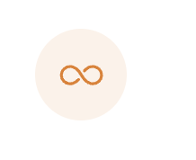

1. **flex-direct** not only row, it can also use for **colum**.
2. **create** open **class** for **js effect**
3. write the **css structure** of each element **firstly**. Analyse every structure firstly!!
4. **Don't put margin** for **individual component**, use flex or grid to get the whole correct layout
5. Use **flexbox** to **center** block item in another block item.

```Js
.btn{
display: flex;
align-items: center;
justify-content: center;
}
```

Use `text-align: center` to **center** text and inline element in a block item.

1. Use **transform** to get correct **location** for **relative position**

```Js
.dots {
        position: absolute;
        left: 50%;
        bottom: 0;
        transform: translate(-50%, 32px);
      }
```


7. **Add** element class **hierachy** can use two classes to identify this element.

```CSS
/* only apply if an element has both classes, can be used to add hierachy */
      .pagelink.page-link--current {
        background-color: #087f5b;
        color: #fff;
      }
```

8. Make a `<div>` center in the page: Use `<body>` as a flexbox
9. `vh` means viewpoint head, the percentage of vh

```CSS
height: 100vh;
```

10. flexbox: set no-same-space between elements: set `margin-left: auto`.

11. main structure -> set background color for each label -> font/font color -> grid or flexbox -> padding/text aling(text location) -> small components

12. Write seperate CSS files. Especially write a general reusable style file. (Omnifood)

13. Trick to **add border inside**: (Omnifood)

```CSS
box-shadow: inset 0 0 0 3px #fff;
```

13. `transition`: button animation (Put transition on original "state") (Omnifood)

```CSS
.btn:link,
.btn:visited {
  display: inline-block;
  text-decoration: none;
  font-size: 2rem;
  padding: 1.6rem 3.2rem;
  border-radius: 9px;
  transition: all 1s;
}

.btn--full:link,
.btn--full:visited {
  background-color: #e67e22;
  color: #fff;
}
```

14. If some spacing set is **reusable**, we can create a helper class to set the margin space. (Omnifood)

```HTML
<a href="#" class="btn btn--full margin-right-sm"
  >Start eating well</a
  >
<a href="#" class="btn btn--outline">Learn more &darr;</a>
```

```CSS
.margin-right-sm {
  margin-right: 1.6rem !important;
}
```

15. When chosing colors, don't forget to check color contrast. (Omnifood)
16. Trick to set anchor underline color be the current color dynamically. (Omnifood)

```CSS
border-bottom: 1px solid currentColor;
```

17. Trick to set anchor underline disapear without having gap in webpage. (Omnifood)

```CSS
border-bottom: 1px solid transparent;
```

18. `width: 100%`: make the size of image fits container. (Omnifood)

19. Trick to get unbalanced grid layout (Omnifood)

```CSS
grid-template-columns: 55fr 45fr;
```

20. fix images gap: make image be block (Omnifood)

21. Add gap between and around grid items: Use gaps and paddings (Omnifood)

```CSS
  gap: 1.6rem;
  padding: 1.6rem;
```


22. `overflow: hidden`: Remove the part over container (Put this code in it's parent container)(Omnifood)

23. another `transform`(Omnifood)

```CSS
transform: rotate(45deg)
```

24. set exclude element style:(Omnifood)

```CSS
.grid:not(:last-child) {
  margin-bottom: 9.6rem;
}
```

25. Add background circle after icon:(Omnifood)

```CSS
.feature-icon {
  color: #e67e22;
  height: 3.2rem;
  width: 3.2rem;
  background-color: #fdf2e9;
  padding: 1.6rem;
  border-radius: 50%;
```



26. Use `grid` for big page layout, use `flexbox` for small staff. (Omnifood)

27. Add **gradient** on **color** or **background**: (Omnifood)

```CSS
background-image: linear-gradient(to right border-bottom, #eb984e, #e67e22);
```

28. **Cover** the whole **image** in a container. (Omnifood)

```CSS
background-size: cover;
```

29. Add **image label** in `<div>` for screen reader.(Omnifood)

```HTML
<div
  class="cta-img-box"
  role="img"
  aria-label="Woman enjoying food"
></div>
```

30. **Remove padding** of resusable style: add another container inside.(Omnifood)


31. Use `<form>` `<input>` to create the form. (Omnifood)

32. Set `<input>` id, write `for` in `<label>` to set cursor focused after clicking. (Omnifood)

```HTML
    <label for="email">Email Address</label>
    <input
                    id="email"
                    type="email"
                    placeholder="me@example.com"
                    required
                  />
```

33. `<select>` `<option>` to set option box. (Don't forget to set `id`). (Omnifood)

```HTML
<label for="select-where">Where did you hear frlabel>
<select name="" id="select-where" required>
  <option value="">Please choose one option:</option>
  <option value="friends">Friends and family</option>
</select>
```

34. **Form** items (inputs/textarea/select/button/etc) **don't inherit font** information. You'll need to set the font-family on those items. (Omnifood)

```CSS
  font-family: inherit;
  color: inherit;
```

35. Use **pesudo** class to style **placeholder**. (Omnifood)

```CSS
.cta-form input::placeholder {
  color: #aaa;
}
```

36. Style both button and anchor. write all in css. (Omnifood)

```CSS
.btn,
.btn:link,
.btn:visited {
  display: inline-block;
  text-decoration: none;
  font-size: 2rem;
  font-weight: 600;
}
```

36. Set focused style: `*:focus`, dont write `outline: none;`only to remove the style. very bad for accessibility. Use `box-shadow`. (Omnifood)

```CSS
*:focus {
  outline: none;
  box-shadow: 0 0 0 0.8rem rgba(230, 125, 34, 0.5);
}

```

37. `<address>` default is italic, use `font-style: normal` to remove default font. (Omnifood)

38. 3 values in `padding`: (Omnifood)

```CSS
.section-cta {
  /* top / horizontal /left */
  padding: 4.8rem 0 12.8rem;
}
```

39. `media` should break at least 200px. (Omnifood-Respontive)

40. Select in CSS based on **attribute**. (Omnifood-Respontive)

- HTML:

```HTML
<ion-icon class="icon-mobile-nav" name="menu-outline"></ion-icon>
```

- CSS:

```CSS
  .nav-open .icon-mobile-nav[name='close-outline'] {
    display: block;
  }
```

41. Using `display: none` to remove an element will have **no animition**. (Omnifood-Respontive)

42. Hidding an element **without** `display:none` (Omnifood-Respontive)

- Hide it visually.

```CSS
opacity: 0;
```

- make it unaccessible to mouse and keyboard.

```CSS
pointer-events: none;
```

- Hide it from screen readers

```CSS
visibility: hidden;
```

If you want to make it visibility, you need to write:

```CSS
  .nav-open .main-nav {
    opacity: 1;
    pointer-events: auto;
    visibility: visible;
    transform: translateX(0);
  }
```

43. trick to write a `button` effect to open an element. (Omnifood-Respontive)

- write another `class` in `html`. Set `display: none` for unrelated elements. select inner element by writing two class name.

```HTML
<header class="header nav-open">
      <a href="#">
        
      </a>
      <nav class="main-nav">
        <ul class="main-nav-list">
          <li><a class="main-nav-link" href="#">How it works</a></li>
          <li><a class="main-nav-link" href="#">Meals</a></li>
          <li><a class="main-nav-link" href="#">Testimonials</a></li>
          <li><a class="main-nav-link" href="#">Pricing</a></li>
          <li><a class="main-nav-link nav-cta" href="#">Try for free</a></li>
        </ul>
      </nav>

      <button class="btn-mobile-nav">
        <ion-icon class="icon-mobile-nav" name="menu-outline"></ion-icon>
        <ion-icon class="icon-mobile-nav" name="close-outline"></ion-icon>
      </button>
    </header>
```

```CSS
.nav-open .main-nav {
    opacity: 1;
    pointer-events: auto;
    visibility: visible;
    transform: translateX(0);
  }

  .nav-open .icon-mobile-nav[name='close-outline'] {
    display: block;
  }

  .nav-open .icon-mobile-nav[name='menu-outline'] {
    display: none;
  }
```

44. Using `transform: translateX(100%);` in element and `overflow-x: hidden;` in `html` and `body` to implement slide in animation. (Omnifood-Respontive)

```css
html {
  overflow-x: hidden;
}

body {
  /* Only works if there is nothing absolutely positioned in relation to body */
  overflow-x: hidden;
}

.main-nav {
  background-color: rgba(255, 255, 255, 0.97);
  position: absolute;
  top: 0;
  left: 0;
  width: 100%;
  height: 100vh;
  transform: translateX(100%);
}
```

45. trick to get **symmetric** layout in **grid** (Omnifood-Respontive): `span` more columns to get correct layout.

```CSS
 .grid--footer {
    grid-template-columns: repeat(6, 1fr);
  }

  .logo-col,
  .address-col {
    grid-column: span 3;
  }

  .nav-col {
    grid-row: 1;
    grid-column: span 2;
    margin-bottom: 3.2rem;
  }
```


46. Use `pseudo-class` to revise z-pattern in another sequence

```CSS
  .step-img-box:nth-child(2) {
    grid-row: 1;
  }
```

47. Use `translate` to change element's location without influencing other elements.
