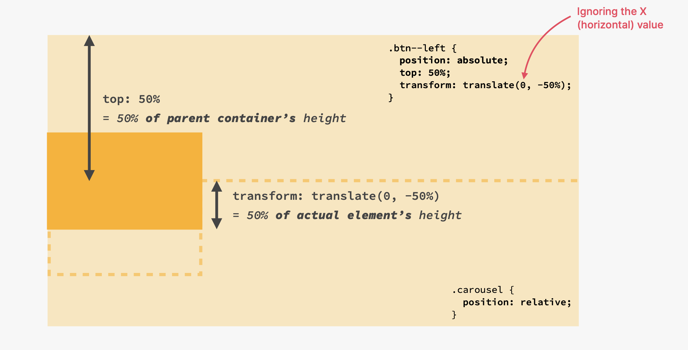

# CSS Studynote

## 1. Styling Text

### 1.1 Font

#### 1.1.1 font-size

[Ref link](https://www.w3schools.com/css/css_font_size.asp)

Set the size of the text.

Ablolute size:

- Sets the text to a specified size
- Does not allow a user to change the text size in all browsers(bad for accessibility reasons)
- Absolute size is useful when the physical size of the output is known.

Relative size:

- Sets the size relative to surrounding elements
- Allows a user to change the text size in browsers

**Note:** default size for paragraph is 16px(16px = 1em).

    /*px*/
    h1 {
      font-size: 40px;
    }

    /*em*/
    h1 {
      font-size: 2.5em;
    }

    /*Set a default font-size in percent for the <body> elemen>*/
    body {
      font-size: 100%;
    }

    /*The text size will follow the size of the browser window*/
    /*1vm = 1% of the viewport width*/
    <h1 style="font-size:10vw">Hello World</h1>

#### 1.1.2 font-family

[Ref link](https://www.w3schools.com/css/css_font.asp)

Specify the font of a text.

`Serif` have a small stroke at the dedges of each letter. Formality and elegance.

`Sans-serif` have clean lines. Modern and minimalistic.

`Monospace` all letters have the same fixed width. Mechaical.

`Cursive` human handwriting.

`Fantasy` decoratice/playful fonts.


**Note:** On computer screens, sans-serif are considered easier to read than serif fonts.


#### 1.1.3 font-style

[Ref link](https://www.w3schools.com/css/css_font_style.asp)

Mostly used to specify italic text.

`normal` The text is shown normally
`italic` Italics
`oblique` The text is "leaning"(oblique is very similar to italic, but less supported)

#### 1.1.4 font-weight

[Ref link](https://www.w3schools.com/cssref/pr_font_weight.php)

`normal` Define normal characters, this is default.
`bold` Define thick characters.
`bolder` Define thicker characters.
`lighter` Define lighter characters.
`number` from 100 to 900, 400 is the same as normal, and 700 is the same as bold.
`initial` default value.
`inherit` Inherits this property from its parent element.

### 1.2 Text

#### 1.2.1 text-transform

[Ref link](https://www.w3schools.com/css/css_text_transformation.asp)

Sprcify uppercase and lowercase letters in a text.

`uppercase` `lowercase` `capitalize`

#### 1.2.2 text-align

[Ref link](https://www.w3schools.com/css/css_text_align.asp)

`center` `left` `right`
`justify` Every line has equal width, the lift and right margins are straight.

#### 1.2.3 line-height

[Ref link](https://www.w3schools.com/css/css_text_spacing.asp)

Specify the space between lines.

    p.small {
      line-height: 0.8;
    }

    p.big {
      line-height: 1.8;
    }

#### 1.2.3 text-decoration

[Ref link](https://www.w3schools.com/css/css_text_decoration.asp)

`text-decoration: none` used to remove underline from links.

### 1.3 List

#### 1.3.1 list-style-type

[Ref link](https://www.w3schools.com/css/css_list.asp)

Specify the type of list item marker.

    ul.a {
      list-style-type: circle;
    }

    ul.b {
      list-style-type: square;
    }

    ol.c {
      list-style-type: upper-roman;
    }

    ol.d {
      list-style-type: lower-alpha;
    }

`none`: remove the markers/bullets.

### 1.4 Cursor

[Ref link](https://www.w3schools.com/cssref/pr_class_cursor.php)

`cursor: pointer`: The cursor is a pointer and indicates a link

## 2. Combining Selectors

Combine selectors to avoid redundancy.

    h1,
    h2,
    h3,
    h4,
    p,
    li {
      font-family: serif;
    }

## 3. Color

### 3.1 Color Type

- RGB (red, green, blue) e.g. `rgb(255, 0, 0)`
  - rgba (red, green, blue, transparent) e.g. `rgba(255, 0, 0, 0.3)`
- HEX (hexadecimal) e.g. #ff0000
- HSL (hue saturation, lightness) e.g. hsl(0, 100%, 50%)

## 4. Border

### 4.1 border-style

[Ref link](https://www.w3schools.com/css/css_border.asp)

Specify what kind of border to display. Also, it can have from one to four values(for the top border, right, bottom, and the left border)

    p.dotted {border-style: dotted;}
    p.dashed {border-style: dashed;}
    p.solid {border-style: solid;}
    p.double {border-style: double;}
    p.groove {border-style: groove;}
    p.ridge {border-style: ridge;}
    p.inset {border-style: inset;}
    p.outset {border-style: outset;}
    p.none {border-style: none;}
    p.hidden {border-style: hidden;}
    p.mix {border-style: dotted dashed solid double;}

## 5 Pseudo-classes

[Ref link](https://www.w3schools.com/css/css_pseudo_classes.asp)

Define a special state of an element.

### 5.1 Synax

    selector:pseudo-class {
      property: value;
    }

### 5.2 Anchor Pseudo-classes

    /* unvisited link */
    a:link {
      color: #FF0000;
    }

    /* visited link */
    a:visited {
      color: #00FF00;
    }

    /* mouse over link */
    a:hover {
      color: #FF00FF;
    }

    /* selected link */
    a:active {
      color: #0000FF;
    }

### 5.3 Child Pseudo-classes

The `:nth-child()` CSS pseudo-class matches elements based on the indexes of the elements in the **child list** of **their parents**. In other words, the :nth-child() selector selects child elements according to their position among all the sibling elements within a parent element.

```CSS
    li:first-child {
      font-weight: bold;
    }

    li:last-child {
      font-style: italic;
    }

    /* li:nth-child(2) {
      color: red;
    }

    li:nth-child(even) {
      color: red;
    } */

    /* Only work for article which first child is paragraph */
    article p:first-child {
      color: red;
    }

    article p:last-child {
      color: red;
    }

    /* set exclude element style */
    .grid:not(:last-child) {
      margin-bottom: 9.6rem;
      }

```

## 6. CSS Theory

### 6.1 Conflicts between selectors


### 6.2 Inheritance and the Universal Selector

Not All properties get inherited. It's mostly ones **related to text**: font-family, font-size, font-weight. font-style, color, line-height, letter-spacing, text-align, text-transform, text-shadow, list style, etc.

**Universal Selector(\*)**: used to all the elements, and there is no inheritance involved.

**body**: any style we put here gets inherited.

### 6.3 The CSS Box Model


**Final element widt** = left border + left padding + width + right padding + right border

**Final element height** = top border + top padding + height + bottom padding + bottom border

Remove default margin and padding:

    * {
      margin: 0;
      padding: 0;
    }

#### 6.3.1 Margin

[Ref link](https://www.w3schools.com/css/css_margin.asp)

Used to create space around elements, ourside of any defined borders.

    p {
      margin-top: 100px;
      margin-bottom: 100px;
      margin-right: 150px;
      margin-left: 80px;
    }

Use `margin-bottom` rather that `margin-top`

**Margin collaspse**: margin = MAX{margin-top, margin-bottom}

#### 6.3.2 Padding

Used to create space around an element's content, inside of any defined border.

[Ref link](https://www.w3schools.com/css/css_padding.asp)

    div {
      padding-top: 50px;
      padding-right: 30px;
      padding-bottom: 50px;
      padding-left: 80px;
    }

Padding shorthand:

    /* padding-top: 50px;
    padding-bottom: 50px; */
    padding: 50px 0;

    /* padding: 20px;
    padding-left: 40px;
    padding-right: 40px; */
    padding: 20px 40px;

### 6.4 Types of boxes

#### 6.4.1 Block-level elements

blocks, 100%width, stacked vertically by default

**Default elements:** body, main, header, footer, section, nav, aside, div, h1-h6, ul, ol, li, etc.

**With CSS:** `display: block`

#### 6.4.2 Inline elements

Occupies content, no line-breaks, heights and widths do not apply, paddings and margins are applied only horizontally.

**Default elements:** a, img, strong, em, button, etc.

**With CSS:** `display: inline`

#### 6.4.3 Inline-block elements

inline outside, block level inside, only content's space, no line-breaks, box-model applies.

**With CSS:** `display: inline-block`

### 6.5 Absolute positioning

#### 6.5.1 Normal flow

Default positioning, in flow

**With CSS:** `position: relative`

#### 6.5.2 Absolute positioning

out of flow, might overlap

Use top, bottom, left or right to offset the element from its **relatively positioned container(first parent)**

**With CSS:** `position: absolute`


## 7. Pseudo-elements

[Ref link](https://www.w3schools.com/css/css_pseudo_elements.asp)

Style specified parts of an element. e.g. first letter

**You can use only one pseudo-element in a selector**

### 7.1 Syntax

    selector::pseudo-element {
      property: value;
    }

### 7.2 Example

**First-letter:**

    p::first-letter {
      color: #ff0000;
      font-size: xx-large;
    }

**after:**
can be used to insert some content after the content of an element.

    h2::after {
    content: "TOP";
    background-color: #ffe70e;
    }

## 8. Float

### 8.1 Concept

out of flow, text and inline elements will **wrap aro und the floated element**, the container will **not** adjust its height to the element.

**With CSS:** `float: left` `float: right`

### 8.2 Clear Floats

- Creat a new blank `div` in html, add clear in CSS.

      HTML:
      <header class="main-header">
        <h1>📘 The Code Magazine</h1>
        <nav>
          <a href="blog.html">Blog</a>
          <a href="#">Challenges</a>
          <a href="#">Flexbox</a>
          <a href="#">CSS Grid</a>
        </nav>
        <div class="clear"></div>
      </header>

      CSS:
      h1 {
        float: left;
      }

      nav {
        float: right;
      }

      .clear {
        clear: both;
      }

- Creat a class after container

      HTML:
      <header class="main-header clearfix">
        <h1>📘 The Code Magazine</h1>
        <nav>
          <!-- <strong>This is the navigation</strong> -->
          <a href="blog.html">Blog</a>
          <a href="#">Challenges</a>
          <a href="#">Flexbox</a>
          <a href="#">CSS Grid</a>
        </nav>
        <!-- <div class="clear"></div> -->
      </header>
      CSS:
      h1 {
        float: left;
      }

      nav {
        float: right;
      }

      .clearfix::after {
        clear: both;
        content: "";
        display: block;
      }

- `clear`

  [Ref link](https://developer.mozilla.org/en-US/docs/Web/CSS/clear)

  The clear CSS property sets whether an element must be moved below (cleared) floating elements that **precede** it.

## 9. Border-sizing

[Ref link](https://css-tricks.com/almanac/properties/b/box-sizing/)

The box-sizing property in CSS controls how the box model is handled for the element it applies to.

`border-box`: Width and height values apply to the content, padding, and border.


**Common use:**

    * {
      /* border-top: 10px solid #1098ad; */
      margin: 0;
      padding: 0;
      box-sizing: border-box;
    }

## 10. Flexbox

- CSS properties for building 1-dimensional layouts
- automatically divided by its child elements
- align items to one another
- solve common problems like vertical centering or equal-height column
- replacing floats

### 10.1 Terminology


### 10.2 Flexbox property

DEFAULT:

`flex-grow: 0;
flex-shrink: 1;
flex-basis: auto;`

Shorthand:

    flex-grow: 0;
    flex-basis: 200px;
    flex-shrink: 0;
    flex: 0 0 200px;

The `flex-basis` width of elements, it is not rigid, if the length of words bigger than 200px,
get its original length

`flex-shrink`: whether flex box is allowed to shrink element if necessary

`flex-grow` Whether elements fill up spaces.

flex-grow original is 0. If A is 1, B is 2, B has double spacese than A.

## 11. CSS Grid

- 2-dimentional layouts
- divide a container element into rows and columns
- 1D-flexbox, 2D-CSS Grid

### 11.1 Terminology


Unlike flexbox, CSS Grid's axis **can not change**.


### 11.2 Sizing Grid columns and rows

- fr: scalable weighth and hight, choose the higgest item
  `grid-template-columns: 1fr 1fr 1fr 1fr;`
- auto: auto by web
  `grid-template-columns: 1fr 1fr 1fr auto;`
- `repeat`: repeat the same proptery
  `grid-template-columns: repeat(4, 1fr);`
- `height`: Define the Grid cell height, doesn't overwrite height which set mannully.
  `height: 500px;`

### 11.3 Placing and spanning grid items

- `span` : span to # items for column or row
  `grid-column: 1 / 4;`
  `grid-column: 1 / span 3;`
  `grid-column: 1/ -1` for the whole line
- `grid-column` and `grid-row` specifies lines in grid(use web Inspect)

### 11.4 Aligning grid items and tracks

- Aligning tracks inside container: distribute empty space:

  ```css
  justify-content: center;
  align-content: center;
  ```

- Aligning items INSIDWE cells: moving items aroung inside cells

  ```css
  /* Default value: stretch*/
  /* CSS uses end and flexbox uses flex-end */
  align-items: end;
  justify-items: end;
  ```

## 12 CSS Other elements

- `opacity`: set opacity, 100 means full display, 0 means empty.
- `transform: scale(1.5)` scale the size of image.
- `transform: translate(-50%, 32px);`: Use transform to get correct location for relative position

```CSS
.dots {
        position: absolute;
        left: 50%;
        bottom: 0;
        transform: translate(-50%, 32px);
      }
```



- ` border-collapse: collapse;`: Collapse the overlap borders.

- `background-image` and `background-size`: Set background image

```CSS
background-image: url(hero.jpg);
background-size: cover;
```

- `linear-gradient`: Set the gradient of image or background color.

- `overflow: scroll;`: How elements that don't fit into container appear

- `max-width`: If the container is larger, use the specified max-width.If the container is less than specified max-width, element width = container width

```CSS
max-width: 1000px;
```

- `rem`: The root element's(`<html>`) font-size. Default: 1rem = 16px

```CSS
html {
  /* font-size: 10px; */
  /* 10 px / 16 px = 62.5% */
  /* Percentage of user's browser font-size setting */
  font-size: 62.5%;
}

.test {
  max-width: 50rem;
  padding: 4rem;
  font-size: 2rem;
}
```

- `transition`: button animation (Put transition on original "state")

```CSS
.btn:link,
.btn:visited {
  display: inline-block;
  text-decoration: none;
  font-size: 2rem;
  padding: 1.6rem 3.2rem;
  border-radius: 9px;
  transition: background-color 1s;
}

.btn--full:link,
.btn--full:visited {
  background-color: #e67e22;
  color: #fff;
}
```

- `z-index`: set the order of display, default: 0.
- `filter`: change the render of image.

```

```
