# Javascript Study Note

## 1. JS fundamentals- Part1

### 1.1 Parameter Naming

- Use **Camel Case**.
- Only two symbols allowed in \_ and $.
- Don't named varible start with **upper case**.
- Real constant: write it in uppercase.
  `PI = 3.1415926;`
- Name parameter as clear as possible.
  ```Javascript
  let myFisrtJob = "Programmer";
  let myCurrentJob = "Teacher";
  ```
- Don't use default name like "function".

### 1.2 Data Types

1. **Number**:

```Javascript
   let age = 23;
```

2. **String**:

```Javascript
   let firstName = "Ella";
```

3. **Boolean**:

```Javascript
   let fullAge = true;
```

4. Undefine(empty value):

```Javascript
   let childeren;
```

5. Null: empty value
6. BigInt(ES2020): Larger integers than the Number type can hold.

**Note**: JavaScript has **dynamic** typing, data types are determined **automatically**. **Values has type, not varible.**

### 1.3 let, const and var

- let: changable variable and can declare undefine data type.

- const: unchanable varible.

**Tips**: Usually use `const` to avoid bugs and use `let` when needed.

### 1.4 Basic Operators

#### 1.4.1 Math operators

`+, -, *, /, **`

Use `+` to add strings:

```Javascript
const firstName = "Ella";
const lastName = "Liu";
console.log(firstName + " " + lastName);
// Ella Liu
```

#### 1.4.2 Assignment operators

```Javascript
let x = 10 + 5;
x += 10; // x = x + 10
x *= 4; // x = x * 4
x++; // x = x + 1
x--; // x = x - 1
console.log(x);
```

#### 1.4.3 Comparison operators

`>, <, >=, <=`

### 1.5 Operator Precedence

[Ref link](https://developer.mozilla.org/en-US/docs/Web/JavaScript/Reference/Operators/Operator_precedence)

### 1.6 Strings and Template Literals

Use `${variable}` to get template literals. Use ` `` ` can write multiline strings directly.

```Javascript
// Normal strings
const ella =
  "I'm " + firstName + ", a " + (year - birthYear) + " years old " + job + "!";
console.log(ella);

// Template Literals
const ellaNew = `I'm ${firstName}, a ${year - birthYear} years old ${job}!`;
console.log(ellaNew);

// Multiline strings
console.log(`String
multiple
lines`);

```

### 1.7 if/else Statements

```Javascript
// Varible need to be declared out of loop
const birthYear = 1998;
let century;
if (birthYear <= 2000) {
  century = 20;
} else if (birthYear > 2000) {
  century = 21;
} else {
  console.log("Wrong");
}
console.log(century);
```

### 1.8 Type Conversion and Coercion

- type conversion

```Javascript
const inputYear = "1991";
// Number: first letter need to be capitcalized
console.log(Number(inputYear), inputYear);
console.log(Number(inputYear) + 18);
console.log(Number("Ella"));
// "NaN" means not a number
console.log(typeof NaN);
console.log(String(23));
```

- type coercion: + will works for string concatenate. -, /, \* only works for number, so js will change string to number

```Javascript
console.log("I'm " + 25 + " years old");
// I'm 25 years old

console.log("23" - "10" - 3);
//10
console.log("23" * 2);
//26
// example
let n = "1" + 1;
n = n - 1;
console.log(n);
// n = 10
```

### 1.9 Truthy and Falsy Values

5 false values: 0, "", underfined, null, NaN

### 1.10 Equality Operators: == vs ===

- `==` will do type coercion, `===` will not
  '18' == 18;
  '18' !== 18;
  18 === 18;

- `prompt` will get a string value from website input.

```Javascript
const favourite = prompt("What's your favourite number?");
console.log(favourite);
```

### 1.11 Logical Operators

And: `&&`
Or: `||`
Not: `!`

### 1.12 Switch Statement

```Javascript
const day = "friday";

switch (
  day // strict comparison
) {
  case "monday": // day === 'monday'
    console.log("Plan course structure");
    console.log("Go to coding meetup");
    break; // break the case
  case "tuesday":
    console.log("Prepare theory videos");
    break;
  case "wednesday":
  case "thursday":
    // if (day === wednesday || day === thursday)
    console.log("Write code examples");
    break;
  case "friday":
    console.log("Record videos");
    break;
  case "saturday":
  case "sunday":
    console.log("Enjoy the weekend :D");
    break;
  default: // other cases are fail
    console.log("Not a valid day!");
}
```

### 1.13 Expression vs Statement

- **Expression**: any word or group of words or symbols that is a value.
- **Statement**: a group of expressions and/or statements that you design to carry out a task or an action.

```Javascript
const price = 500;
```

Expression: `const` `price` `=` `500`
Statement: `const price = 500`

### 1.14 Ternary Operator

`condition ? exprIfTrue : exprIfFalse`

```Javascript
const drink = age >= 18 ? "wine 🍷" : "water 💧";
```

It can also used in template literal:

```Javascript
console.log(`I like to drink ${age >= 18 ? "wine 🍷" : "water 💧"}`);
```

## 2. JS fundamentals- Part2

### 2.1 Strict Mode

`"use strict";`

**Benifits**:

- Strict mode forbids us to do certain things.
- Create visible errors.

### 2.2 Functions

```Javascript
function name(parameter1, parameter2, parameter3) {
  // code to be executed
}
```

### 2.3 Function Declarations vs Expression

- Function Declarations: can call it before defined.

```Javascript
function calcAge1(birthYear) {
  return 2037 - birthYear;
}
const age1 = calcAge1(1998);
```

- Function Expression

```Javascript
const calcAge2 = function (birthYear) {
  return 2037 - birthYear;
};
const age2 = calcAge2(1998);
```

### 2.4 Arrow Function

```Javascript
// one expression: don't need to write return
() => expression

param => expression

(param) => expression

(param1, paramN) => expression

() => {
  statements
}

param => {
  statements
}

(param1, paramN) => {
  statements
}

```

```Javascript
const calcAge3 = (birthYear) => 2037 - birthYear;

const yearsUntilRetirement = (birthYear, firstName) => {
  const age = 2037 - birthYear;
  const retirement = 65 - age;
  return `${firstName} retires in ${retirement} years`;
};
```

### 2.5 Functions Calling Other Functions

Write functions seperately is great to revise and ovoid bugs.

```Javascript
function cutFirtePieces(fruit) {
  return fruit * 4;
}

function fruitProcessor(apples, oranges) {
  const applePieces = cutFirtePieces(apples);
  const orangePieces = cutFirtePieces(oranges);
  const juice = `Juice with ${applePieces} piece of apples and ${orangePieces} piece of oranges.`;
  return juice;
}
```

### 2.6 Function Anatomy

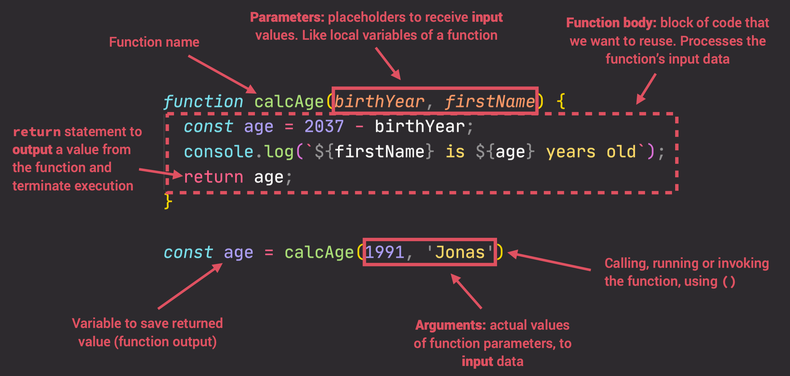

### 2.7 Array

#### 2.7.1 Introduction

- Syntax1:

```Javascript
const friends = ["Ella", "Lucy", "Vincent"];
```

- Syntax2:

```Javascript
const year = new Array(1998, 1999, 2000, 2001, 2002);
```

- Array value is mutable even though it is declared by `const`.

#### 2.7.2 Operations

- **Add** elements:
  `push`: Push an element in the **end** of array, return a value of length of the new array.

  ```Javascript
  const friends = ["Ella", "Lucy", "Vincent"];
  const newLength = friends.push("Jay");
  // friends = ["Ella", "Lucy", "Vincent", "Jay"]
  // newLength = 4
  ```

  `unshift`: Insert an element for the **first** element of array, return a value of length of the new array

  ```Javascript
  friends.unshift("John");
  console.log(friends);
  //friends = ["John", "Ella", "Lucy", "Vincent", "Jay"]
  ```

- **Remove** elements:
  `pop`: **Last** element remove, return the removed element.

  ```Javascript
  const friends = ["Ella", "Lucy", "Vincent"];
  const popped = friends.pop();
  // friends = ["Ella", "Lucy"]
  // popped = "Vincent"
  ```

  `shift`: **First** element remove, return the removed element.

  ```Javascript
  friends.shift();
  // friends = ["Ella"]
  ```

- Get the **index**:
  `array.indexOf(element)`: Return the **index** of element. If element doesn't exist, return -1.

  ```Javascript
  const friends = ["Ella", "Lucy", "Vincent"];
  console.log(friends.indexOf("Lucy"));
  // 1
  ```

- Check elements **includes** in the array:
  `array.includes(element)`: Check **strict equallity**, not type conversion, return true or false.(Can used in the `if` expresseion)

  ```Javascript
  const friends = ["Ella", "Lucy", "Vincent", 23];
  console.log(friends.indexOf("Lucy"));
  //true
  console.log(friends.indexOf("Bob"));
  //false
  console.log(friends.indexOf(23));
  //true
  console.log(friends.indexOf("23"));
  //false
  ```

### 2.8 Object

#### 2.8.1 Notation

```Javascript
// Object syntax
const ella = {
  firstName: "Ella",
  lastName: "Xia",
  age: 25,
  job: "student",
  friend: ["Vincent", "Lucy", "Ella"],
};

// 1. Use dot.
console.log(ella.lastName);
// 2. Use bracket
// bracket can put expression inside it.
console.log(ella["lastName"]);
```

#### 2.8.2 Methonds

`this`: the object calling the method

```Javascript
const ella = {
  firstName: "Ella",
  lastName: "Xia",
  birthYear: 1998,
  job: "student",
  friend: ["Vincent", "Lucy", "Ella"],
  hasDriversLicense: true,


  // Reduce multiple compution if function called multiple times
  calcAge: function () {
    this.age = 2037 - this.birthYear;
    return this.age;
    // this : ella object
  }
  }
```

### 2.9 Loop

#### 2.9.1 For Loop

```Javascript
for (let rep = 1; rep <= 10; rep++) {
  console.log(`Ligting wights repetition ${rep} 🏋🏻‍♀️`);
}
```

#### 2.9.2 Looping Arrays, break and continue

- Loop in Array

```Javascript
for (let i = 0; i < ella.length; i++) {
  console.log(ella[i], typeof ella[i]);
  // types[i] = typeof ella[i];
  types.push(typeof ella[i]);
}
```

- `continue`: exit the current iteration of the loop and continue to the next one.

```Javascript
console.log("--- ONLY STRINGS ---");
for (let i = 0; i < ella.length; i++) {
  if (typeof ella[i] !== "string") continue;
  console.log(ella[i], typeof ella[i]);
}
```

- `break`: completely terminate the whole loop.

```Javascript
console.log("--- BREAK WITH NUMBER ---");
for (let i = 0; i < ella.length; i++) {
  if (typeof ella[i] === "number") break;
  console.log(ella[i], typeof ella[i]);
}

```

#### 2.9.3 Looping Backwards and Loops in Loops

- Backwards

```Javascript
const ella = ["Ella", "Xia", 25, "student", ["Vincent", "Lucy", "Ella"]];

for (let i = ella.length - 1; i >= 0; i--) {
  console.log(ella[i]);
}
```

- Loops in Loops

```Javascript
for (let exercise = 1; exercise < 4; exercise++) {
  console.log(`------Starting exercise------- ${exercise}`);

  for (let rep = 1; rep < 6; rep++) {
    console.log(`Exercise ${exercise}: Lifting weight repetition ${rep} 🏋🏻‍♀️`);
  }
}
```

#### 2.9.4 The while Loop

Use while when you don't need a counter.

```Javascript
let dice = Math.trunc(Math.random() * 6) + 1;
console.log(dice);

while (dice !== 6) {
  console.log(`You rolled a ${dice}`);
  dice = Math.trunc(Math.random() * 6) + 1;
  if (dice === 6) console.log("Loop is about to end...");
}

```

## 3. Developer Skills & Editor Setup

### 3.1 Useful tools

**Check Vedio 55 for more details**

- `Prettier - Code formatter`: Code formatter
  Revise format on **setting**, write **prettierrc file** to revise default format
- `spinppets`: Get shorcut command
- `image preview`: html image preview
- `TODO Highlight`: Highlight some keywords
  go to **Open Setting (JSON)** in **Setting** to write some configuration file.
- `Live Server`: reload the web after saving the file.
  You can download it on Extension of VScode or npm.
  - For `npm` download:
    1. download node.js on official website.
    2. Terminal: `sudo npm install live-server -g`.
    3. Termiinal close: `control + C`
    4. Test: `live-server`, worked for open a website automatically.

### 3.2 Four Steps to solve any problem

1. Make sure you 100% understand the problem. **Ask the right questions** to get a clear pircture of the problem.
2. **Divide and conquer**: Break a big problem into smaller sub-problems.
3. Don't be afraid to do as much **research** as you have to.
4. For bigger problems, **write pseudo-code** before writing the actual code.

### 3.3 The debugging process

1. **Identify:** becomming aware that there is a bug.
   - During development
   - Testing software
   - User reports during production
   - Context: browsers, users
2. **Find:** Isolating where exactly the bug is happening in code.
   - Developer console(simple code)
   - Debugger(complex code)
3. **Fix:** Correct the bug.
   - Replace wrong solution with new correct solution
4. **Prevent:** Preventing it from happening again.
   - Searching for the same bug in similar code
   - Writing tests using testing software

### 3.4 Debugging with the console and breakpoints

- `console.table()`: console the result in table format.
- write `debugger` in code will trigger the debug console in website.
  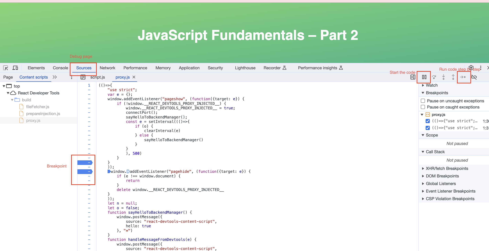

## 4. DOM and Events Fundamentals

### 4.1 DOM Introduction

DOM for Document Object Model: Structure representation of html documents. Allows javascript to access HTML elements and styles to manipulate them.

### 4.2 Selecting and Manipulation elements

- `document.querySelector()`: returns the **first** element within the document that matches the specified selector, or group of selectors.
- `document.querySelectorAll()`: returns **all** depth inherit elements within the document that matches the specified selector, or group of selectors.
- `textContent`: returns the text content of an element.
- `value`: get the value of `input` element.

```Javascript
// Example
document.querySelector('.message').textContent = 'Correct Number!';
console.log(document.querySelector('.message').textContent);
document.querySelector('.number').textContent = 13;

console.log(document.querySelector('.guess').value);
document.querySelector('.guess').value = 23;
```

### 4.3 Handling Click Events

- `addEventListener`: Set up a function that will be called whenever the specified event is delivered to the target.

```Javascript
// Syntax
addEventListener(type, listener)
addEventListener(type, listener, options)
addEventListener(type, listener, useCapture)


// click: Set up a function when the element was clicked
document.querySelector('.check').addEventListener('click', function () {
  const guess = Number(document.querySelector('.guess').value);
  console.log(guess);
});
```

### 4.4 Manipulating CSS Styles

```Javascript
// Syntax
document.querySelector('html property').style.cssProperty = '';
// Tips: If the CSS property uses two worlds, then it will use Camel case in Javascript. Also, the value should be string.
document.querySelector('body').style.backgroundColor = '#60b347';
```

### 4.5 Working with Classes

- `classList.remove('className')`: Close class.

```Javascript

const modal = document.querySelector('.modal');
// Don't use dot(.) for class,  dot(.) is only used for selector.
modal.classList.remove('hidden');
```

- `classList.add('className')`: Add class.

```Javascript
modal.classList.add('hidden');
```

- `classList.contains('className')`: Check if class contained in the classList.

```Javascript
modal.classList.contains('hidden');
```

- `classList.toggle('className')`: Removes an existing token from the list and returns false. If the token doesn't exist it's added and the function returns true.

```Javascript
player0El.classList.toggle('player--active');
player1El.classList.toggle('player--active');
```

- Create function to refactor in `addEventListener`.

```Javascript
// Create a function to close the modal.
const closeModel = function () {
  modal.classList.add('hidden');
  overlay.classList.add('hidden');
};

// Don't use parentheses() after function. Just declare it. Use parentheses means function was calling.
// Calling the function when the button is clicked.
btnCloseModal.addEventListener('click', closeModel);
```

### 4.6 Handling Keypress Event

```Javascript
// keydown, keypress, keyup
// Argument e: Call a function when a key down event happens, pass the event object as an argument
// Object example
document.addEventListener('keydown', function (e) {
  if (e.key === 'Escape' && !modal.classList.contains('hidden')) {
    closeModel();
  }
});

```

## 5. Data Structures, Modern Operators, and Strings.

### 5.1 Destrcturing Arrays

The destructuring assignment syntax is a JavaScript expression that makes it possible to **unpack values** from arrays, or properties from objects, into **distinct variables**.

```Javascript
// Normal assignment
const arr = [2, 3, 4];
const a = arr[0];
const b = arr[1];
const c = arr[2];

// destrcturing the array.
const [x, y, z] = arr;
console.log(x, y, z);
// x = 2, y = 3, z = 4

// Get first two elements
const [first, second] = arr;
console.log(first, second);
// 2, 3

// Get first and third elements
const [first1, , third3] = arr;
console.log(first1, third3);
// 2, 4

// Switching variables
// Normal:
let [main, , secondary] = arr;
[main, secondary] = [secondary, main];
// main = 2, secondary = 0

// Receive 2 return values from a function
const restaurant = {
  name: 'Classico Italiano',
  location: 'Via Angelo Tavanti 23, Firenze, Italy',
  categories: ['Italian', 'Pizzeria', 'Vegetarian', 'Organic'],
  starterMenu: ['Focaccia', 'Bruschetta', 'Garlic Bread', 'Caprese Salad'],
  mainMenu: ['Pizza', 'Pasta', 'Risotto'],

  order: function (starterIndex, mainIndex) {
    return [this.starterMenu[starterIndex], this.mainMenu[mainIndex]];
  },
};

const [starter, mainCourse] = restaurant.order(2, 0);
console.log(starter, mainCourse);
// Garlic Bread, Pizza

// Nested destructuring
const nested = [2, 4, [5, 6]];
// const [i, , j] = nested;
// console.log(i, j);
const [i, , [j, k]] = nested;
console.log(i, j, k);
// 2, 5, 6

// Default values
const [p, q, r = 1] = [8, 9];
console.log(p, q, r);
// 8, 9, 1
```

### 5.2 Destrcturing Objects

```Javascript
const restaurant = {
  name: 'Classico Italiano',
  location: 'Via Angelo Tavanti 23, Firenze, Italy',
  categories: ['Italian', 'Pizzeria', 'Vegetarian', 'Organic'],
  starterMenu: ['Focaccia', 'Bruschetta', 'Garlic Bread', 'Caprese Salad'],
  mainMenu: ['Pizza', 'Pasta', 'Risotto'],

  order: function (starterIndex, mainIndex) {
    return [this.starterMenu[starterIndex], this.mainMenu[mainIndex]];
  },

  openingHours: {
    thu: {
      open: 12,
      close: 22,
    },
    fri: {
      open: 11,
      close: 23,
    },
    sat: {
      open: 0, // Open 24 hours
      close: 24,
    },
  },

  orderDilivery: function (
    starterIndex = 1,
    mainIndex = 0,
    time = '20:00',
    address
  ) {
    console.log(
      `Order received ${this.starterMenu[starterIndex]} and ${this.mainMenu[mainIndex]} will be delivered to ${address} at ${time}`
    );
  },
};

// Used in function
restaurant.orderDilivery({
  time: '22:30',
  address: 'UNSW Village',
});

// Must use the property name in object
const { name, openingHours, categories } = restaurant;
console.log(name);
console.log(openingHours);
console.log(categories);

// Change the variable name
const {
  name: restaurantName,
  openingHours: hours,
  categories: tags,
} = restaurant;
console.log(restaurantName);

// Default value
const { menu = [], starterMenu: starters = [] } = restaurant;

// Mutating variables
let a = 111;
let b = 999;
const obj = { a: 23, b: 7, c: 14 };
// Must use ()
({ a, b } = obj);
console.log(a, b);

// Nested objects
const {
  fri: { open: o, close: c },
} = openingHours;

console.log(o, c);
```

### 5.3 The Spread Operator(...)

Write values, separated by comma.

```Javascript
// Normal ways to extend the array
const arr = [7, 8, 9];
const badNesArr = [1, 2, arr[0], arr[1], arr[2]];
console.log(badNesArr);

const newArr = [1, 2, ...arr];
console.log(newArr);
// [1, 2, 7, 8, 9]

// Get the array individually
console.log(...newArr);
//1 2 7 8 9

// Spread operator takes all the element from the array, and it doesn't create new variable.
// Only use it in place where we would write values separateed by comma.
const newMenu = [...restaurant.mainMenu, 'Gnocci'];
console.log(newMenu);

// Copy array
const mainMenuCopy = [...restaurant.mainMenu];

// Join 2 arrays
const menu = [...restaurant.mainMenu, ...restaurant.starterMenu];
console.log(menu);

// Iterables: arrays, strings, maps, sets. NOT objects
const str = 'Ella';
const letters = [...str, ' ', 'E. '];
console.log(letters);
//['E', 'l', 'l', 'a', ' ', 'E. ']
console.log(...str);
//E l l a

// Objects
const newRestaurant = { foundedIN: 1998, ...restaurant, founder: 'Guiseppe' };
console.log(newRestaurant);

const restaurantCopy = { ...restaurant };
restaurantCopy.name = 'Ella';
console.log(restaurantCopy.name);
console.log(restaurant.name);
```

### 5.4 Rest Pattern and Parameters

Write variable names, separated by comma

```Javascript
// 1) Destructuring
// Spread, because on right side of =
const arr = [1, 2, ...[3, 4]];

// Rest, because on LEFT side of =
const [a, b, ...others] = [1, 2, 3, 4, 5];
console.log(a, b, others);

const [pizza, , risotto, ...otherFood] = [
  ...restaurant.mainMenu,
  ...restaurant.starterMenu,
];
console.log(pizza, risotto, otherFood);

// Object
const { sat, ...weekDays } = restaurant.openingHours;
console.log();

// 2) Functions
// Use ... can input both array and single values
const add = function (...numbers) {
  let sum = 0;
  for (let i = 0; i < numbers.length; i++) {
    sum += numbers[i];
    console.log(sum);
  }
};
add(2, 3, 5);
const x = [23, 5, 7];
add(...x);
```

### 5.5 Short Circuiting(&&, || and ??)

#### 5.5.1 OR

Use OR operator to set **default values**. Return the first truthy value of all the operands, or simply the last value if all of them are falsy.

```Javascript
console.log(3 || 'Ella');
// 3
console.log('' || 'Ella');
// Ella
console.log(true || 0);
// true
console.log(undefined || null);
// null

// Easier method to set default values
const guest1 = restaurant.numGuests ? restaurant.numGuests : 10;
console.log(guest1);
// 10
const guest2 = restaurant.numGuests || 10;
console.log(guest2);
// 10
```

#### 5.5.2 AND

Use AND operator to execute code in **the second operand** if the first one is true. Return the first falsy value or the last value if all of them are truthy.

```Javascript
console.log(0 && 'Ella');
// 0
console.log('Ella' && 'Lucy');
// Lucy

// Practical example
if (restaurant.orderPizza) {
  restaurant.orderPizza('mushrooms', 'spinach');
}
restaurant.orderPizza && restaurant.orderPizza('mushrooms', 'spinach');
```

#### 5.5.3 Nullish

Nullish: null and undefined (NOT 0 or ' ')

```Javascript
restaurant.numGuests = 0;
const guestCorrect = restaurant.numGuests ?? 10;
console.log(guestCorrect);
// 0
```

### 5.6 Logical Assignment Operators

```Javascript

const rest1 = {
  name: 'Ella',
  numGuests: 0,
};

const rest2 = {
  name: 'Vincent',
  owner: 'Happy',
};

// OR assignment operator
// rest1.numGuests = rest1.numGuests || 10;
// rest2.numGuests = rest2.numGuests || 10;
// rest1.numGuests ||= 10;
// rest2.numGuests ||= 10;

// Nullish assignmenr operator
rest1.numGuests ??= 10;
rest2.numGuests ??= 10;

// AND assignment operator
// rest1.owner = rest1.owner && '<ANONYMOUS>';
// rest2.owner = rest2.owner && '<ANONYMOUS>';
rest1.owner &&= '<ANONYMOUS>';
rest2.owner &&= '<ANONYMOUS>';
console.log(rest1);
console.log(rest2);
```

### 5.7 Looping Arrays: The for-of Loop

- Get every element in an array.

```Javascript
for (const item of menu) console.log(item);
```

- `entries()`: get the index of each item.

```Javascript
for (const item of menu.entries()) {
  console.log(item);
}
// (2) [0, 'Focaccia']
// (2) [1, 'Bruschetta']
// (2) [2, 'Garlic Bread']
// (2) [3, 'Caprese Salad']
// (2) [4, 'Pizza']
// (2) [5, 'Pasta']
// (2) [6, 'Risotto']
```

- Using destructure to get index from 1.

```Javascript
for (const [i, el] of menu.entries()) {
  console.log(`${i + 1}: ${el}`);
}

// 1: Focaccia
// 2: Bruschetta
// 3: Garlic Bread
// 4: Caprese Salad
// 5: Pizza
// 6: Pasta
// 7: Risotto
```

### 5.8 Enhanced Object Literals

1. When reference the property name, create the same property name in the object

```Javascript
const openingHours = {
  sat: {
    open: 0, // Open 24 hours
    close: 24,
  },
};

const restaurant = {
  name: 'Classico Italiano',
  location: 'Via Angelo Tavanti 23, Firenze, Italy',
  categories: ['Italian', 'Pizzeria', 'Vegetarian', 'Organic'],
  starterMenu: ['Focaccia', 'Bruschetta', 'Garlic Bread', 'Caprese Salad'],
  mainMenu: ['Pizza', 'Pasta', 'Risotto'],
  // ES6 enhanced objec literals[1]
  // Put openingHours in resturant object, creat a same property name
  // Don't need to write openingHours: openingHours
  openingHours}

```

2. Function format simplify in object

```Javascript
const restaurant = {
  name: 'Classico Italiano',
  location: 'Via Angelo Tavanti 23, Firenze, Italy',
  categories: ['Italian', 'Pizzeria', 'Vegetarian', 'Organic'],
  starterMenu: ['Focaccia', 'Bruschetta', 'Garlic Bread', 'Caprese Salad'],
  mainMenu: ['Pizza', 'Pasta', 'Risotto'],
  openingHours,
  // ES6 enhanced objec literals[2]
  // Function format simplify in object
  order(starterIndex, mainIndex) {
    return [this.starterMenu[starterIndex], this.mainMenu[mainIndex]];
  }

```

3. Compute property name using a template literal or expression

```Javascript
const weekdays = ['mon', 'tue', 'wed', 'thu', 'fri', 'sat', 'sun'];
const openingHours = {
  // ES6 enhanced objec literals[3]
  // Compute property name using a template literal or expression
  [weekdays[3]]: {
    open: 12,
    close: 22,
  },
  [weekdays[4]]: {
    open: 11,
    close: 23,
  },
  sat: {
    open: 0, // Open 24 hours
    close: 24,
  },
};

```

### 5.9 Optional Chaining(?.)

Operator accesses an object's property or calls a function. If the object accessed or function called using this operator is undefined or null, the expression short circuits and evaluates to **undefined** instead of throwing an error.

```Javascript
// Methods
console.log(restaurant.order?.(0, 1) ?? 'Method does not exist');
console.log(restaurant.orderRisotto?.(0, 1) ?? 'Method does not exist');

// Array
const users = [{ name: 'Ella' }];
console.log(users[0]?.name ?? 'User array empty');
// Equally
if (users.length > 0) console.log(users[0].name);
else console.log('user array empty');
```

### 5.10 Looping objects: Keys, Values, and Entries

- Looping object **keys**: `Object.keys()` Return an array of keys.

```Javascript
const weekdays = ['mon', 'tue', 'wed', 'thu', 'fri', 'sat', 'sun'];
const openingHours = {
  thu: {
    open: 12,
    close: 22,
  },
  fri: {
    open: 11,
    close: 23,
  },
  sat: {
    open: 0, // Open 24 hours
    close: 24,
  },
};

const properties = Object.keys(openingHours);
console.log(properties);
//(3) ['thu', 'fri', 'sat']
```

- Looping object **values**: `Object.values()` returns an array of values.

```Javascript
const values = Object.values(openingHours);
console.log(values);
// (3) [{…}, {…}, {…}]
// 0: {open: 12, close: 22}
// 1: {open: 11, close: 23}
// 2: {open: 0, close: 24}
// length: 3
// [[Prototype]]: Array(0)
```

- Looping object: `Object.entries()`

```Javascript
const entries = Object.entries(openingHours);
console.log(entries);
// (3) [Array(2), Array(2), Array(2)]
// 0: (2) ['thu', {…}]
// 1: (2) ['fri', {…}]
// 2: (2) ['sat', {…}]
// length: 3
// [[Prototype]]: Array(0)

// The values itself is also an object, don't forget to use {}
for (const [key, { open, close }] of entries) {
  console.log(`On ${key} we open at ${open} and close at ${close}`);
}
// On thu we open at 12 and close at 22
// On fri we open at 11 and close at 23
// On sat we open at 0 and close at 24
```

### 5.11 Sets

Elements are **unique**. The **order** of elements in the set is **irrelevant**.

````Js
const ordersSet = new Set(['Pizza', 'Pizza', 'Pizza', 'Hot Pot', 'Pasta']);
console.log(ordersSet);
// Set(3) {'Pizza', 'Hot Pot', 'Pasta'}```
````

- `.size`: Get the length of set

````Js
console.log(ordersSet.size);
// 3```
````

- `.has(elemnet)` : Check if the element in the set, return `true` or `false`.

```Js
console.log(ordersSet.has('Pizza'));
// true
console.log(ordersSet.has('Sauguage'));
// false
```

- Add and delete element

```Js
ordersSet.add('Garlic Bread');
console.log(ordersSet);
// Set(4) {'Pizza', 'Hot Pot', 'Pasta', 'Garlic Bread'}
ordersSet.delete('Hot Pot');
console.log(ordersSet);
// Set(3) {'Pizza', 'Pasta', 'Garlic Bread'}

```

- `clear()`: Clear the set

```Js
ordersSet.clear();
console.log(ordersSet);
```

- Looping is possible

```Js
for (const order of ordersSet) console.log(order);
```

- Use string will separate the string

```Js
console.log(new Set('Ella'));
// Set(3) {'E', 'l', 'a'}
```

- Example: Remove duplicate elements from array, and return a new array

```Js
const staff = ['Waiter', 'Chef', 'Waiter', 'Manager', 'Chef', 'Waiter'];
// Use spread to get array directly
const staffUnique = [...new Set(staff)];
console.log(staffUnique);
console.log(
  new Set(['Waiter', 'Chef', 'Waiter', 'Manager', 'Chef', 'Waiter']).size
);
```

### 5.12 Maps

In Object, key is string. But in the map, key can be **any types**.

```Js
const rest = new Map();
```

- `set()`: Map instances adds or updates an entry in this map with a specified key and a value.

```Js
rest
  .set('categories', ['Italian', 'Pizzeria', 'Vegetarian', 'Organic'])
  .set('open', 11)
  .set('close', 23)
  .set(true, 'We are open :D')
  .set(false, 'We are closed :(');
```

- `get()`: read data from a map.

```Js
console.log(rest.get('open'));
// 11
```

- Same property

```Js
console.log(rest.has('categories'));
// true
rest.delete(true);
rest.clear();
console.log(rest.size());
```

- Get the value when key is array or object.

```Js
rest.set(document.querySelector('h1'), 'Heading');
const arr = [1, 2];
// Must write arr not [1, 2] to let them in the same cache when get it
rest.set(arr, 'Test');
console.log(rest.get(arr));
```

### 5.12 Maps: Iteration

```Javascript
// Convert object to map
console.log(Object.entries(openingHours));
// 0: (2) ['thu', {…}]
// 1: (2) ['fri', {…}]
// 2: (2) ['sat', {…}]

const hoursMap = new Map(Object.entries(openingHours));
console.log(hoursMap);
// 0: {"thu" => Object}
//   key: "thu"
//   value: {open: 12, close: 22}
// 1: {"fri" => Object}
//   key: "fri"
//   value: {open: 11, close: 23}
// 2: {"sat" => Object}
//   key: "sat"
//   value: {open: 0, close: 24}

// Map is iterable
//Quiz app
console.log(question.get('question'));
for (const [key, value] of question) {
  if (typeof key === 'number') console.log(`Answer ${key}: ${value}`);
}
const answer = Number(prompt('Your answer'));
console.log(answer);
console.log(question.get(answer === 'correct'));

// Covert Map to array
console.log([...question]);
```

### 5.13 Which Data Structure to Use?

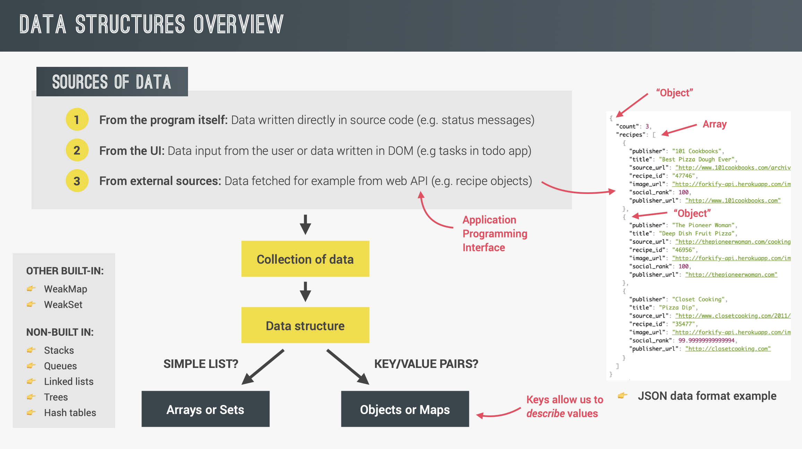
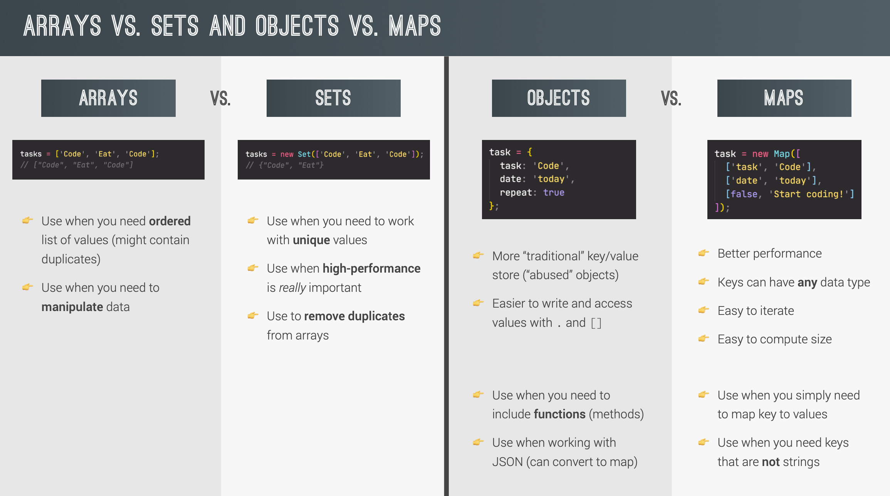

### 5.14 Working with Strings

- Get the index

```Javascript
const airline = 'TAP Air China';
const plane = 'A320';

console.log(plane[0]);
// A
console.log(plane[1]);
// 3
console.log('A320'[0]);
// A

console.log(airline.length);
// 13
console.log('B737'.length);
// 4

// Get the index
// Get the first index
console.log(airline.indexOf('i'));
// 5
// Get the last index
console.log(airline.lastIndexOf('i'));
// 10
// Get the whole word index
console.log(airline.indexOf('China'));
// 8
```

- `slice()`: Extract string

```Javascript
console.log(airline.slice(4));
//Air China
// Extract string from the forth to 7th index
// The end index will be cut off
console.log(airline.slice(4, 7));

// Get the first word
console.log(airline.slice(0, airline.indexOf(' ')));
// Get the last word
console.log(airline.slice(airline.lastIndexOf(' ') + 1));
//Air

// Extra character from end
console.log(airline.slice(-2));
console.log(airline.slice(1, -1));
```

- `toLowerCase()` and `toUpperCase()`

```Javascript
const airline = 'TAP Air China';

// Get everystring in lowercase before anything
console.log(airline.toLowerCase());
// tap air china
console.log(airline.toUpperCase());
// TAP AIR CHINA
```

- `trim()`: Values removes whitespace from both ends of this string and returns a new string, without modifying the original string.

```Javascript
// Compare emails
const email = 'ella@gmail.com';
const loginEmail = '   Ella@Gmail.com   \n';
const normalizaedEmail = loginEmail.toLowerCase().trim();
console.log(normalizaedEmail);
// ella@gmail.com
```

- `replace()`:Replacing the first certain element.

```Javascript
// replace(pattern, replacement)
const priceCN = '299,97¥';
const pricnUS = priceCN.replace('¥', '$').replace(',', '.');
console.log(pricnUS);
// 299.97$
```

- `replaceAll()`: Replacing all elements.

```Javascript
const announcement =
  'All passengers come to boarding door 23. Borading door 23!';
console.log(announcement.replace('door', 'gate'));
// All passengers come to boarding gate 23. Borading door 23!
console.log(announcement.replaceAll('door', 'gate'));
// All passengers come to boarding gate 23. Borading gate 23!
```

- `includes()`: determines whether an array includes a certain value among its entries, returning true or false as appropriate.

```Javascript
const plane = 'A320neo';
console.log(plane.includes('A320'));
// true
```

- `startWith()` and `endWith()`: check if the string start or end with certain element.

```Javascript
console.log(plane.startsWith('A'));
// true
console.log(plane.endsWith('haha'));
// false
```

- `split()`: takes a pattern and divides this string into an ordered list of substrings by searching for the pattern, puts these substrings into an array, and **returns the array**.

```Js
console.log('a+very+nice+string'.split('+'));
// ['a', 'very', 'nice', 'string']
console.log('Tonghao Liu'.split(' '));
// ['Tonghao', 'Liu']
```

- `join()`: creates and returns a new string by concatenating all of the elements in this array, separated by commas or a specified separator string. If the array has only one item, then that item will be returned without using the separator.

```Js
const [firstName, lastName] = 'Tonghao Liu'.split(' ');
const newName = ['Ms.', firstName, lastName.toUpperCase()].join(' ');
console.log(newName);
// Ms. Tonghao LIU
```

- `padStart()` and `padEnd()`: String values pads this string with another string (multiple times, if needed) until the resulting string reaches the given length. The padding is applied from the start or end of this string.

```Js
// padEnd(targetLength, padString)
const message = 'Go to gate 6';
console.log(message.padStart(20, '+').padEnd(30, '+'));
// ++++++++Go to gate 6++++++++++

// mask card
const maskCreditCard = function (number) {
  const str = number + '';
  const last = str.slice(-4);
  return last.padStart(str.length, '*');
};
console.log(maskCreditCard(12123747473742));
//**********3742
```

- `repeat()`: Repeat same strings multiple times.

```Js
const message2 = 'Bad weather...All Departues Delayes... ';
console.log(message2.repeat(3));
//Bad weather...All Departues Delayes... Bad weather...All Departues Delayes... Bad weather...All Departues Delayes...

const planesInLine = function (n) {
  console.log(`There are ${n} planes in the line ${'🛩️'.repeat(n)}`);
};
planesInLine(5);
// There are 5 planes in the line 🛩️🛩️🛩️🛩️🛩️
planesInLine(3);
// There are 3 planes in the line 🛩️🛩️🛩️
```

## 6. A Closer Look at Functions

### 6.1 Default Parameters

Default value write in the expression of parameter.

```Javascript
const bookings = [];
const createBooking = function (flightNum, numPassengers = 1, price = 199) {
  // ES5 default value
  // numPassengers = numPassengers || 1;
  // price = price || 199;

  const booking = {
    flightNum,
    numPassengers,
    price,
  };
  console.log(booking);
  bookings.push(booking);
};

createBooking('LH123');
// Skip one default parameter
createBooking('LH123', undefined, 800);
```

### 6.2 First-Class and Higher-Order Functions

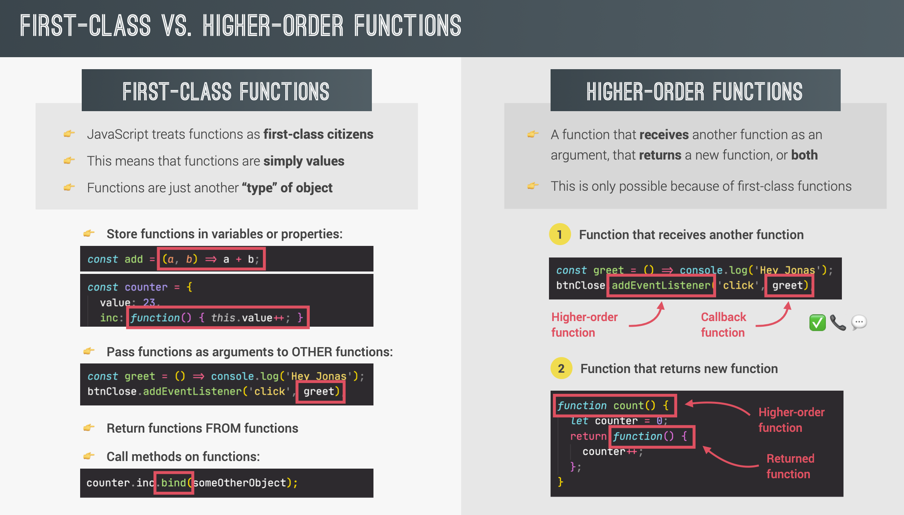

### 6.3 Callback Functions

A function passed into another function as an argument, which is then invoked inside the outer function to complete some kind of routine or action

Advantages:

- It makes easy to split up code into more reusable and interconnected parts.
- Callback functions allow us to create abstraction.

```Javascript
const oneWord = function (str) {
  return str.replace(/ /g, '').toLowerCase();
};

const upperFirstWord = function (str) {
  const [first, ...others] = str.split(' ');
  return [first.toUpperCase(), ...others].join(' ');
};

// Higher-order function
// fn: call back function
const transformer = function (str, fn) {
  console.log(`Original string: ${str}`);
  console.log(`Transformed strinf: ${fn(str)}`);
  console.log(`Transformed by: ${fn.name}`);
};

transformer('JavaScript is the best!', upperFirstWord);
// Original string: JavaScript is the best!
// Transformed strinf: JAVASCRIPT is the best!
// Transformed by: upperFirstWord
transformer('JavaScript is the best!', oneWord);
// Original string: JavaScript is the best!
// Transformed strinf: javascriptisthebest!
// Transformed by: oneWord

// JS uses callbacks all the time
const high5 = function () {
  console.log('✋');
};
document.body.addEventListener('click', high5);
['Ella', 'Lucy', 'Nat'].forEach(high5);
```

### 6.4 Functions Returning Functions

```Js
const greet = function (greeting) {
  return function (name) {
    console.log(`${greeting} ${name}`);
  };
};

const greeterHey = greet('Hey');
greeterHey('Ella');
// Hey Ella

// all in one
greet('Hello')('Ella');
// Hello Ella
```

### 6.5 call and apply methods

`call()`: calls `this` function with a given `this` value and `arguments` provided individually.

```Js

const sydney = {
  airline: 'sydney',
  iataCode: 'SYD',
  bookings: [],
  book(flightNum, name) {
    console.log(
      `${name} booked a seat on ${this.airline} flight ${this.iataCode}${flightNum}`
    );
    this.bookings.push({
      flight: `${this.iataCode}${flightNum}`,
      name,
    });
  },
};

sydney.book(238, 'Ella');
sydney.book(122, 'Vincent');

const melbourne = {
  airline: 'melbourne',
  iataCode: 'MEL',
  bookings: [],
};

// call(): call the book function with the this keyword set to melbourne object.
// call(): manually and exlicitly set the this keyword if ant function we want to call.
// all the argument after the first one are simply the arguments of the original function

const book = sydney.book;
book.call(melbourne, 23, 'Ella Liu');
//Ella Liu booked a seat on melbourne flight MEL23
```

`apply()`: calls this function with a given `this` value, and `arguments` provided as an array.

```Js
const brisbane = {
  airline: 'brisbane',
  iataCode: 'BRE',
  bookings: [],
};

book.call(brisbane, 234, 'Lucy Cooper');
console.log(brisbane);

// Apply method
// Not use anymore
const flightData = [583, 'George Cooper'];
book.apply(brisbane, flightData);
console.log(brisbane);

// same as book.apply(brisbane, flightData);
// important!!
book.call(brisbane, ...flightData);
```

### 6.6 The bind Method

`bind()` doesn't not immediately call the function, it returns a new function where this keyword is bind.

- Return a new function

```Js
const bookMB = book.bind(melbourne);
const bookBB = book.bind(brisbane);
const bookSD = book.bind(sydney);
bookMB(46, 'Steven Green');
// Steven Green booked a seat on melbourne flight MEL46
```

- Store the function only remains name

```Js
const bookSD46 = book.bind(sydney, 46);
bookSD46('Elsa');
// Elsa booked a seat on sydney flight SYD46
bookSD46('Selina');
// Selina booked a seat on sydney flight SYD46
```

- With Event Listeners

```Js
sydney.planes = 500;
sydney.buyPlane = function () {
  console.log(this);
  this.planes++;
  console.log(this.planes);
};

// bind the this keyword to function rather nor button
document
  .querySelector('.buy')
  .addEventListener('click', sydney.buyPlane.bind(sydney));
```

- Partial application: preset parameters

```Js
const addTax = (rate, value) => value + value * rate;
console.log(addTax(0.1, 200));
// 220

// when set the same tax rate
const addVAT = addTax.bind(null, 0.23);
// addVAT = value => value + value * 0.23
console.log(addVAT(100));
// 123
```

### 6.7 Immediately invoked Function Expressions(IIFE)

Call function only once

```Js
(function () {
  console.log('This will never run again');
})();

(() => console.log('This will never run again'))();
```

### 6.8 Closure

```Js
const secureBooking = function () {
  let passengerCount = 0;

  return function () {
    passengerCount++;
    console.log(`${passengerCount} passengers`);
  };
};

const booker = secureBooking();

booker();
// 1 passengers
booker();
// 2 passengers
```

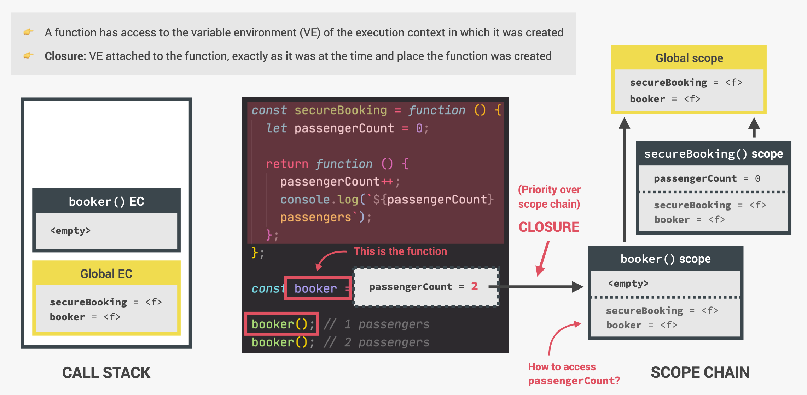

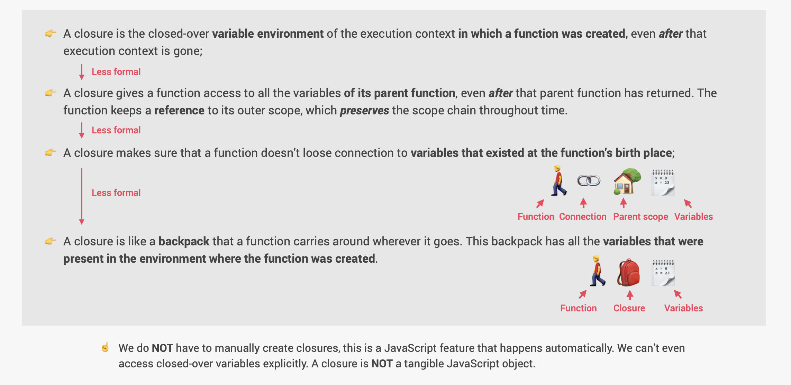

### 6.9 More Closure Examples

- The closure can change when the avaiable is reassigned

```Js
let f;

const g = function () {
  const a = 23;
  f = function () {
    console.log(a * 2);
  };
};

const h = function () {
  const b = 777;
  f = function () {
    console.log(b * 2);
  };
};

g();
f();
// 46

// Re-assigning f function
h();
f();
// 1554
```

- Clousure also can used in timer

```Js
const boardPassengers = function (n, wait) {
  const perGroup = n / 3;

  setTimeout(function () {
    console.log(`We are now boarding all ${n} passengers`);
    console.log(`There are 3 groups, each with ${perGroup} passengers`);
  }, wait * 1000);
  console.log(`Will start boarding in ${wait} secons`);
};

boardPassengers(180, 3);
// Will start boarding in 3 secons
// We are now boarding all 180 passengers
// There are 3 groups, each with 60 passengers

```

## 7. Working with arrays

### 7.1 Simple array methods

- `slice()`: extract part of any array without changing the original array, return a new array.

```Js
console.log(arr.slice(2));
// ['c', 'd', 'e']
console.log(arr.slice(2, 4));
// ['c', 'd']
console.log(arr.slice(-2));
// ['d', 'e'];

// shallow copy of an array
// 1) slice
console.log(arr.slice());
// ['a', 'b', 'c', 'd', 'e'];
// 2)
console.log([...arr]);
// ['a', 'b', 'c', 'd', 'e'];
```

- `splice()`: functional like slice, but it changes the original array, new array = arr - spliced elements.

```Js
// console.log(arr.splice(2));
// ['c', 'd', 'e']
// console.log(arr);
//  ['a', 'b']

console.log(arr.splice(-1));
// ['e']
console.log(arr);
// ['a', 'b', 'c', 'd'];
// splice array from position 1, delete 2 elements
console.log(arr.splice(1, 2));
// ['b', 'c'];
console.log(arr);
// ['a', 'd']
```

- `reverse()`: reverse array and return it.

```Js
const arr2 = ['j', 'i', 'h', 'g', 'f'];
console.log(arr2.reverse());
// ['f', 'g', 'h', 'i', 'j']
console.log(arr2);
// ['f', 'g', 'h', 'i', 'j']
```

- `concat()`: concat arrays, doesn't mutate the original array

```Js
arr = ['a', 'b', 'c', 'd', 'e'];
const letters = arr.concat(arr2);
console.log(letters);
// ['a', 'b', 'c', 'd', 'e', 'f', 'g', 'h', 'i', 'j']
// another ways
console.log([...arr, ...arr2]);
// ['a', 'b', 'c', 'd', 'e', 'f', 'g', 'h', 'i', 'j']
```

- `join()`: join every element with some smybol without changing the original array

```Js
console.log(letters.join(' - '));
// a - b - c - d - e - f - g - h - i - j;

```

- **Mutate array method: `splice()`, `reverse()`**

### 7.2 at method

- New way to get the index value of an array

```Js
const arr = [23, 11, 64];
console.log(arr[0]);
// 23
console.log(arr.at(0));
// 23
```

- getting the last element

```Js
console.log(arr[arr.length - 1]);
// 64
console.log(arr.slice(-1)[0]);
// 64
console.log(arr.at(-1));
// 64

// at method also can be used in string
console.log('Ella'.at(0));
// E

```

### 7.3 forEach vs for...of

Executes a provided function once for each array element

- Iterate element

```Js
const movements = [200, 450, -400, 3000, -650, -130, 70, 1300];

for (const movement of movements) {
  if (movement > 0) {
    console.log(`You deposited ${movement}`);
  }
  if (movement < 0) {
    console.log(`You withdrew ${Math.abs(movement)}`);
  }
}

console.log('----FOREACH----');
movements.forEach(function (movement) {
  if (movement > 0) {
    console.log(`You deposited ${movement}`);
  }
  if (movement < 0) {
    console.log(`You withdrew ${Math.abs(movement)}`);
  }
});
```

- Add index of array: `forEach(currentElement, currentIndex, currentArray)`

```Js
for (const [i, movement] of movements.entries()) {
  if (movement > 0) {
    console.log(`Movement ${i + 1}: You deposited ${movement}`);
  }
  if (movement < 0) {
    console.log(`Movement ${i + 1}: You withdrew ${Math.abs(movement)}`);
  }
}

console.log('----FOREACH----');
movements.forEach(function (mov, i, arr) {
  if (mov > 0) {
    console.log(`Movement ${i + 1}: You deposited ${mov}`);
  }
  if (mov < 0) {
    console.log(`Movement ${i + 1}: You withdrew ${Math.abs(mov)}`);
  }
});
```

- **Main difference**: You can not break(e.g. continue, break) `forEach()` loop. Except this feature, `forEach()` also same as `for...of`

### 7.4 forEach with maps and sets

- Map: `forEach(function(value, key, map) {})`

```Js
const currencies = new Map([
  ['USD', 'United States dollar'],
  ['EUR', 'Euro'],
  ['GBP', 'Pound sterling'],
]);

currencies.forEach(function (value, key, map) {
  console.log(`${key}: ${value}`);
});

// USD: United States dollar
// EUR: Euro
// GBP: Pound sterling
```

- Set: `forEach(function(value, value, map) {})`

```Js
// Set doesn't have index, the first two arguments are values
const currenciesUnique = new Set(['USD', 'GBP', 'EUR']);
currenciesUnique.forEach(function (value, _, map) {
  console.log(`${value}: ${_}`);
});

// USD: USD
// GBP: GBP
// EUR: EUR
```

### 7.5 DOM elements

- `innerHtML`: gets or sets the HTML or XML markup contained within the element.

  - Overwrite the original movements container: `containerMovements.innerHTML = '';`
  - **tips to get value:** html: `innerHTML`, input: `.value`, label: `.textContent`

- `insertAdjacentHTML(position, text)`: parses the specified text as HTML or XML and inserts the resulting nodes into the DOM tree at a specified position.

  - `"beforebegin"`: Before the element. Only valid if the element is in the DOM tree and has a parent element.

  - `"afterbegin"`: Just inside the element, before its first child.

  - `"beforeend"`: Just inside the element, after its last child.

  - `"afterend"`: After the element. Only valid if the element is in the DOM tree and has a parent element.

- `preventDefault()`: delete the default effect (e.g. `<button>` in `<form> will reload page`)
- `blur()`: blur the mouse cursor。

```Js
const displayMovements = function (movements) {
  containerMovements.innerHTML = '';

  movements.forEach(function (mov, i) {
    const type = mov > 0 ? 'deposit' : 'withdrawal';
    const html = `<div class="movements__row">
    <div class="movements__type movements__type--${type}">${i + 1} ${type}</div>
    <div class="movements__value">${mov}</div>
  </div>`;

    containerMovements.insertAdjacentHTML('afterbegin', html);
  });
};
```

### 7.6 Map, filter, reduce

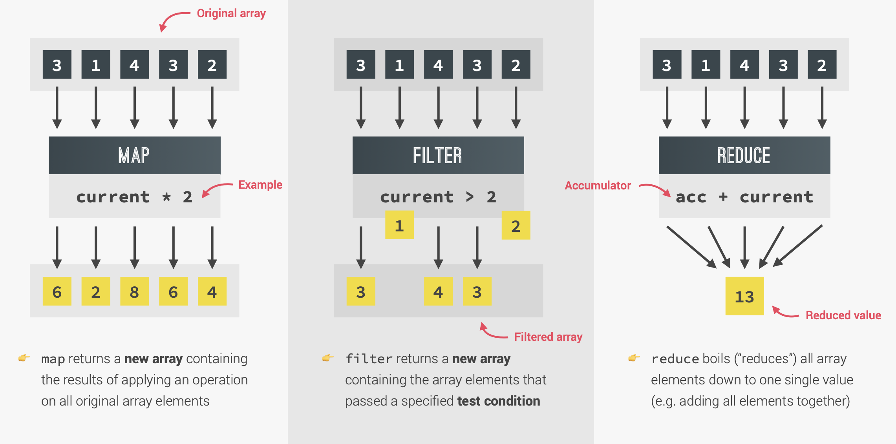

#### 7.6.1 Map

`forEach` method creates the side effect, `map` method return each of the strings from the callback, no side effect.

````Js
const movements = [200, 450, -400, 3000, -650, -130, 70, 1300];
const eurToUSD = 1.1;

const movementsUSD1 = movements.map(mov => mov * eurToUSD);
console.log(movementsUSD1);
// [220.00000000000003, 495.00000000000006, -440.00000000000006, 3300.0000000000005, -715.0000000000001, -143, 77, 1430.0000000000002]

const movementDescription = movements.map(
  (mov, i) =>
    `Movement ${i + 1}: You ${mov > 0 ? 'deposited' : 'withdraw'} ${Math.abs(
      mov
    )}`
);
console.log(movementDescription);
// ['Movement 1: You deposited 200', 'Movement 2: You deposited 450', 'Movement 3: You withdraw 400', 'Movement 4: You deposited 3000', 'Movement 5: You withdraw 650', 'Movement 6: You withdraw 130', 'Movement 7: You deposited 70', 'Movement 8: You deposited 1300']
```sho

#### 7.6.2 Filter

```Js
const movements = [200, 450, -400, 3000, -650, -130, 70, 1300];
const deposit = movements.filter(function (mov, i, array) {
  return mov > 0;
});

console.log(movements);
// [200, 450, 3000, 70, 1300]
console.log(deposit);
// [-400, -650, -130]
````

#### 7.6.3 Reduce

```Js
// Get the sum of movements

const movements = [200, 450, -400, 3000, -650, -130, 70, 1300];

accumulator => snowball
const balance = movements.reduce(
  function (acc, cur, i, arr) {
    console.log(`Iteraition ${i}: ${acc}`);
    return acc + cur;
  },
  0 // accumulator innitial value
);

// simplify by arrow function
const balance = movements.reduce(
  (acc, cur) => acc + cur,
  0 // accumulator innitial value
);

// Get the maximum of movements
// Maximum value
const max = movements.reduce(
  (acc, mov) => (acc > mov ? acc : mov),
  movements[0]
);
console.log(max);
// 3000
```

### 7.7 Chaining Methods

**Suggestions:**

- Do not overuse chaining, try to compress all the functionality

- Aviod mutating arrays(e.g. `splice()`, `reverse()`)

- If want to debug one method of pipeline, return the next line value, console log and debug it.

```Js
const eurToUSD = 1.1;

// PIPELINE
const totalDepositsUSD = movements
  .filter(mov => mov > 0)
  .map(mov => mov * eurToUSD)
  .reduce((acc, mov) => acc + mov, 0);
console.log(totalDepositsUSD);
```

### 7.8 Find method

`find()`: return the first element in the array satisfies the condition.

```Js
const movements = [200, 450, -400, 3000, -650, -130, 70, 1300];

const firstWithdrawal = movements.find(mov => mov < 0);
console.log(firstWithdrawal);
// -400

const account = accounts.find(acc => acc.owner === 'Jessica Davis');
console.log(account);
// {owner: 'Jessica Davis', movements: Array(8), interestRate: 1.5, pin: 2222, username: 'jd'}

```

### 7.9 findIndex Method

Return the index of specific value in an array.

```Js
const index = accounts.findIndex(
      acc => acc.username === currentAccount.username
    );
    // Delete account
    accounts.splice(index, 1);
```

### 7.10 some and every Method

- `some()`: returns true if any element in array satisfy the condition.

```JS
const movements = [200, 450, -400, 3000, -650, -130, 70, 1300];

console.log(movements.some(mov => mov === -130));
// true
const anyDeposites = movements.some(mov => mov > 0);
console.log(anyDeposites);
// true
```

- `every()`: every(): returns true if all elements in array satisfy the condition

```Js
console.log(movements.every(mov => mov > 0));
// false
console.log(movements.every(mov => mov > -1000));
// true
```

### 7.11 Seperate callback

```Js
const deposit = mov => mov > 0;
console.log(movements.every(deposit));
```

### 7.12 flat and flatMap

`flat()`: Creates a new array with all sub-array elements concatenated into it recursively up to the specified depth.

```Js
const arr = [[1, 2, 3], [4, 5, 6], 7, 8];
console.log(arr.flat());
// [1, 2, 3, 4, 5, 6, 7, 8]

const arrDeep = [[[1, 2], 3], [4, [5, 6]], 7, 8];
console.log(arrDeep.flat());
// [Array(2), 3, 4, Array(2), 7, 8]
// Set the flat level
console.log(arrDeep.flat(2));
// [1, 2, 3, 4, 5, 6, 7, 8]
```

`flatMap()`: Returns a new array formed by applying a given callback function to each element of the array, and then flattening the result by **one** level.

```Js
// flat()
const overallBalance = accounts
  .map(acc => acc.movements)
  .flat()
  .reduce((acc, mov) => acc + mov, 0);
console.log(overallBalance);
// 17840

// flatMap()
const overallBalance2 = accounts
  .flatMap(acc => acc.movements)
  .reduce((acc, mov) => acc + mov, 0);
console.log(overallBalance);
// 17840

```

### 7.13 sort

`sort()`: sort strings and mutate array.

```Js
const owners = ['Ella', 'Lucy', 'Nat', 'Zach', 'Adam'];
console.log(owners.sort());
// ['Adam', 'Ella', 'Lucy', 'Nat', 'Zach']
console.log(owners);
// ['Adam', 'Ella', 'Lucy', 'Nat', 'Zach']
```

`sort() for numbers`:

```Js
const movements = [200, 450, -400, 3000, -650, -130, 70, 1300];
// console.log(movements.sort());
// [-130, -400, -650, 1300, 200, 3000, 450, 70]

console.log(movements);
// return < 0, A, B (keep order)
// return > 0, B, A (switch order)

// Ascending
movements.sort((a, b) => a - b);
console.log(movements);

// Descending
movements.sort((a, b) => b - a);
console.log(movements);

```

### 7.14 Create empty array and fill method

- Create an empty array with specific length

```Js
const x = new Array(7);
console.log(x);
// [empty × 7]
```

- `fill()`: fill and mutate array

```Js
x.fill(1);
console.log(x);
// [1, 1, 1, 1, 1, 1, 1]
```

```Js
// fill 1 at index of 3 with length of 2
x.fill(1, 3, 5);
console.log(x);
// [empty × 3, 1, 1, empty × 2]
const arr = [1, 2, 3, 4, 5, 6, 7];
arr.fill(23, 2, 6);
console.log(arr);
// [1, 2, 23, 23, 23, 23, 7];
```

- `Array.from()`: creates a new, shallow-copied Array instance from an iterable or array-like object.

```Js
const y = Array.from({ length: 7 }, () => 1);
console.log(y);
// [1, 1, 1, 1, 1, 1, 1]

const z = Array.from({ length: 7 }, (_, i) => i + 1);
console.log(z);
// [1, 2, 3, 4, 5, 6, 7]
```

Use `Array.from()` to select value from specific class in web

```Js
labelBalance.addEventListener('click', function () {
  const movementsUI = Array.from(
    document.querySelectorAll('.movements__value'),
    el => Number(el.textContent.replace('€', ''))
  );
  console.log(movementsUI);
  // ['1300', '70', '-130', '-650', '3000', '-400', '450', '200']
});

```

### 7.15 Summary: Which array method to use?

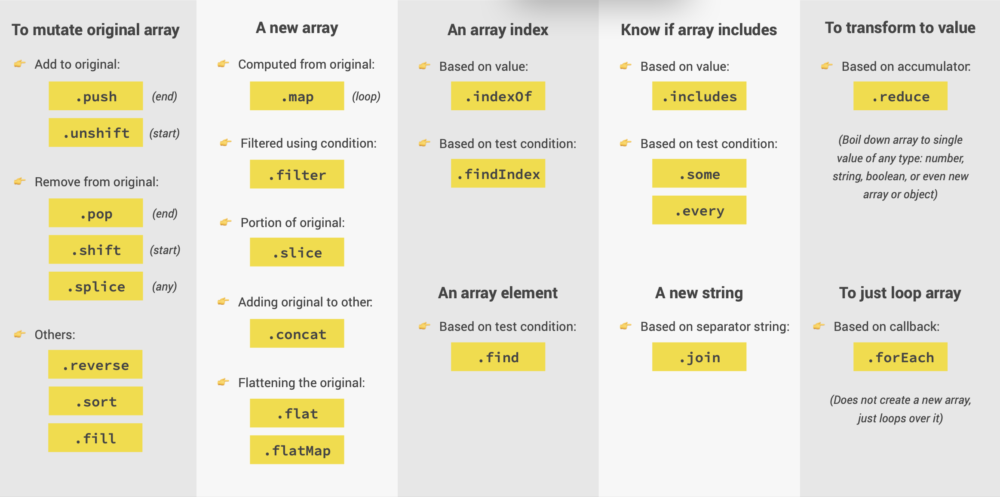

## 8 Advanced DOM and Events

### 8.1 How the DOM Really works

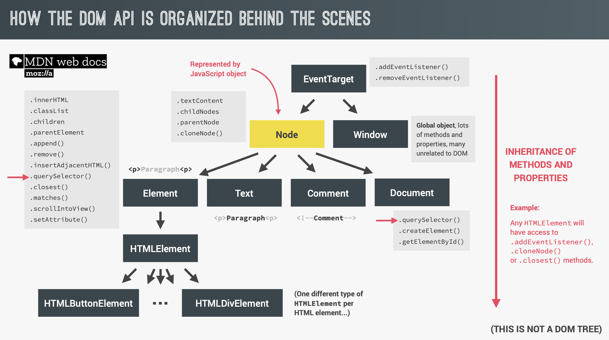

### 8.2 Selecting, Creating and Deleting elements

#### 8.2.1 Selecting elements:

- Select all document

```Js
console.log(document.documentElement);
// Select head
console.log(document.head);
// Select body
console.log(document.body);
```

- Select specific element

```Js
document.querySelector('.header');

// Select all elements with specific class, return a NodeList(not live collection)
const allSections = document.querySelectorAll('.section');
console.log(allSections);
// NodeList(4) [section#section--1.section, section#section--2.section, section#section--3.section, section.section.section--sign-up]

document.getElementById('section--1');

// Select all the element name with 'button', return an HTMLCollection(live collection)
const allButtons = document.getElementsByTagName('button');
console.log(allButtons);
// HTMLCollection(9) [button.btn--text.btn--scroll-to, button.btn.operations__tab.operations__tab--1.operations__tab--active, button.btn.operations__tab.operations__tab--2, button.btn.operations__tab.operations__tab--3, button.slider__btn.slider__btn--left, button.slider__btn.slider__btn--right, button.btn.btn--show-modal, button.btn--close-modal, button.btn]

// Select all element with specific class name, return an HTMLCollection(live collection)
console.log(document.getElementsByClassName('btn'));
// HTMLCollection(5) [button.btn.operations__tab.operations__tab--1.operations__tab--active, button.btn.operations__tab.operations__tab--2, button.btn.operations__tab.operations__tab--3, button.btn.btn--show-modal, button.btn]

```

#### 8.2.2 Creating and inserting elements

- Creating elements

```Js
// Create element tag
const message = document.createElement('div');

// Create element class
message.classList.add('cookie-message');

// Create element content
message.innerHTML =
  'We use cookied for improved functionality and analytics. <button class="btn btn--close--cookie">Got it!</button>';
```

- Inserting elements

```Js
const header = document.querySelector('.header');

// Put element(message) before specific element(header) (Just once)
header.before(message);

// Put element(message) before specific element(header) (Just once)
header.after(message);

// Put element(message) in the first of specific element(header) (Just once)
header.prepend(message);

// Put element(message) in the last of specific element(header) (Just once)
header.append(message);

// cloneNode(): true means can use specific elements multiple times.
header.append(message.cloneNode(true));

```

#### 8.2.3 Deleting elements

```Js
// remove()
document
  .querySelector('.btn--close--cookie')
  .addEventListener('click', function () {
    message.remove();
  });
```

### 8.3 Styles, Attributes and Classes

#### 8.3.1 Styles

- inline styles

```Js
message.style.backgroundColor = '#37383d';
message.style.width = '120%';

// inline styles write in the .html file, can't get in style sheet(.css).
console.log(message.style.color);
//
console.log(message.style.backgroundColor);
// rgb(55, 56, 61)
```

- `getComputedStyle()`: get all property of a specific element.

```Js
console.log(getComputedStyle(message).color);
// rgb(187, 187, 187)
```

- `setProperty()`: Set property style

```Js
//setProperty: Sets a new value for a property on a CSS style declaration object.
document.documentElement.style.setProperty('--color-primary', 'orangered');
```

#### 8.3.2 Attribute

Example:

```Js

```

- Get the standard property

```Js
const logo = document.querySelector('.nav__logo');
// Get the standard property
console.log(logo.alt);
// Bankist logo
console.log(logo.className);
// nav__logo
```

- Get the non-standard property

```Js
console.log(logo.designer);
// undefined
console.log(logo.getAttribute('designer'));
// Ella
```

- Get different format of url and href

```Js
console.log(logo.src);
// http://127.0.0.1:5500/Javascript/Javascript/13-Advanced-DOM-Bankist/starter/img/logo.png
console.log(logo.getAttribute('src'));
// img/logo.png

const link = document.querySelector('.nav__link--btn');
console.log(link.href);
// http://127.0.0.1:5500/Javascript/Javascript/13-Advanced-DOM-Bankist/starter/index.html#
console.log(link.getAttribute('href'));
// #
```

- Get data attribute

provides read/write access to custom data attributes (data-\*) on element.

```Js
console.log(logo.dataset.versionNumber);
// 3.0
```

- Set attribute

```Js
// Standard
logo.alt = 'Beautiful minimalist logo';
// Non Standard
logo.setAttribute('company', 'Bankist');
```

#### 8.3.3 Class

```Js
logo.classList.add('c');
logo.classList.remove('c');
// if visible is set remove it, otherwise add it
logo.classList.toggle('c');
logo.classList.contains('c'); // not includes

// Don't use, will overwrite everything and just can contain one class
logo.className = 'jonas';
```

### 8.4 Implementing Smooth Scrolling

`scrollIntoView()`

```Js
const btnScrollTo = document.querySelector('.btn--scroll-to');
const section1 = document.querySelector('#section--1');

btnScrollTo.addEventListener('click', `function (e) {`
  section1.scrollIntoView({ behavior: 'smooth' });
});
```

### 8.5 Types of Events and Event Handlers

#### 8.5.1 Event Types

[Even Types](https://developer.mozilla.org/en-US/docs/Web/Events)

#### 8.5.2 Event Handlers

```Js
const h1 = document.querySelector('h1');
const alertH1 = function (e) {
  alert('You are reading the heading ;D');
};

// Add Event
h1.addEventListener('mouseenter', alertH1);

// Remove Event
h1.removeEventListener('mouseenter', alertH1);
```

### 8.6 Event Propagation: Bubbling and Capturing

Event bubbling and capturing are two ways of event propagation in the HTML DOM API, when an event occurs in **an element inside another element**, and both elements **have registered a handle** for that event.

With **bubbling**, the event is first captured and handled by the innermost element and then propagated to outer elements.

With **capturing**, the event is first captured by the outermost element and propagated to the inner elements. Event through all the **parents element** and **no sibling elements**.

**By Defalut, event(addEventListner) can only be handled in the target and bubbling phase**

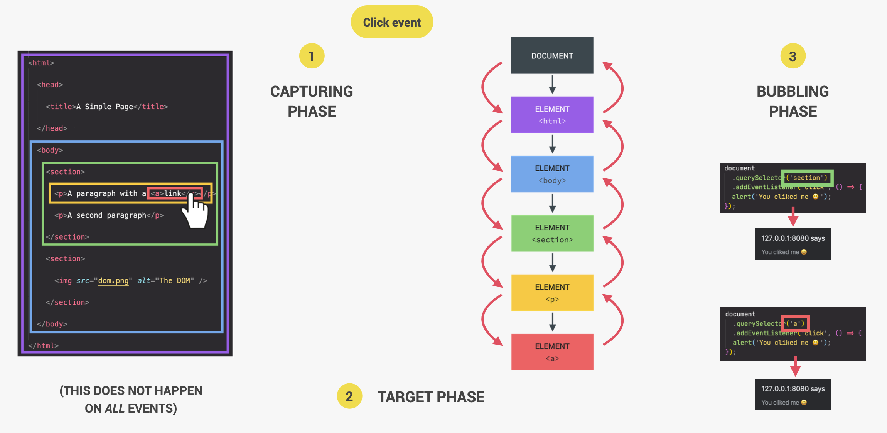

```Html
<!-- Example -->
 <nav class="nav">
  <ul class="nav__links">
    <li class="nav__item">
      <a class="nav__link" href="#">Features</a>
    </li>
  </ul>
</nav>
```

```Js
const randomInt = (min, max) =>
  Math.floor(Math.random() * (max - min + 1) + min);

const randomColor = () =>
`rgb(${randomInt(0, 255)}, ${randomInt(0, 255)}, ${randomInt(0, 255)})`;

// e.target is same because of bubbling phase
// e.currentTarget === this
document.querySelector('.nav__link').addEventListener('click', function (e) {
this.style.backgroundColor = randomColor();
console.log('LINK', e.target, e.currentTarget);

// STOP propagation
// e.stopPropagation();
});

document.querySelector('.nav__links').addEventListener('click', function (e) {
this.style.backgroundColor = randomColor();
console.log('CONTAINER', e.target, e.currentTarget);
});

document.querySelector('.nav').addEventListener('click', function (e) {
this.style.backgroundColor = randomColor();
console.log('NAV', e.target, e.currentTarget);
});


// Change to capture phase: add true
document.querySelector('.nav').addEventListener(
  'click',
  function (e) {
    this.style.backgroundColor = randomColor();
    console.log('NAV', e.target, e.currentTarget);
  },
  true
);
```

**Different** between `target` and `currentTarget`:

- `target` is the element that triggered the event (e.g., the user clicked on).
- `currentTarget` is the element that the event listener is attached to.

### 8.7 Event Delegation: Page Navagation

1. Put the ID of elements that want to scroll to in HTML href
2. Add event listener to common parent element
3. Determine what element originated the event
4. Read the href in javascript, select the element wants to scroll to

Example:

```HTML
<!-- HTML -->
<nav class="nav">
  <ul class="nav__links">
    <li class="nav__item">
      <a class="nav__link" href="#section--1">Features</a>
    </li>
    <li class="nav__item">
      <a class="nav__link" href="#section--2">Operations</a>
    </li>
    <li class="nav__item">
      <a class="nav__link" href="#section--3">Testimonials</a>
    </li>
    <li class="nav__item">
      <a class="nav__link nav__link--btn btn--show-modal" href="#"
              >Open account</a
      >
    </li>
  </ul>
</nav>
```

```Js
// Js
document.querySelector('.nav__links').addEventListener('click', function (e) {
  e.preventDefault();

  // Matching strategy
  // Check child element
  if (e.target.classList.contains('nav__link')) {
    // Use e.target to get the specific element to scroll
    const id = e.target.getAttribute('href');
    document.querySelector(id).scrollIntoView({ behavior: 'smooth' });
  }
});
```

### 8.8 DOM traversing

Example:

```HTML
<div class="header__title">
  <h1>
    When
    <!-- Green highlight effect -->
    <span class="highlight">banking</span>
    meets<br />
    <span class="highlight">minimalist</span>
  </h1>
  <h4>A simpler banking experience for a simpler life.</h4>
  <button class="btn--text btn--scroll-to">Learn more &DownArr</button>
  
</div>
```

#### 8.8.1 Going downwards: child

- Return all-depth specific class children of element

```Js
const h1 = document.querySelector('h1');
// Return all-depth .highlight children in h1
console.log(h1.querySelectorAll('.highlight'));
console.log(h1.childNodes);
// NodeList(9) [text, comment, text, span.highlight, text, br, text, span.highlight, text]
```

- Only direct children

```Js
// .children only works for direct children
console.log(h1.children);
// HTMLCollection(3) [span.highlight, br, span.highlight]
```

- Get first or last children

```Js
h1.firstElementChild.style.color = 'white';
// span.highlight (first one)
h1.lastElementChild.style.color = 'orangered';
// span.highlight (second one)
```

#### 8.8.2 Going upwards: parent

- Return direct parent

```Js
console.log(h1.parentNode);
//<div class="header__title">...</div>
console.log(h1.parentElement);
//<div class="header__title">...</div>
```

- `closest()`: method of the Element interface traverses the **element** and its parents (heading toward the document root) until it finds a node that **matches the specified CSS selector**. The closest **ancestor Element** or **itself**, which matches the selectors. If there are no such element, null. **Very good for Event Delegation**.

```Js
// In this example: find h1's the closest parent element has 'header' class
h1.closest('header').style.background = 'var(--gradient-secondary)';
```

#### 8.8.3 Going sideways: siblings

- Js can only access direct siblings

```Js
console.log(h1.previousElementSibling);
// null
console.log(h1.nextElementSibling);
// <h4>A simpler banking experience for a simpler life.</h4>
```

- If want to get all siblings, traversing to parent element and get children

```Js
console.log(h1.parentElement.children);
// HTMLCollection(4)
// 0: h1
// 1: h4
// 2: button.btn--text.btn--scroll-to
// 3: img.header__img
// length: 4

[...h1.parentElement.children].forEach(function (el) {
  if (el !== h1) el.style.transform = 'scale(0.5)';
});

```

### 8.9 Tabbed component

```Js
const tabs = document.querySelectorAll('.operations__tab');
const tabsContainer = document.querySelector('.operations__tab-container');
const tabsContent = document.querySelectorAll('.operations__content');

tabsContainer.addEventListener('click', function (e) {
  const clicked = e.target.closest('.operations__tab');

  // Guard clause: prevent other elements are clicked
  if (!clicked) return;

  // Active tab
  tabs.forEach(t => t.classList.remove('operations__tab--active'));
  clicked.classList.add('operations__tab--active');
  tabsContent.forEach(c => c.classList.remove('operations__content--active'));

  // Active content area
  document
    .querySelector(`.operations__content--${clicked.dataset.tab}`)
    .classList.add('operations__content--active');
});
```

### 8.10 Passing arguments to event handlers

Use `bind()` to add extra arguments.

```Js
// Menu fade animation
const handleHover = function (e) {
  if (e.target.classList.contains('nav__link')) {
    const link = e.target;
    const siblings = link.closest('.nav').querySelectorAll('.nav__link');
    const logo = link.closest('.nav').querySelector('img');

    siblings.forEach(el => {
      // this equal to addithional parameter
      if (el !== link) el.style.opacity = this;
    });
    logo.style.opacity = this;
  }
};

// Passing "argument" into handler
nav.addEventListener('mouseover', handleHover.bind(0.5));
```

### 8.11 The intersection Observer API

```Js
// callback function: get called each time that the observed element(target element) is intersecting the root element at the threshold that we defined.
const obsCallback = function (entries, observer) {
  // Use it for more threshold
  entries.forEach(entry => {
    console.log(entry);
  });
};

// condition
const obsOptions = {
  // root: the element that the target is intersecting
  // null means viewpoint
  root: null,
  // the percentage of the intersection at which the observer callback will be called
  // threshold: 0.1,
  // 0: trigger out of view, 0.2: trigger 20% when in to the view
  threshold: [0, 0.2],
};

const observer = new IntersectionObserver(obsCallback, obsOptions);

// target element
observer.observe(section1);
```

Example to implement **Sticky Navigation**

```Js
const header = document.querySelector('header');
const navHeight = nav.getBoundingClientRect().height;

const stickyNav = function (entries) {
  // Using destruct to get the first index value
  // Use it for only one threshold
  const [entry] = entries;
  console.log(entry);
  if (!entry.isIntersecting) nav.classList.add('sticky');
  else nav.classList.remove('sticky');
};

const headerObserver = new IntersectionObserver(stickyNav, {
  root: null,
  threshold: 0,
  rootMargin: `-${navHeight}px`,
});
headerObserver.observe(header);
```

### 8.12 Revealing elements on Scroll

Also use the intersectin observer.

```JS
// Reveal sections
const allSections = document.querySelectorAll('.section');

const revealSection = function (entries, observe) {
  const [entry] = entries;
  if (!entry.isIntersecting) return;
  entry.target.classList.remove('section--hidden');

  // Being unobserve after first time
  observe.unobserve(entry.target);
};

const sectionObserver = new IntersectionObserver(revealSection, {
  root: null,
  threshold: 0.15,
});

allSections.forEach(function (section) {
  sectionObserver.observe(section);
  section.classList.add('section--hidden');
});
```

### 8.13 Lazy Loading Images

Handle lazy laoding images by using load before image and display image after loading.

```Js
// Lazy loading images
// Select imgs which have data-src attribute
const imgTargets = document.querySelectorAll('img[data-src]');

const loadImg = function (entries, observe) {
  const [entry] = entries;

  if (!entry.isIntersecting) return;

  // Replace src with data-src
  entry.target.src = entry.target.dataset.src;
  entry.target.addEventListener('load', function () {
    entry.target.classList.remove('lazy-img');
  });

  observe.unobserve(entry.target);
};

const imgObserver = new IntersectionObserver(loadImg, {
  root: null,
  threshold: 0,
  rootMargin: '200px',
});

imgTargets.forEach(img => imgObserver.observe(img));
```

### 8.14 defer and async

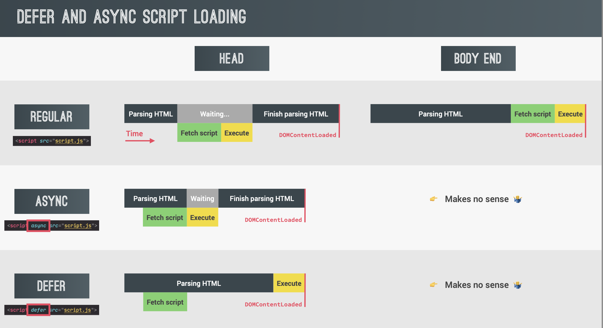
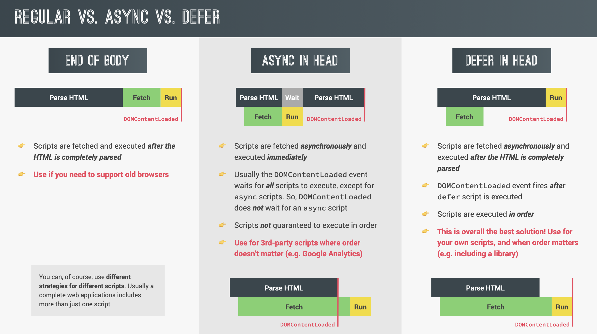

**Why use defer?**

The defer attribute is a good choice for scripts that need to **interact with the DOM**, such as scripts that initialize widgets or add event listeners.

## 9. Object Oriented programming

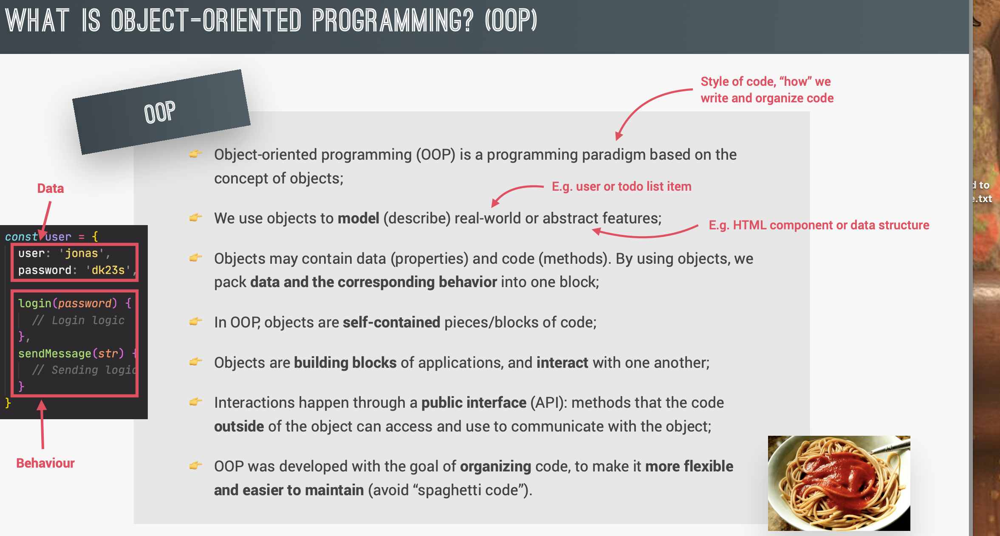

### 9.1 The 4 fundamental OOP principles

#### 9.1.1 Abstraction

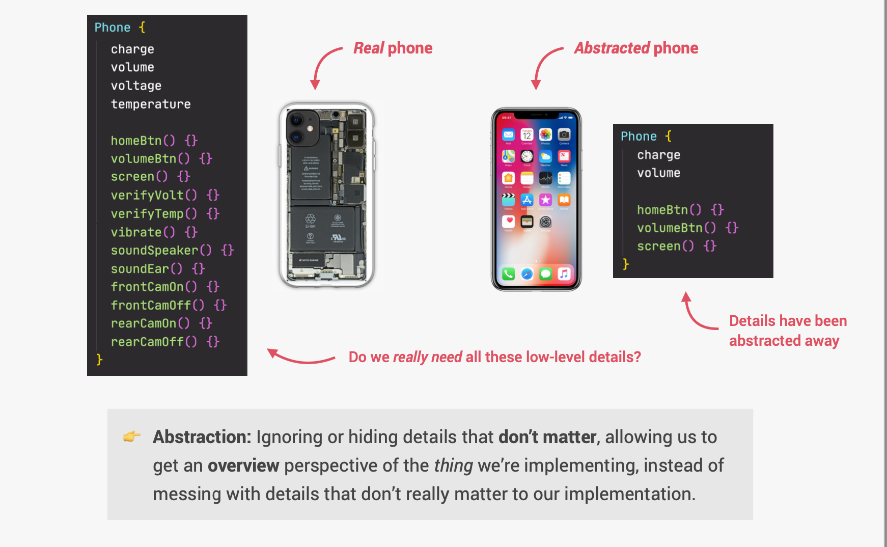

#### 9.1.2 Encapsulation

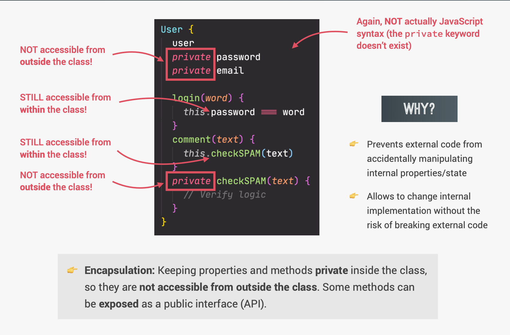

#### 9.1.3 Inheritance

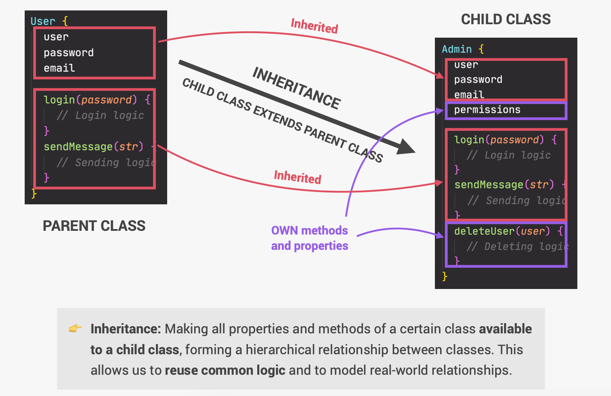

#### 9.1.4 Polymorphism

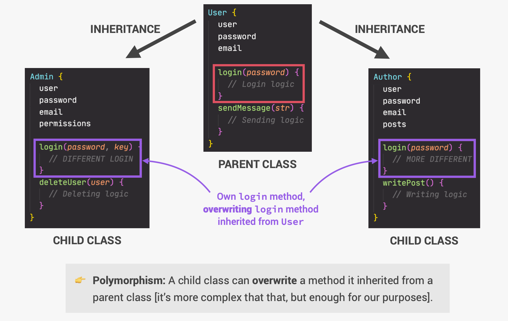

### 9.2 OOP in Javascript

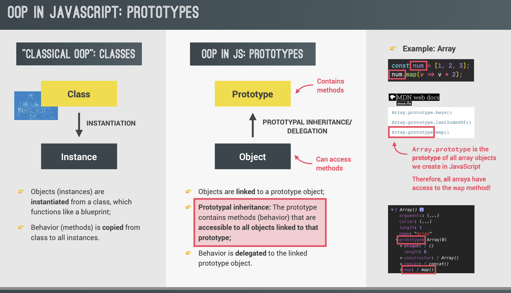

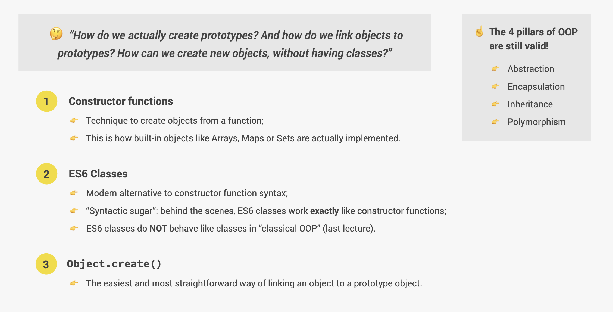

### 9.3 Constructor functions and the new Operator

- New {} is created
- Function is called, this = {}
- {} linked to prototype
- Function automatically return {}

```Js
// Constructor name should be capitalised
const Person = function (firstName, birthYear) {
  // Instance properties
  this.firstName = firstName;
  this.birthYear = birthYear;

  // Never create a method inside of a construtor function
  // this.calcAge = function () {
  //   console.log(2037 - this.birthYear);
  // };
};

const ella = new Person('Ella', 1998);
console.log(ella);
// Person {firstName: 'Ella', birthYear: 1998}

console.log(ella instanceof Person);
// true
```

**Never create a method inside of a construtor function, not good for performance.**

### 9.4 Prototypes

```Js
console.log(Person.prototype);

// {constructor: ƒ}
// calcAge: ƒ ()
// species: "China"
// constructor: ƒ (firstName, birthYear)
// [[Prototype]]: Object

Person.prototype.calcAge = function () {
  console.log(2037 - this.birthYear);
};

ella.calcAge();
// 39
console.log(ella.__proto__);
// {calcAge: ƒ, constructor: ƒ}
```

`species` property is not inside of the ella object, it can access to ella object because it's in the prototype of person.

```Js
Person.prototype.species = 'China';
console.log(ella.species);
// China

console.log(ella.hasOwnProperty('firstName'));
// true
console.log(ella.hasOwnProperty('species'));
// false

```

### 9.5 Prototype inheritance and the prototype chain

- Prototype inheritance

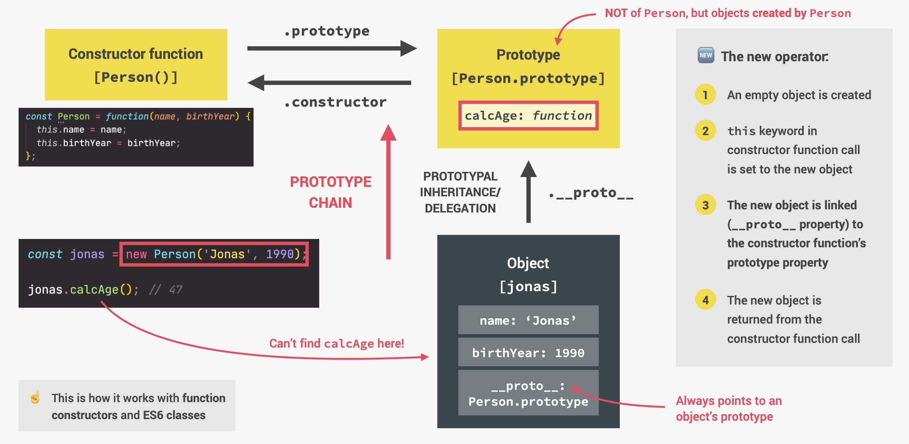

```Js
console.log(ella.__proto__ === Person.prototype);
// true
console.log(ella.__proto__);
// {species: 'China', calcAge: ƒ, constructor: ƒ}
// Object.prototype (top of prototype chain)
console.log(ella.__proto__.__proto__);
// {constructor: ƒ, __defineGetter__: ƒ, __defineSetter__: ƒ, hasOwnProperty: ƒ, __lookupGetter__: ƒ, …}
console.log(ella.__proto__.__proto__.__proto__);
// null
console.dir(Person.prototype.constructor);
// ƒ Person(firstName, birthYear)

```

- Prototype chain

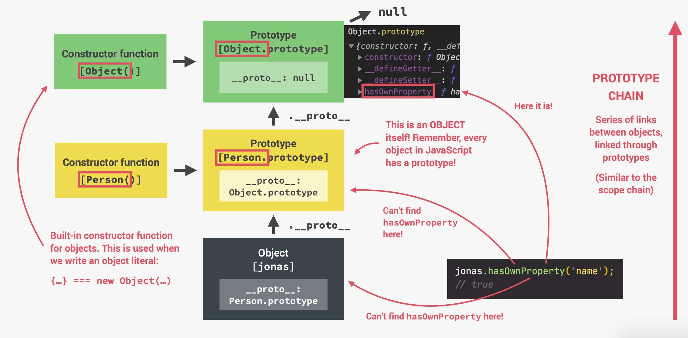

```Js

const arr = [1, 2, 3, 4, 5, 5];
console.log(arr.__proto__);
// [constructor: ƒ, at: ƒ, concat: ƒ, copyWithin: ƒ, fill: ƒ, …]
console.log(arr.__proto__ === Array.prototype);
// true
console.log(arr.__proto__.__proto__);
// {constructor: ƒ, __defineGetter__: ƒ, __defineSetter__: ƒ, hasOwnProperty: ƒ, __lookupGetter__: ƒ, …}

// Don't do it frequently
Array.prototype.unique = function () {
  return [...new Set(this)];
};

console.log(arr.unique());
// [1, 2, 3, 4, 5]
```

`__proto__` is the actual object that is used in the lookup chain to resolve methods.
`prototype` is the object that is used to build **proto** when you create an object with new.

### 9.6 ES6 Classes

- Classes are NOT hoisted
- Classes are first-class citizes
- Classes are executed in strick mode

Two ways to use classes:

```Js
// First letter capitalized
// class expression
const PersonCl = class {}

// class declaration
class PersonCL {
  constructor(firstName, birthYear) {
    this.firstName = firstName;
    this.birthYear = birthYear;
  }

  // No comma(,) between methods
  // Prototype
  calcAge() {
    console.log(2037 - this.birthYear);
  }

}

const jessica = new PersonCL('Jessica', 1998);
console.log(jessica);

console.log(jessica.__proto__ === PersonCL.prototype);
// true
```

### 9.7 Setters and Getters

The `get` syntax binds an object property to a function that will be called when that property is looked up. It can also be used in classes

The `set` syntax binds an object property to a function to be called when there is an attempt to set that property. It can also be used in classes.

- Used in `object`:

```Js
// In object
const account = {
  owner: 'Ella',
  movements: [200, 530, 120, 300],

  get lastest() {
    return this.movements.slice(-1).pop();
  },

  set lastest(mov) {
    this.movements.push(mov);
  },
};

// Don't need to call the function
console.log(account.lastest);
// 300
account.lastest = 50;
console.log(account.movements);
// [200, 530, 120, 300, 50]

```

- Used in `class` (Good for data validation)

```Js
class PersonCL {
  constructor(fullName, birthYear) {
    this.fullName = fullName;
    this.birthYear = birthYear;
  }

  get age() {
    return 2037 - this.birthYear;
  }

  // Very good for data validation
  set fullName(name) {
    console.log(name);
    // _ means not a js features
    if (name.includes(' ')) this._fullName = name;
    else alert(`${name} is not a full name`);
  }

  get fullName() {
    return this._fullName;
  }
}

const jessica = new PersonCL('Jessica Green', 1998);
console.log(jessica.age);
// 39
```

### 9.8 Static Method

**Instance Method**: Called on specific instances, method will be added to .prototype property.

**Static Method**: Called directly on the constructor function, not available in the instances.

```Js
class PersonCL {
  constructor(fullName, birthYear) {
    this.fullName = fullName;
    this.birthYear = birthYear;
  }

  // Instance method
  calcAge() {
    console.log(2037 - this.birthYear);
  }

  get age() {
    return 2037 - this.birthYear;
  }

  get fullName() {
    return this._fullName;
  }

  // Static method:
  static hey() {
    console.log('Her there');
    console.log(this);
  }
}

const jessica = new PersonCL('Jessica Green', 1998);
console.log(jessica.age);
// 39

// Static Method call
PersonCL.hey();
```

### 9.9 Object.create()

Create a new object, using an existing object as the prototype of the newly created object.

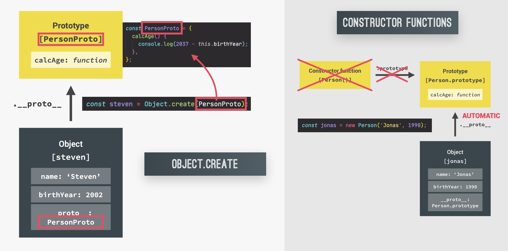

```Js
// First letter capitalized
const PersonProto = {
  calcAge() {
    console.log(2037 - this.birthYear);
  },

  init(firstName, birthYear) {
    this.firstName = firstName;
    this.birthYear = birthYear;
  },
};

const sarah = Object.create(PersonProto);
sarah.init('Satah', 1979);
sarah.calcAge();
// 58

```

### 9.10 Inheritance between "Classes"

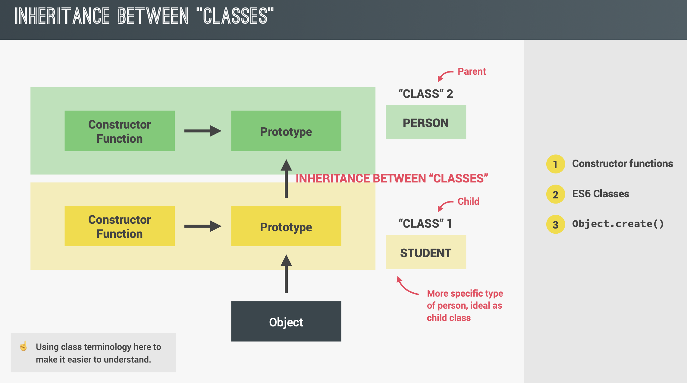

#### 9.10.1 Constructor Functions

- Use `call` to link `this` in constructor.
- Use `Object.create()` to link prototypes.
- Set the constructor
- 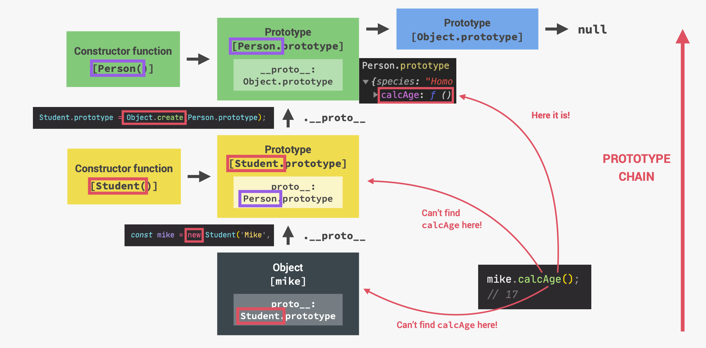

```Js
// Parent
const Person = function (firstName, birthYear) {
  this.firstName = firstName;
  this.birthYear = birthYear;
};

Person.prototype.calcAge = function () {
  console.log(2037 - this.birthYear);
};

// Child
const Student = function (firstName, birthYear, course) {
  // Use call to link this in constructor
  Person.call(this, firstName, birthYear);
  this.course = course;
};

// Linking prototypes
Student.prototype = Object.create(Person.prototype);

// Set the Student
Student.prototype.constructor = Student;

// Add for function in child
Student.prototype.introduce = function () {
  console.log(`My name is ${this.firstName} and I study ${this.course}`);
};


// Test
const mike = new Student('Mike', 1998, 'Computer Science');
console.log(mike);
// Student {firstName: 'Mike', birthYear: 1998, course: 'Computer Science'}
mike.introduce();
// My name is Mike and I study Computer Science
mike.calcAge();
// 39
```

#### 9.10.2 ES6 Classes

- Use `extend` to inheritance Parent constructor
- Use `super()` to link

```Js
// Parent
class PersonCL {
  constructor(fullName, birthYear) {
    this.fullName = fullName;
    this.birthYear = birthYear;
  }

  calcAge() {
    console.log(2037 - this.birthYear);
  }
}

// Child
class StudentCL extends PersonCL {
  constructor(fullName, birthYear, course) {
    // super(): used to access properties on an object literal or class's [[Prototype]], or invoke a superclass's constructor.
    // Always needs to happen first!
    super(fullName, birthYear);
    this.course = course;
  }

  introduce() {
    console.log(`My name is ${this.fullName} and I study ${this.course}`);
  }
}

// Test
const martha = new StudentCL('Martha Jones', 2012, 'Computer Science');
martha.introduce();
// My name is Martha Jones and I study Computer Science
martha.calcAge();
// 25
```

#### 9.10.3 Object.create

- Use `Object.create()` create child prototype.
- Use `call()` to link prototype initial function.
- creat child object.

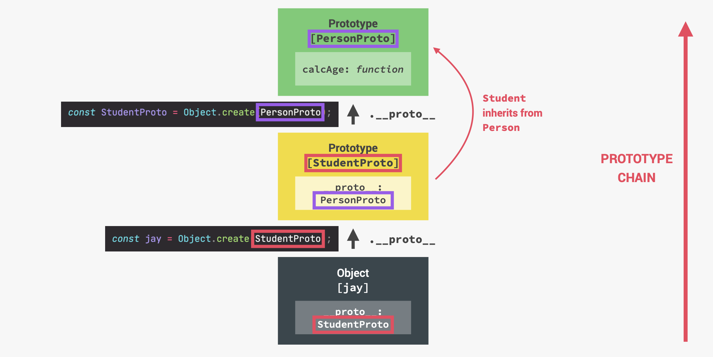

```Js
// Parent
const PersonProto = {
  calcAge() {
    console.log(2037 - this.birthYear);
  },

  init(firstName, birthYear) {
    this.firstName = firstName;
    this.birthYear = birthYear;
  },
};

// Child
const StudentProto = Object.create(PersonProto);
StudentProto.init = function (firstName, birthYear, course) {
  PersonProto.init.call(this, firstName, birthYear);
  this.course = course;
};

// Child add more function
StudentProto.introduce = function () {
  console.log(`My name is ${this.firstName} and I study ${this.course}`);
};

// Instance Object
const jay = Object.create(StudentProto);

// Test
jay.init('Jay', 2010, 'Computer Science');
jay.introduce();
// My name is Jay and I study Computer Science
jay.calcAge();
// 27
```

### 9.11 Encapsulation

#### 9.11.1 Protected Properties and Method

Add `_` for parameter to indicate privacy. (This is just a developer convention)

```Js
// protected property
  this._pin = pin;
  this._movements = [];
```

#### 9.11.2 Private Class Fields and Methods

- Public fields
- Private fields (Use `#`)
- Public methods
- Private methods (Use `#`)

```Js
class Account {
  // 1) Public fields (instances)
  locale = navigator.language;

  // 2) Private fields (instances)
  #movements = [];
  // Declare the empty private value because pin will be assignmented later
  #pin;
  constructor(owner, currency, pin) {
    this.owner = owner;
    this.currency = currency;
    // protected property
    this.#pin = pin;
    // this._movements = [];
    // this.locale = navigator.language;

    console.log(`Thanks for opening an account, ${owner}`);
  }

  // 3) Public method
  // Public interface
  getMovements() {
    return this.#movements;
  }

  deposit(val) {
    this.#movements.push(val);
    return this;
  }

  withdraw(val) {
    this.deposit(-val);
    return this;
  }

  requestLoan(val) {
    if (this.#approveLoan(val)) {
      this.deposit(val);
      console.log(`Loan approved`);
      return this;
    }
  }

  // 4) Private method
  #approveLoan(val) {
    return true;
  }
}
```

#### 9.11.3 Chaining Methods

```Js
acc1.deposit(300).deposit(500).withdraw(35).requestLoan(25000).withdraw(4000);
console.log(acc1.getMovements());
//  [300, 500, -35, 25000, -4000]
```

#### 9.11.4 ES6 Classes Summary

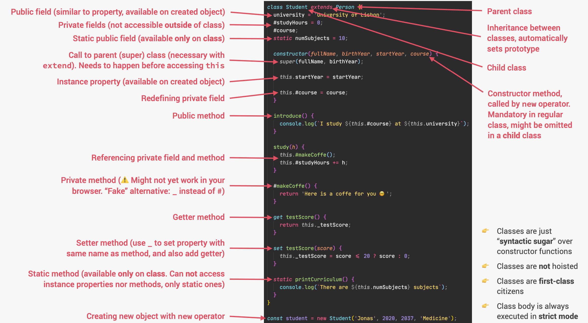

## 10. Javascript works behind the scenes

### 10.1 An high-level overview of javascript

- High-level
- Garbage-collected
- Interpreted or just-in-time compiled
- Multi-paradigm
- Prototype-based object-oriented
- First-class function
- Dynamic
- Single-threaded
- Non-blocking event loop

### 10.2 The javascript engine and runtime

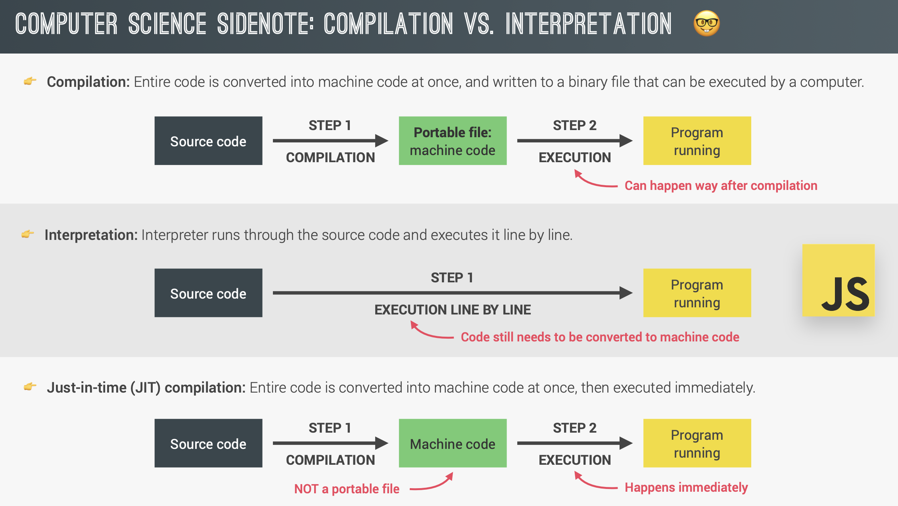

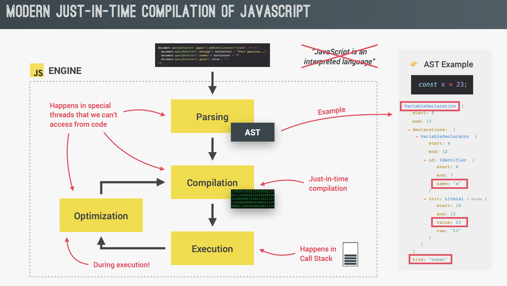

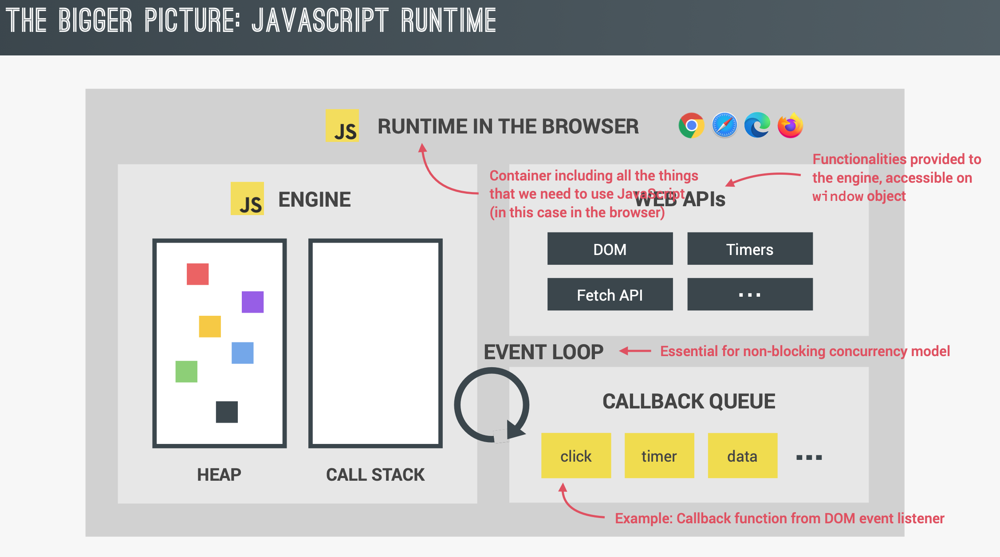

### 10.3 Execution contexts and the Call stack

#### 10.3.1 Execution Context

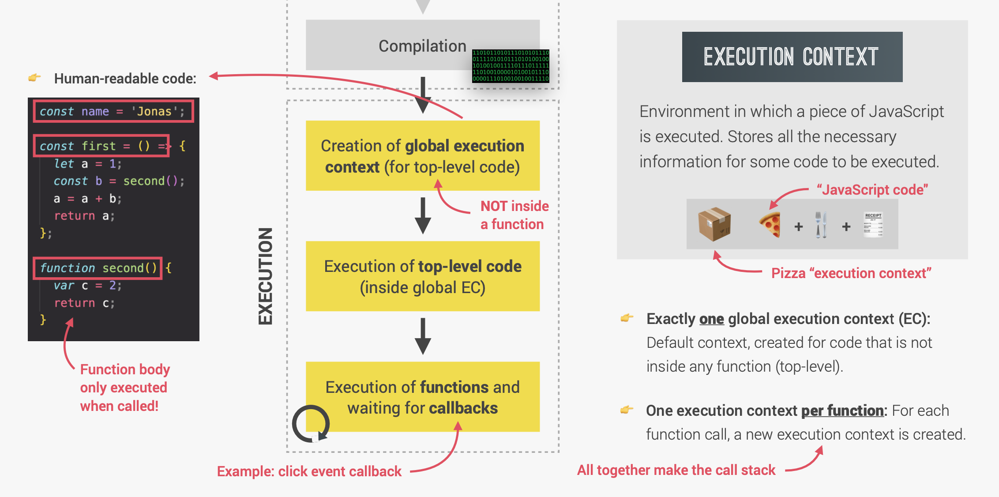

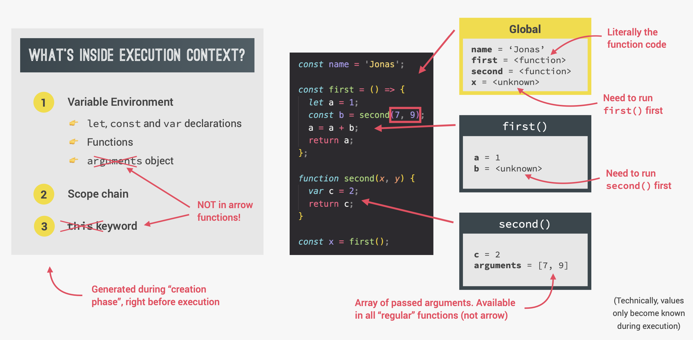

#### 10.3.2 Call Stack

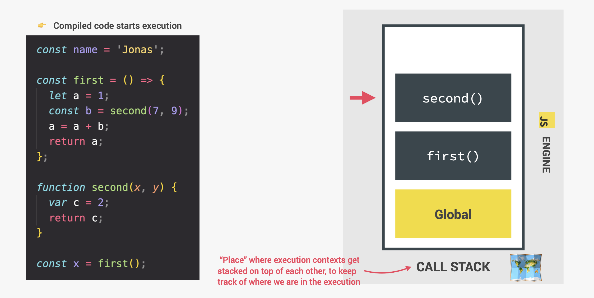

### 10.4 Scope and the scope chain

#### 10.4.1 Scope concepts

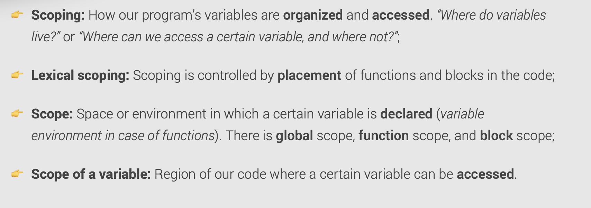

#### 10.4.2 The 3 types of scope

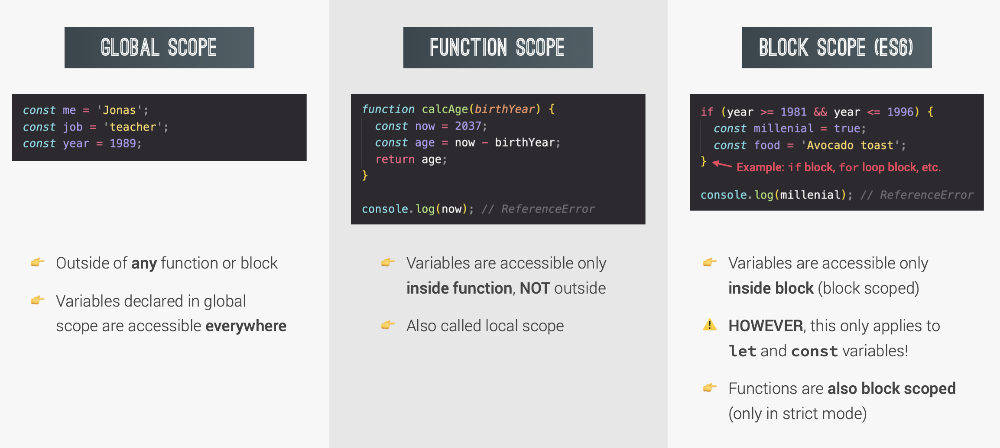

#### 10.4.3 The Scope Chain

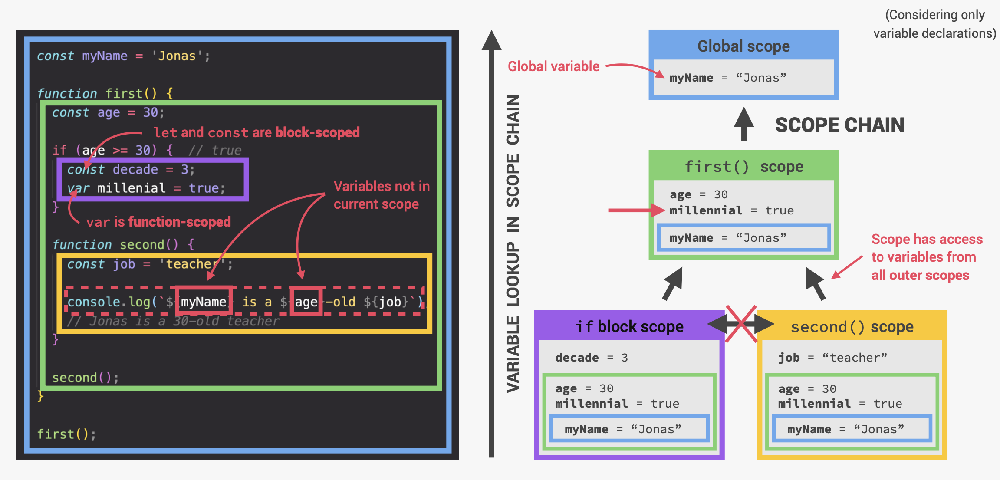

#### 10.4.4 Scope chain vs call stack

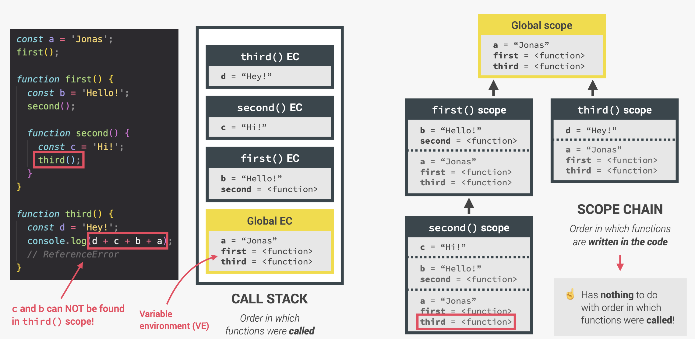

### 10.5 Hoisting and TDZ

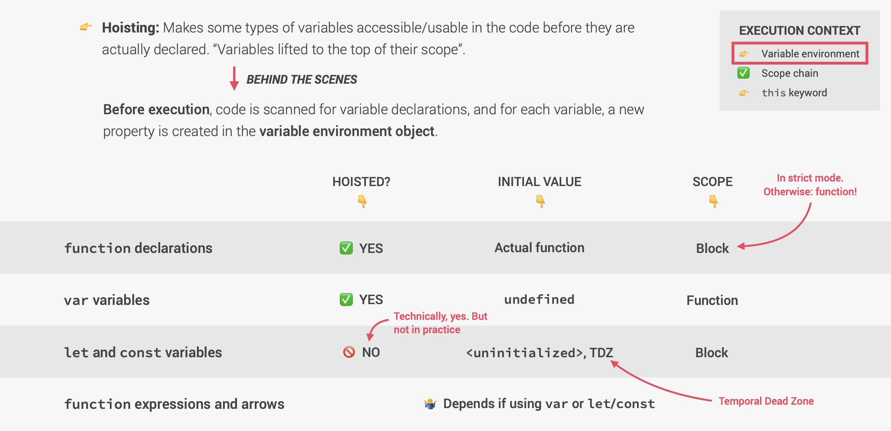

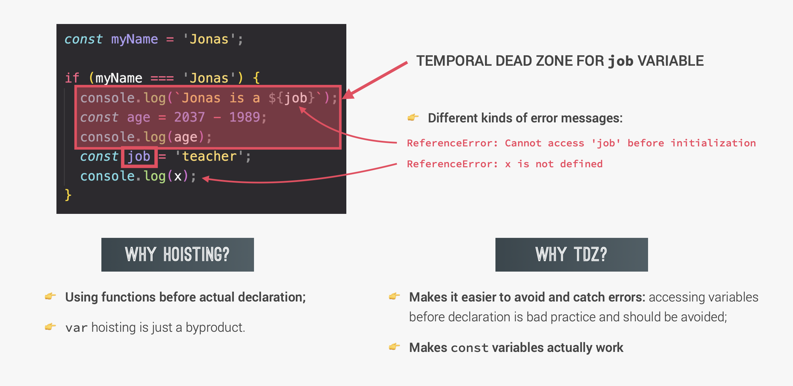

#### 10.5.1 Hoisting Paractice

- hoisting in functions:

```Js
// Functions
console.log(addDecl(2, 3));
// 5
console.log(addExpr(2, 3));
// get error

function addDecl(a, b) {
  return a + b;
}

const addExpr = function (a, b) {
  return a + b;
};
```

- Why don't use `var`:
  - The initial value of `var` is `undefined` before it declaration. If use it in function to check false or true, it will influennce the result.
  - `var` will create window object.

```Js
console.log(undefined);
if (!numProducts) deleteShoppingCart();
// deleteShoppingCart() will be called but numProduct is true in reality.

var numProducts = 10;

function deleteShoppingCart() {
  console.log('All products deleted!');
}
```

### 10.6 The this keyword

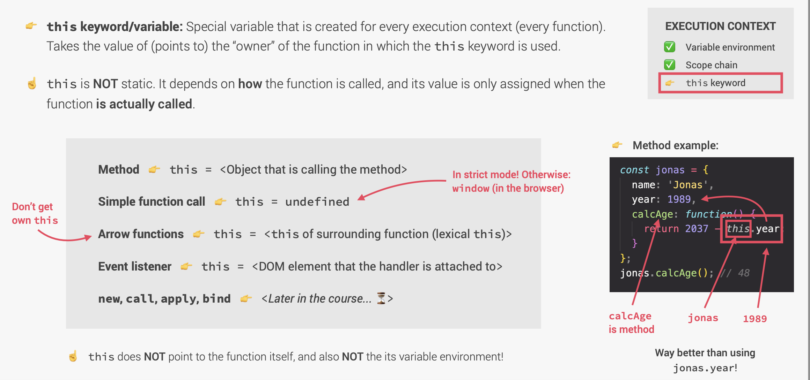

- Simple function call

```Js
const calcAge = function (birthYear) {
  console.log(2037 - birthYear);
  console.log(this);
};

calcAge(1998);
// 39
// undefined
```

- Arrow function call

```Js
const calcAgeArrow = birthYear => {
  console.log(2037 - birthYear);
  console.log(this);
};

calcAgeArrow(1980);
// 57
// Window {window: Window, self: Window, document: document, name: '', location: Location, …}
```

- Object method

```Js
const jonas = {
  year: 1991,
  calcAge: function () {
    console.log(this);
  },
};

jonas.calcAge();
// {year: 1991, calcAge: ƒ}
```

### 10.7 Regular functions vs arrow functions

Use arrow function to solve the problem when write nested method in an object method

```Js
const jonas = {
  firstName: 'Jonas',
  year: 1991,
  calcAge: function () {
    console.log(this);
    console.log(2037 - this.year);

    // If we write inner function, this will be undefined because in default, this in function is undefined.
    const isMillenial = function () {
      console.log(this.year >= 1991 && this.year <= 1996);
      // Uncaught TypeError: Cannot read properties of undefined (reading 'year')
    };

    // Solution1 (before ES6): write self outer and use scope chain
    const self = this;
    const isMillenial = function () {
      console.log(self.year >= 1991 && self.year <= 1996);
      // Uncaught TypeError: Cannot read properties of undefined (reading 'year')
    };

    // Solution2 (ES6): use arrow function which doesn't have this keyword and will use its parent this keyword
    const isMillenial = () => {
      console.log(this.year >= 1991 && this.year <= 1996);
    };
    isMillenial();
  },

  // Never use an arrow function as a method
  greet: () => console.log(`Hey ${this.firstName}`),
};
```

### 10.8 Primitives VS. Objects

- Primitive types:

  - Number
  - String
  - Boolean
  - Undefined
  - Null
  - Symbol
  - BigInt

- Objects (Reference types):

  - Object literal
  - Arrays
  - Functions
  - ...

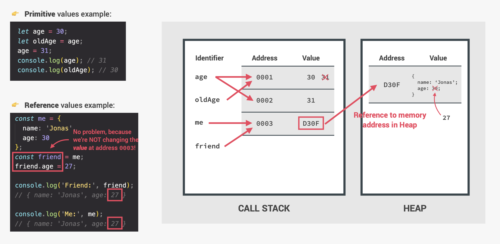

- Primitives values example:

  - In call Stack, `age` and `oldAge` points to same address 0001.
  - When `age` changes value from 30 to 31, a new address 0002 will be created.
  - `oldAge` still points to address 0001, `age` will point to 0002.
  - `age` changes to 31, `oldAge` still be 30.

- Reference values example:

  - `me` and `friend` point to the same Address 0003, values is a heap address D30F
  - when `friend` changes the value from object, the value in heap address will change, but heap address will not change.
  - `me` and `friend` change together.

- `Object.assign()`: shallow copy the object.

```Js
// Copying objects
const jessica = {
  firstName: 'Jessica',
  lastName: 'Williams',
  age: 27,
};

const jessicaCopy = Object.assign({}, jessica);
jessica.lastName = 'Davis';
console.log('Before marriage:', jessica);
// Before marriage: {firstName: 'Jessica', lastName: 'Davis', age: 27}
console.log('After marriage', jessicaCopy);
// After marriage {firstName: 'Jessica', lastName: 'Williams', age: 27}
```

## 11. Numbers, Dates, Intl and Timers

### 11.1 Converting and Checking Numbers

Js only has **one** data type for all numbers

```Js
console.log(23 === 23.0);
// true
```

#### 11.1.1 Number convertion and coercion

- convertion

```Js
console.log(Number('23'));
// 23
```

- coercion
  `+number` in string will trigger js type coercion, change type from string to number

```Js
console.log(+'23');
// 23
```

#### 11.1.2 Parsing

`Number.parseInt(string, regex)`: get the integer number for a string which starts with number in a regex type.

```Js
console.log(Number.parseInt('30px', 10));
// 30
console.log(Number.parseInt('30px', 16));
// 48
console.log(Number.parseInt('s30px'));
// NaN
```

`Number.parseFloat()`: get the float number for a string which starts with number.

```Js
console.log(Number.parseFloat('2.5rem'));
// 2.5
console.log(Number.parseInt('2.5rem'));
// 2
```

#### 11.1.3 Number Check

`Number.isNaN()`: check if any value is NaN. But it will treat float and (number / 0) a number.

```Js
console.log(Number.isNaN(20));
// false
console.log(Number.isNaN('20'));
// false
console.log(Number.isNaN(+'20X'));
// true
// However, it will check 20 / 0 is a number
console.log(Number.isNaN(20 / 0));
// false
```

`Number.isFinite()`: check if the input is a finite number. **Best way to check if value is a number**

```Js
console.log(Number.isFinite(20));
// true
console.log(Number.isFinite('20'));
// false
console.log(Number.isFinite(+'20X'));
// false
console.log(Number.isFinite(20 / 0));
// false
```

`Number.isInteger()`: check if the input is an integer.

```Js
console.log(Number.isInteger(23));
// true
console.log(Number.isInteger(23.0));
// true
console.log(Number.isInteger(23.1233));
// false
console.log(Number.isInteger(20 / 0));
// false
```

### 11.2 Math and Rounding

#### 11.2.1 Math

- `Math.sqrt()`: get the square root.

```Js
console.log(Math.sqrt(25));
// 5
console.log(25 ** (1 / 2));
// 5
console.log(8 ** (1 / 3));
// 2
```

- `Math.max()`: get the maximum value, can get type coercion but no parsing.

```Js
console.log(Math.max(5, 12, 3, '23', 4));
// 23
```

- `Math.min()`: get the minimum value, can get type coercion but no parsing.

```Js
console.log(Math.min(5, 12, 3, '23', 4));
// 3
```

- `Math.PI`: get the value of PI.

```Js
console.log(Math.PI);
// 3.141592653589793;
```

#### 11.2.2 Round Integer

- `Math.random()`: generate a number greater than or equal to 0 and less than 1.
- `Math.trunc()`: Remove any decimal part.
- `Math.round()`: returns the value of a number rounded to the nearest integer.
- `Math.ceil()`: rounds up and returns the smallest integer greater than or equal to a given number.
- `Math.floor()`: always rounds down and returns the largest integer less than or equal to a given number.

```Js
console.log(Math.round(23.3));
// 23
console.log(Math.round(23.9));
// 24

console.log(Math.ceil(23.3));
// 24
console.log(Math.ceil(23.9));
// 24

console.log(Math.floor(23.3));
// 23
console.log(Math.floor(23.9));
// 23
console.log(Math.floor(-23.3));
// -24
```

```Js
// Return the value between min and max
const randomInt = (min, max) =>
  Math.floor(Math.random() * (max - min + 1)) + min;
```

#### 11.2.3 Round Decimal

- `.toFixed()`: return a string which the decimal number rounded in selected digit.

```Js
console.log((2.7).toFixed(0));
// 3
console.log((2.7).toFixed(3));
// 2.700
console.log((2.345).toFixed(2));
// 2.35
//convert string to a number
console.log(+(2.345).toFixed(2));
```

### 11.3 The Remainder Operator

`%`

```Js
console.log(5 % 2);
// 1
```

### 11.4 Numeric Separators

Js can use `_` to separate numbers, but it can not use in string and just display which is not change the value.

```Js
// 287, 460, 000, 000
const diameter = 287_460_000_000;
console.log(diameter);
// 287460000000

const price = 345_99;
console.log(price);
// 34599

console.log(Number('230_000'));
// NaN
```

###] 11.5 BigInt

#### 11.5.1 Syntax

The biggest number js can store:

```Js
console.log(Number.MAX_SAFE_INTEGER);
// 9007199254740991
```

Use `n` to denote BigInt.

```Js
const huge = 10000000000000000000000000n;
```

#### 11.5.2 Operations

- `BigInt` can't mix with other types. Use type coercion to compute BigInt and Number.

```Js
const num = 23;
const huge = 10000000000000000000000000n;
console.log(huge * BigInt(num));
// 230000000000000000000000000n
```

- logical operator

```Js
console.log(20n > 15);
// true
console.log(20n === 20);
// false
console.log(20n == 20);
// true
console.log(typeof 20n);
// bigint
```

- string concatenations

```Js
console.log(huge + '  is REALLY big!!!');
// 10000000000000000000000000  is REALLY big!!!
```

- Division: Divisions will return the closest BigInt.

```Js
console.log(10n / 3n);
// 3n
console.log(10 / 3);
// 3.3333333333333335
```

### 11.6 Creating Dates

- Create a date.

```Js
const now = new Date();
console.log(now);
// Tue Dec 05 2023 18:20:37 GMT+1100 (Australian Eastern Daylight Time)
```

- Js can parse string dynamically.

```Js
console.log(new Date('Tue Dec 05 2023 18:20:46'));
console.log(new Date(2037, 10, 19, 15, 23, 5));
// Thu Nov 19 2037 15:23:05 GMT+1100 (Australian Eastern Daylight Time)
// Js can auto correct the day
console.log(new Date(2037, 10, 31));
// Tue Dec 01 2037 00:00:00 GMT+1100 (Australian Eastern Daylight Time)

```

- JavaScript stores dates as number of milliseconds since January 01, 1970.

```Js
console.log(new Date(0));
// 3 days after January 01, 1970
console.log(new Date(3 * 24 * 60 * 60 * 1000));
// Sun Jan 04 1970 10:00:00 GMT+1000 (Australian Eastern Standard Time)
```

- Working with dates

```Js
const future = new Date(2037, 10, 19, 15, 23);

// Get year, moth, day...
console.log(future.getFullYear());
// 2037
console.log(future.getMonth());
// 10 (0 base)
console.log(future.getDate());
// 19 (the day of month)
console.log(future.getDay());
// 4 (the day of week)
console.log(future.getHours());
// 15
console.log(future.getMinutes());
// 23
console.log(future.getSeconds());
// 0
console.log(future.toISOString());
// 2037-11-19T04:23:00.000Z (International standard)
console.log(future.getTime());
// 2142217380000 (Timestamp of milliseconds since January 01, 1970)
console.log(Date.now());
// 1701763386968 (Timestamp now)

// Set method
future.setFullYear(2040);
console.log(future);
// Mon Nov 19 2040 15:23:00 GMT+1100 (Australian Eastern Daylight Time)
```

- Calculate days pased

```Js
const calcDaysPasses = (date1, date2) =>
  Math.round(Math.abs(date2 - date1) / (1000 * 60 * 60 * 24));
```

### 11.7 Internationalizing(Intl)

#### 11.7.1 Dates

Used in different language and country.

```Js
    // Get the current date
    const now = new Date();

    // Set options to formate date
    const options = {
      hour: 'numeric',
      minute: 'numeric',
      day: 'numeric',
      month: 'long',
      year: 'numeric',
      weekday: 'short',
    };

    // Get the Browser's language
    const locale = navigator.language;

    // Display the current date in Intl format in <span>
    labelDate.textContent = new Intl.DateTimeFormat(
      locale,
      options
    ).format(now);
```

[ISO_format](http://www.lingoes.net/en/translator/langcode.htm)

[More-Intl](https://developer.mozilla.org/en-US/docs/Web/JavaScript/Reference/Global_Objects/Intl)

#### 11.7.2 Numbers

```Js
const num = 100000000.23;

const options = {
  style: 'unit',
  unit: 'mile-per-hour',
};
console.log('US: ', new Intl.NumberFormat('en-US', options).format(num));
// US:  100,000,000.23 mph
console.log('Germany: ', new Intl.NumberFormat('de-DE', options).format(num));
// Germany:  100.000.000,23 mi/h
```

### 11.8 Timers: setTimeout and setInterval

#### 11.8.1 setTimeout

Run the function after x-ms.

```Js
// setTimeout;
setTimeout(() => console.log('Here is your pizza 🍕'), 3000);
console.log('Waiting...');

// Add arguments
setTimeout(
  (ing1, ing2) => console.log(`Here is your pizza 🍕 with ${ing1} and ${ing2}`),
  3000,
  'olives',
  'spinach'
);
// Here is your pizza 🍕 with olives and spinach

// clear the Timeout
const ingredients = ['olives', 'spinach'];
const pizzaTimer = setTimeout(
  (ing1, ing2) => console.log(`Here is your pizza 🍕 with ${ing1} and ${ing2}`),
  3000,
  ...ingredients
);

if (ingredients.includes('spinach')) clearTimeout(pizzaTimer);
```

#### 11.8.1 setInterval

Loop the function after every x-ms.

```Js
// setInterval;
setInterval(function () {
  const now = new Date();
  console.log(now);
}, 3000);
```

## 12 Mapty App

### 12.1 How to Plan a Web Project

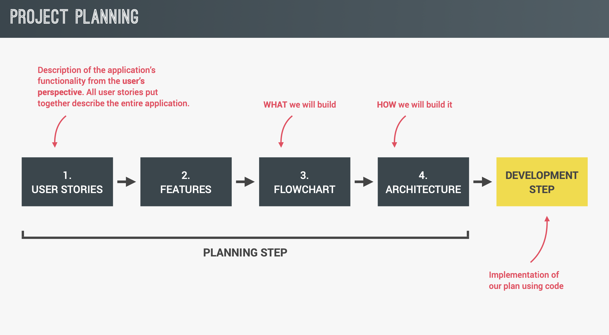

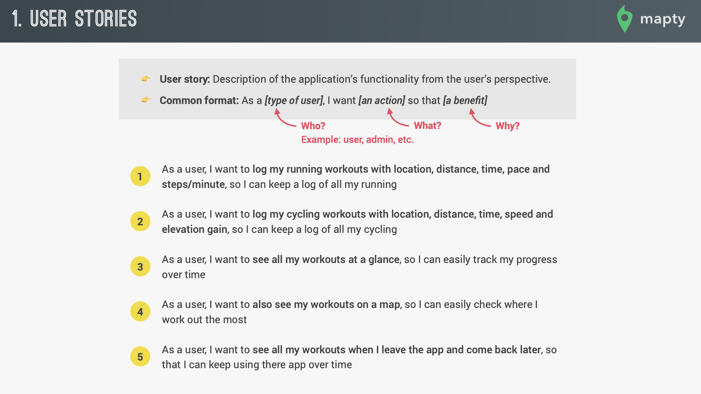

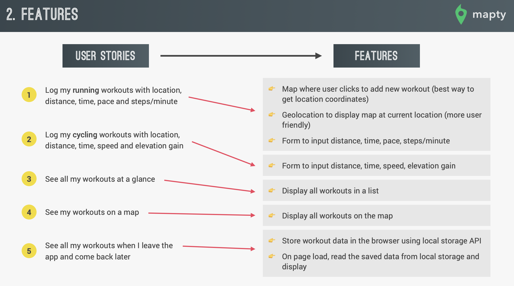

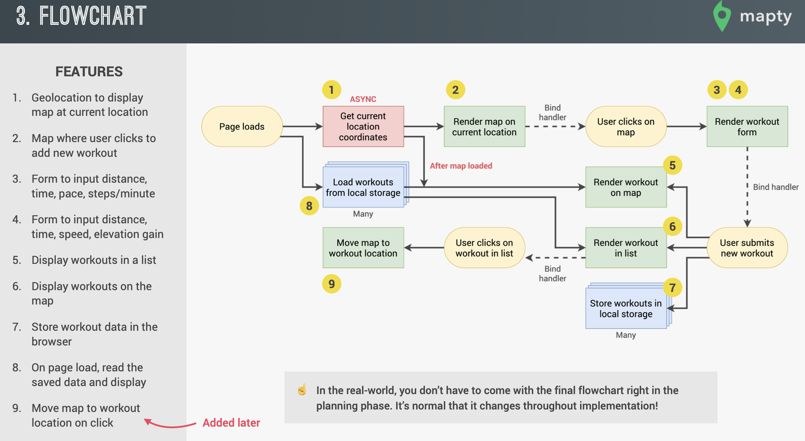

### 12.2 Using the Geolocation API

`navigator.geolocation.getCurrentPosition()`: Two callback functions, one for success, another for failed.

```JS
navigator.geolocation.getCurrentPosition(
  // Default an argument to return the position
  function (position) {
    console.log(position);
    // GeolocationPosition {coords: GeolocationCoordinates, timestamp: 1702191098519}
    const { latitude } = position.coords;
    const { longitude } = position.coords;
    console.log(
      `https://www.google.com/maps/@${latitude},${longitude},15z?entry=ttu`
    );
    // -33.9159564 151.2287
  },
  function () {
    alert('Could not get your position');
  }
);
```

### 12.3 Leaflet Library

[Leaflet Doc](https://leafletjs.com/reference.html)

### 12.5 Project Architecture

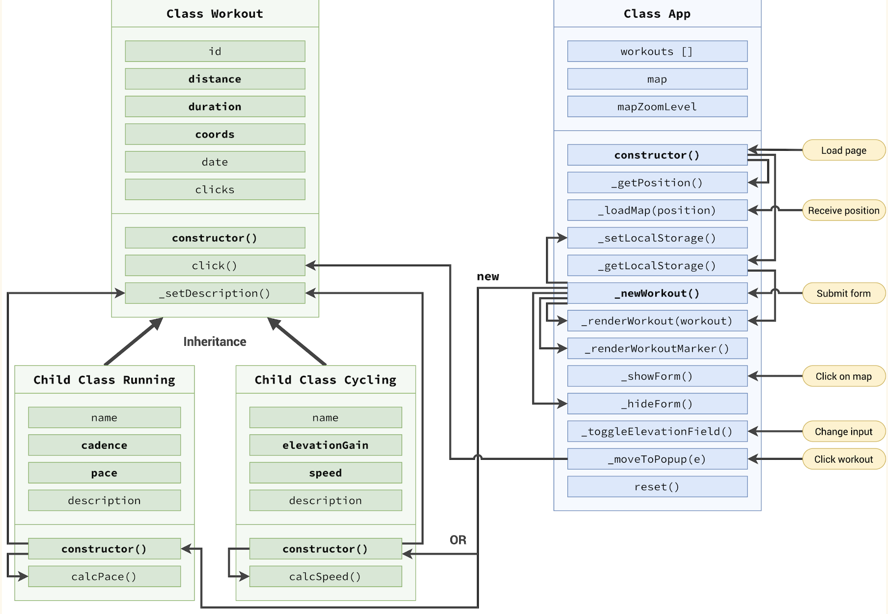

#### 12.5.1 Constructor

- Method in constructor will be called immediately when an object is created -> **write some functions** which need to be called when **page load**.
- Use `bind` to change `this` if needs.

#### 12.5.2 `_getPosition()`

- Use `navigator.geolocation.getCurrentPosition()` to get **current position**.
- Use `bind` to change `this` if needs.

#### 12.5.3 `_loadMap()`

- Get the `latitude` and `longitude`.
- Create map object (**Leaflet version**)
- Handling map addEventListener if needs. (e.g. click to show workout form)

#### 12.5.4 `_showForm(mapE)`

- Get the location info in `#mapEvent`.
- Remove the `hidden` class list.
- Add cursur focused

#### 12.5.5 `_toggleElevationField()`

- Toogle the `hidden` class list when workout mode changes.

#### 12.5.6 `_newWorkout()`

(Need to look code)

- Remove the `<form>` default.
- Get data from form.
- Check `running` or `cycling`
  - Check every input number and positive. (Use **guard clause and ||**).
- Add new object to workout array. (Add public attribute `workout` on ).
- Render workout on map as marker `_renderWorkoutMarker()`.
- Render workout on list `_renderWorkout()`.
- Hide form + clear input field `_hideForm()`.

#### 12.5.7 `_renderWorkoutMarker()`

- Add **marker** (**Leaflet version**) and set popup options.

#### 12.5.8 `_renderWorkout()`

- Add common html which `running` and `cycling` has both.
- Check workout type to add html individually.
- Set auto parameter.
- insertHTML

#### 12.5.9 `_hideForm()`

- Empty inputs
- Remove form style display and `hidden` it.
- `setTimeout` for the grid style.

#### 12.5.10 `_moveToPopup()`

- target to the workout container by **DOM delegation**.
- guard clause for unrelated click
- find the workout in array by **ID** (element dataset id = workout.id in workoutlist).
- Set the view

#### 12.5.11 `_setLocalStorage()`

```Js
localStorage.setItem('workouts', JSON.stringify(this.#workouts));
```

#### 12.5.12 `_getLocalSorage()`

```Js
const data = JSON.parse(localStorage.getItem('workouts'));
```

But render marker in local storage needs to write in `_loadMap()` because marker needs to load map firstly and add marker on it.

### 12.6 Managing Workout Data

- Create `Workout` object to be parent.
- Create `Running` and `Cycling` object to be children.

#### 12.6.1 `_setDescription()`

- Get the description of working and display it on marker.

### 12.7 Additional challenges

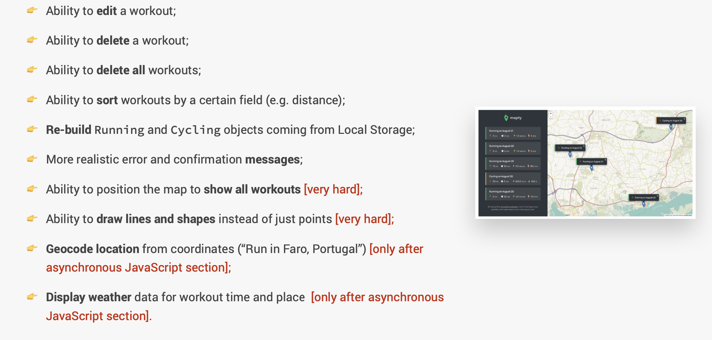

## 13. Asnychrounous Javascript

### 13.1 Concept

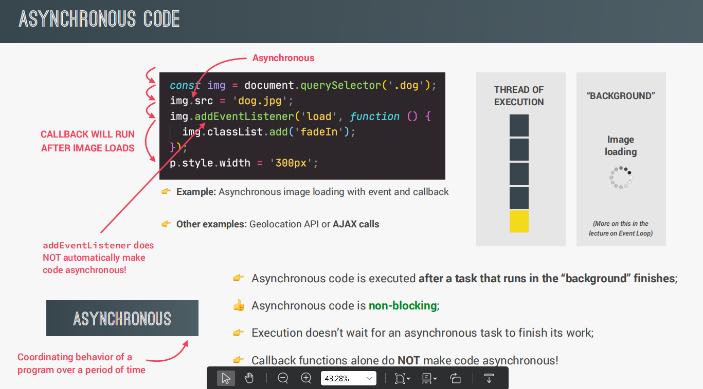

- **A**synchronous **J**avaScript **A**nd **X**ML: Allows us to commumicate with remote web servers in an **asynchronous way**. With AJAX calls, we can **request data** from web servers dynamically.

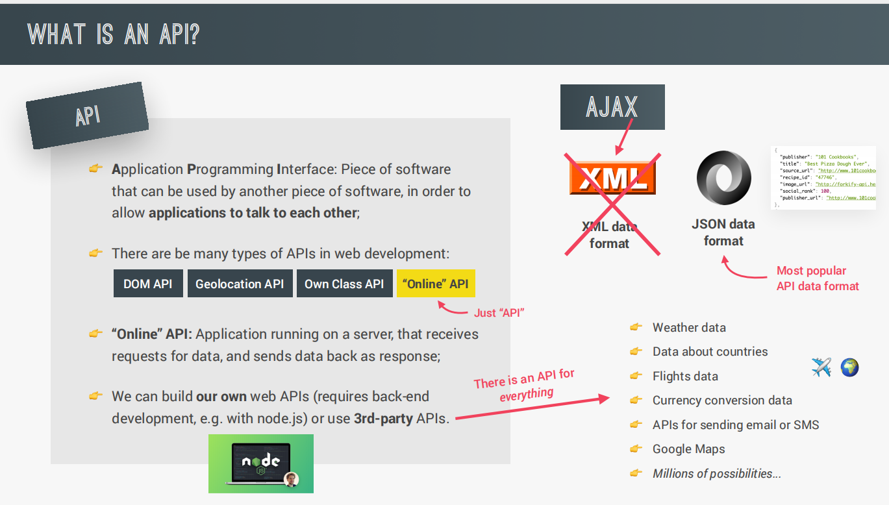

### 13.2 XMLHttpRequest

```JS
const request = new XMLHttpRequest();
  request.open('GET', `https://restcountries.com/v3.1/name/austrlia`);
  request.send();

// If there has losts of load, the order is not defined because of asynchronous
request.addEventListener('load', function () {})
```

### 13.3 Callback Hell

Losts of nested callback functions.

### 13.4 Promises and the Fetch API

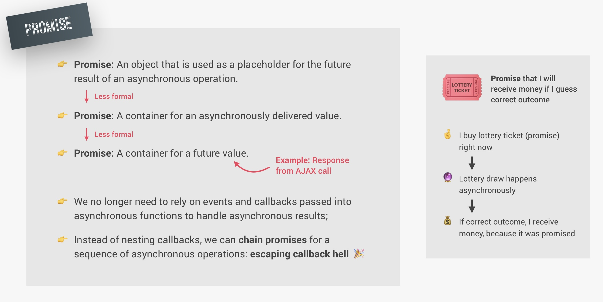

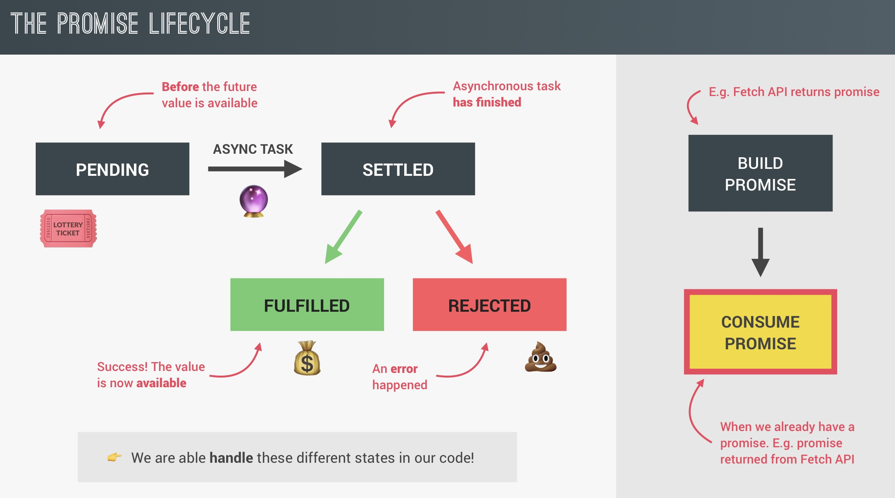

### 13.5 Consuming promise

- Use `then()` to handle promise and **return a promise**. If write `return` in `then()`, the value in `return` will be the **fullfiled value**.
- Js will receive an argument to handle promises (Can use in the `then()`)

```Js
const getCountryData = function (country) {
  fetch(`https://restcountries.com/v3.1/name/${country}`)
    // Use then() to handle promise
    .then(
      response => response.json() // A new promise
    )
    .then(data => renderCountry(data[0]));
};

getCountryData('usa');
```

### 13.6 Chaining Promises

- Use `then()` to chain promises
- Always return a promise and handle the `then()` **outside** to escape callback hell.

```Js
const getCountryData = function (country) {
  // Country 1
  fetch(`https://restcountries.com/v3.1/name/${country}`)
    // Use then() to handle promise
    // Return the country 1 result
    .then(
      response => response.json() // A new promise
    )
    // render the country 1 and find neighbour
    .then(data => {
      renderCountry(data[0]);
      const neighbour = data[0]?.borders[0];
      if (!neighbour) return;

      // Country 2
      return fetch(`https://restcountries.com/v3.1/alpha/${neighbour}`);
    })
    // Return the country 1 result
    .then(response => response.json())
    // render the country 2
    .then(data => renderCountry(data[0], 'neighbour'));
};

getCountryData('germany');
```

### 13.7 Handling Rejected Promises

`fetch` `promise` only rejects when there is no **internet connection**.

#### 13.7.1 Sol1: write error alert in the `then()`

Only called when the promise is fulfilled.

```Js
fetch(`https://restcountries.com/v3.1/name/${country}`)
    // Use then() to handle promise
    // Return the country 1 result
    .then(
      response => response.json(),
      err => alert(err)
    )
```

#### 13.7.2 Sol2: write `catch()` in the end

Only call when the promise is rejected.

```Js
 .catch(err => {
      console.error(`${err}!!!`);
      renderError(`Something went wrong!`);
    })
```

#### 13.7.3 Sol3: `finally()` in the end

Used for something needs to happen no matter the result of the promise

```Js
 .finally(() => {
      countriesContainer.style.opacity = 1;
    });
```

#### 13.7.4: Whole code

```Js
const getCountryData = function (country) {
  // Country 1
  fetch(`https://restcountries.com/v3.1/name/${country}`)
    // Use then() to handle promise
    // Return the country 1 result
    .then(
      // A new promise
      // Handle rejected promise sol1: write error alert in the then()
      // Only called when the promise is fulfilled
      response => response.json(),
      err => alert(err)
    )
    // render the country 1 and find neighbour
    .then(data => {
      renderCountry(data[0]);
      const neighbour = data[0]?.borders[0];
      if (!neighbour) return;

      // Country 2
      return fetch(`https://restcountries.com/v3.1/alpha/${neighbour}`);
    })
    // Return the country 1 result
    .then(
      response => response.json()
      // err => alert(err)
    )
    // render the country 2
    .then(data => renderCountry(data[0], 'neighbour'))
    // Handle rejected promise sol2: write catch() in the end
    // Only call when the promise is rejected
    .catch(err => {
      console.error(`${err}!!!`);
      renderError(`Something went wrong!`);
    })
    // Be called always, used for something needs to happen no matter the result of the promise
    .finally(() => {
      countriesContainer.style.opacity = 1;
    });
};

```

### 13.8 Throwing Errors manually

- Check `response.ok` status
- Use `throw` to immediately terminate the current function.
  - `throw`: Execution of the **current function** will stop (the statements after throw won't be executed), and control will be passed to the first `catch` block in the call stack. If no catch block exists among caller functions, the program will terminate.

```Js
const getJSON = function (url, errorMsg = 'Something went wrong') {
  return fetch(url).then(response => {
    if (!response.ok) {
      throw new Error(`${errorMsg} ${response.status}`);
    }
    return response.json();
  });
};
```

### 13.9 Event Loop Asynchronous

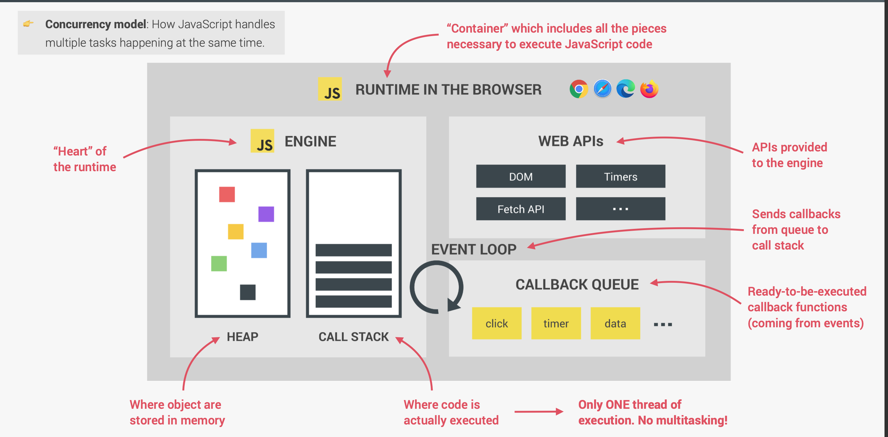

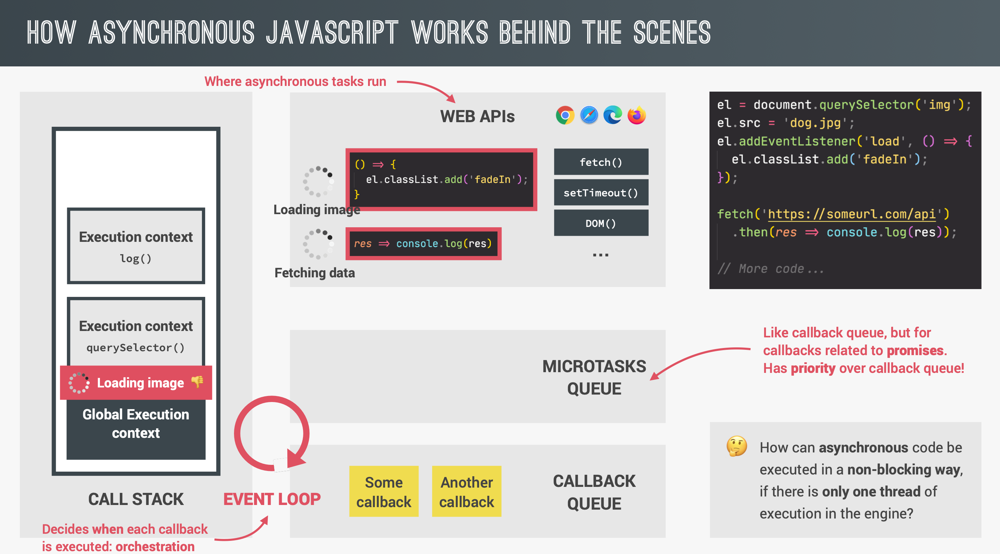

You can not do **high precision** using js **timers**: If the microtasks before is too heavy, timer may wait for them..

```Js
console.log('Test start');
setTimeout(() => console.log('0 sec timer'), 0);
Promise.resolve('Resolved promise 1').then(res => console.log(res));
console.log('Test end');

// Correct sequence:
// 1. Test start (No callback)
// 2. Test end (No callback)
// 3. Resolved promise 1 (microtasks)
// 4. 0 sec timer (regular callback)

```

### 13.10 Build a simple promise

- Build a `Promise`
  - write `resolve` and `reject`
  - write function

```Js
const lotteryPromise = new Promise(function (resolve, reject) {
  console.log('Lotter draw is happening');
  setTimeout(function () {
    if (Math.random() >= 0.5) {
      // Fulfilled
      resolve('You WIN 💰');
    } else {
      // Pass the error function which wants to be able in the catch handler later
      reject(new Error('You lost your money'));
    }
  }, 2000);
});

lotteryPromise.then(res => console.log(res)).catch(err => console.error(err));
```

- Promisifying(like fetch) `setTimeout`

```Js
const wait = function (seconds) {
  return new Promise(function (resolve) {
    setTimeout(resolve, seconds * 1000);
  });
};

wait(2)
  .then(() => {
    console.log('I waited for 2 seconds');
    return wait(1);
  })
  .then(() => console.log('I waited for 1 second'));
```

- Quick way to set promise

```Js
Promise.resolve('abc').then(x => console.log(x));
Promise.reject(new Error('Problem!')).catch(x => console.error(x));
```

### 13.11 Async/Await

`async`: declare a function run asynchronusly in the background and return a promise. Don't need callback function.

`await`: stop decode execution at this point of the function until the promise is fulfilled

#### 13.11.1 Comsuming Promises

```Js
const whereAmI = async function () {
// Exactly same
  // fetch(`https://restcountries.com/v3.1/name/${country}`).then(res =>
  //   console.log(res)
  // );

  const res = await fetch(
    `https://restcountries.com/v3.1/name/${dataGeo.country}`
  );
  const data = await res.json();
  renderCountry(data[0]);
};

```

#### 13.11.2 Error handling with try...catch

The code in the `try` block is executed first, and if it throws an exception, the code in the `catch` block will be executed.

```Js
const whereAmI = async function () {
  try {
    // Geolocation
    const pos = await getPosition();
    const { latitude: lat, longitude: lng } = pos.coords;

    // Reverse geocoding
    const resGeo = await fetch(`https://geocode.xyz/${lat},${lng}?geoit=json`);
    if (!resGeo.ok) throw new Error('Problem getting location data');
    const dataGeo = await resGeo.json();

    // Country data
    const res = await fetch(
      `https://restcountries.com/v3.1/name/${dataGeo.country}`
    );
    if (!res.ok) throw new Error('Problem getting country');
    const data = await res.json();
    renderCountry(data[0]);
  } catch (err) {
    // err.message is in (throw new Error())
    renderError(`Something went wrong!! ${err.message}`);
  }
};
```

#### 13.11.3 Returning values from async functions

Use double async functions. Careful for the `Rethrow error`.

First `async` function:

```Js
const whereAmI = async function () {
  try {
    // Geolocation
    const pos = await getPosition();
    const { latitude: lat, longitude: lng } = pos.coords;

    // Reverse geocoding
    const resGeo = await fetch(`https://geocode.xyz/${lat},${lng}?geoit=json`);
    if (!resGeo.ok) throw new Error('Problem getting location data');
    const dataGeo = await resGeo.json();

    // Country data
    const res = await fetch(
      `https://restcountries.com/v3.1/name/${dataGeo.country}`
    );
    if (!res.ok) throw new Error('Problem getting country');
    const data = await res.json();
    renderCountry(data[0]);

    // If the promise is fulfilled, it will return
    return `You are in ${dataGeo.city}, ${dataGeo.country}`;
  } catch (err) {
    renderError(`Something went wrong!! ${err.message}`);

    // Rethrow error: throw the error again so that we can then propagait it down
    // Reject promise returned from async function
    throw err;
  }
};
```

Second `async` function to call the first `async` function:

```Js
(async function () {
  try {
    console.log('1: Will get location');
    const city = await whereAmI();
    console.log(city);
  } catch (err) {
    // must write throw err in the first catch function
    console.error(`2: ${err.message}`);
  }
  console.log('3: Finished getting location');
})();


// Equal to
whereAmI()
  .then(city => console.log(`2: ${city}`))
  .catch(err => console.error(`2: ${err.message}`))
  .finally(console.log('3: Finished getting location'));
```

### 13.12 Promise Combinator

#### 13.12.1 Promise.all()

`Promise.all()`: If run losts of promises but their **operations** are **not depend** on another, use it to run **parallel**. This function takes in an **array** of promises, return the array of fufilled values. It rejects when any of the input's promises rejects, with this first rejection reason.

```Js
const get3Countries = async function (c1, c2, c3) {
  try {
    const data = await Promise.all([
      getJSON(`https://restcountries.com/v3.1/name/${c1}`),
      getJSON(`https://restcountries.com/v3.1/name/${c2}`),
      getJSON(`https://restcountries.com/v3.1/name/${c3}`),
    ]);
    console.log(data.map(d => d[0].capital[0]));
  } catch (err) {
    console.error(err);
  }
};

get3Countries('usa', 'canada', 'australia');
```

#### 13.12.2 Promise.allSettled()

`Promise.allSettled()`: takes in an array of multiple promises and returns a **list** of Promises. This returned promise fulfills when all of the input's promises settle (including when an empty iterable is passed).

Compared to `Promise.all()`: has **no shortcircuit** when there has a reject.

```Js
Promise.all([
  Promise.resolve('Success'),
  Promise.reject('Error'),
  Promise.resolve('Another success'),
]).then(res => console.log(res));
// Uncaught (in promise) Error

Promise.allSettled([
  Promise.resolve('Success'),
  Promise.reject('Error'),
  Promise.resolve('Another success'),
]).then(res => console.log(res));

// 0: {status: 'fulfilled', value: 'Success'}
// 1: {status: 'rejected', reason: 'Error'}
// 2: {status: 'fulfilled', value: 'Another success'}
```

#### 13.12.3 Promise.any()

`Promise.any()`: takes in an
of multiple promises and return the **first fulfilled** promise, ignore reject promise.

```Js
Promise.any([
  Promise.resolve('Success'),
  Promise.reject('Error'),
  Promise.resolve('Another success'),
]).then(res => console.log(res));
// Success
```

#### 13.12.4 Promise.race()

`Promise.race()`: is **settled**(a value is available, no matter promise is reject or fulfilled) as soon as one of the input promises settles, returns a **single Promise**.

```Js
(async function () {
  const res = await Promise.race([
    getJSON(`https://restcountries.com/v3.1/name/italy`),
    getJSON(`https://restcountries.com/v3.1/name/usa`),
    getJSON(`https://restcountries.com/v3.1/name/australia`),
  ]);
  // return one of three country beyond which load the fastest.
  // console.log(res[0]);
})();，
```

- Good example to use `promise.race()` and `timeout()`: check user website internet connection. Automatically reject after a certain time has passed.

```Js
const timeout = function (sec) {
  return new Promise(function (_, reject) {
    setTimeout(function () {
      reject(new Error('Request too long!'));
    }, sec * 1000);
  });
};

Promise.race([
  getJSON(`https://restcountries.com/v3.1/name/italy`),
  timeout(1),
]).then(res => console.log(res[0]));

```

## 14 Modern JavaScript Development

### 14.1 Modern JavaScript Development

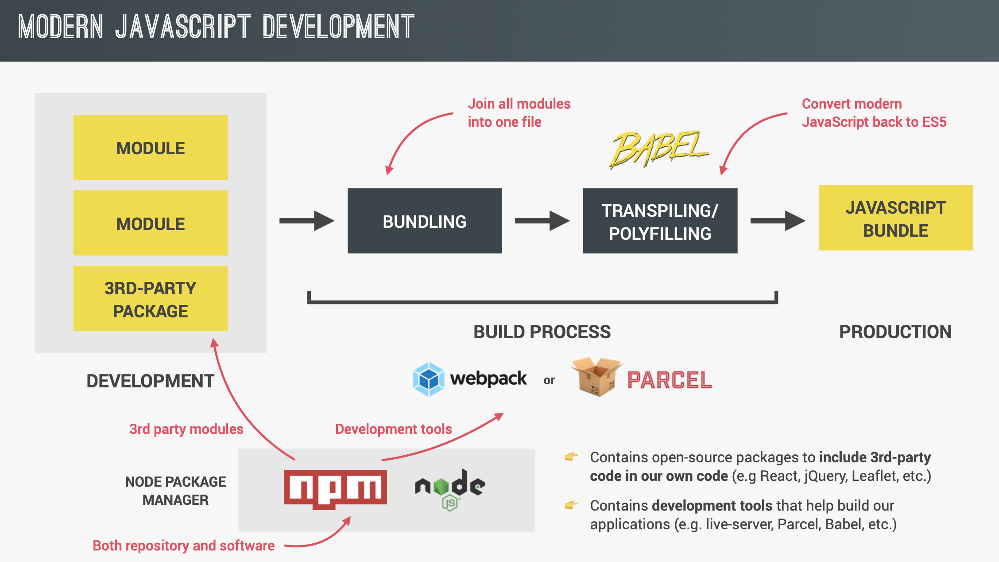

### 14.2 Modules

- Normal modules
  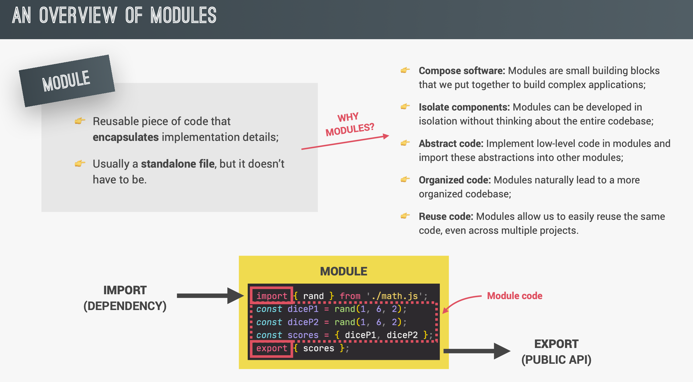

- ES6 modules

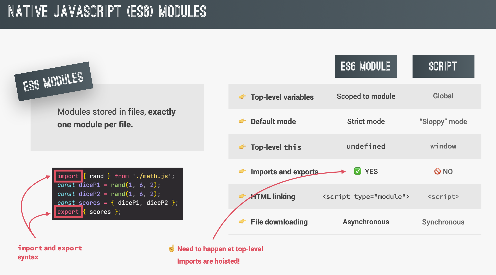

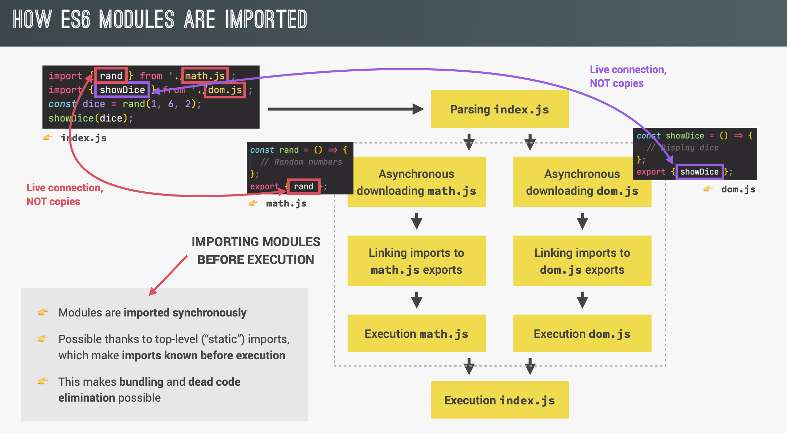

### 14.3 Exporting and Importing in ES6 Modules

- You can use 2 ways, but **don't mix** them.
- `import` are not copies of the `export`, they are **live connection**.

#### 14.3.1 Name Exports

- use `export` and `import`
- can use `as` to simplify
- can use `*` to import whole export part

**Export**:

```js
// Exporting module
console.log('Exporting module');

const shippingCost = 10;
const cart = [];

// Name export
export const addToCart = function (product, quantity) {
  cart.push({ product, quantity });
  console.log(`${quantity} ${product} added to cart`);
};

const totalPrice = 237;
const totalQuantity = 23;

export { totalPrice, totalQuantity as tq };
```

**Import**

```Js
// Way1:
import { addToCart, totalPrice as price, tq } from './shoppingCart.js';

addToCart('bread', 5);
console.log(price, tq);
console.log('Importing module');

// Way2:
import * as ShoppingCart from './shoppingCart.js';
ShoppingCart.addToCart('bread', 5);

```

#### 14.3.2 Default export

- only export one thing per module, don't need to write

**Export**:

```js
export default function (product, quantity) {
  cart.push({ product, quantity });
  console.log(`${quantity} ${product} added to cart`);
}
```

**Import**

```Js
import add from './shoppingCart.js';
add('pizza', 2);
```

### 14.4 Top-Level await(ES2022)

- Use `await` **outside** of an `async` function in modules

- Will **block** the entire execution of this module

- Very good to use when get the **return value** from async function

```Js
const getLastPost = async function () {
  const res = await fetch('https://jsonplaceholder.typicode.com/posts');
  const data = await res.json();
  return { title: data.at(-1).title, text: data.at(-1).body };
};

// async function will return a Promise
const lastPost = getLastPost();
console.log(lastPost);
// Promise

// Way1: use them (not very clean)
lastPost.then(res => console.log(res));
// {title: 'at nam consequatur ea labore ea harum', text: 'cupiditate quo est a modi nesciunt soluta\nipsa vol…nam et distinctio eum\naccusamus ratione error aut'}

// Way2: use Top-Level await
const lastPost2 = await getLastPost();
console.log(lastPost2);
// {title: 'at nam consequatur ea labore ea harum', text: 'cupiditate quo est a modi nesciunt soluta\nipsa vol…nam et distinctio eum\naccusamus ratione error aut'}
```

### 14.5 Command line introduction

`ls`: show the current folder
`cd`: change directory
`clear` or `command key`: clear the concole
`mkdir`: create a folder
`touch`: create a file or multiple files(at the same time).
`rm`: delete a file.
`mv`: move a file. `mv current-file move-to-file-location` e.g. `mv mapty.js ../`
`rmdir`: remove an empty directory.
`rm -r`: remove a directory with all files inside.

### 14.6 Npm introduction

`npm -i package-name`: install a package

### 14.7 Review: Writing clean and modern javascript

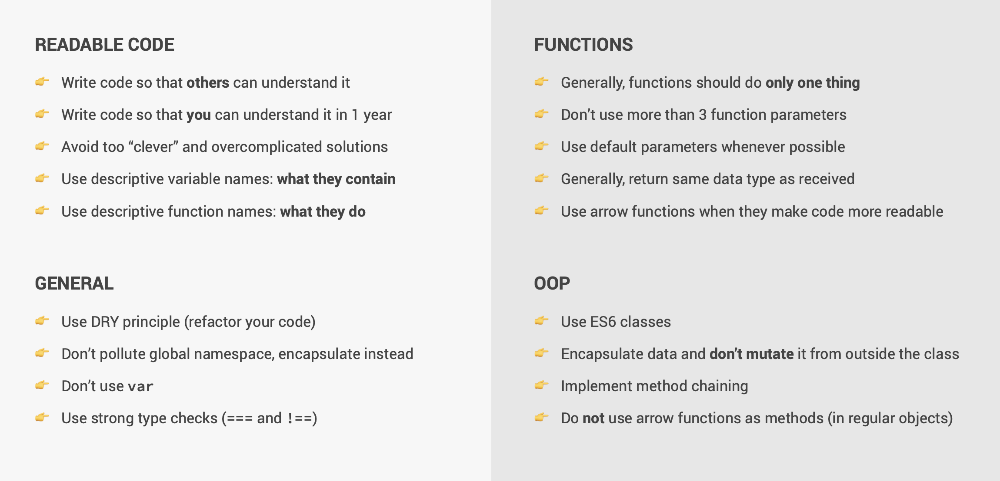

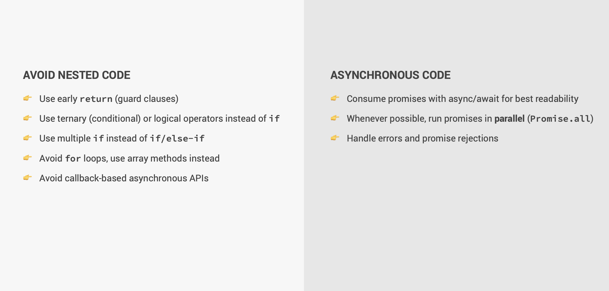

Excersise:

- Revise variable and function name
- Change var to const/let
- Use default parameter
- Refactory code(dry)
- remove duplicated block brace{}
- remove console.log
- template literal rather than + strings
- change if else to ternary

### 14.8 Declarative and functional code

### 16. Setting up git and deployment


#### 16.1 Setting up

`git init`
`git config --global user.name EllaLiu0401`
`git config --global user.email ellatong0515@gmail.com`

#### 16.2 Git fundamentals

- `.gitignore` file: ingore updating to git.
- `git status`: get the status in git.
- `git add -A`: add all changed.
- `git commit -m`: commit a message
  - **consensus**: first commit always be: Initial commit
- `git reset --hard HEAD`: go to previous commit
- `git reset --hard #git-log-id`: go to the specific id git log.
- `git log`: see the log of git.
- `git branch`: set the branch.
- `git branch branch-name`: create a new branch.
- `git checkout branch-name`: switch to a branch.
- `git merge branch-name`: merge code from branch-name to current branch.

[git-cheat-sheet](https://education.github.com/git-cheat-sheet-education.pdf)
