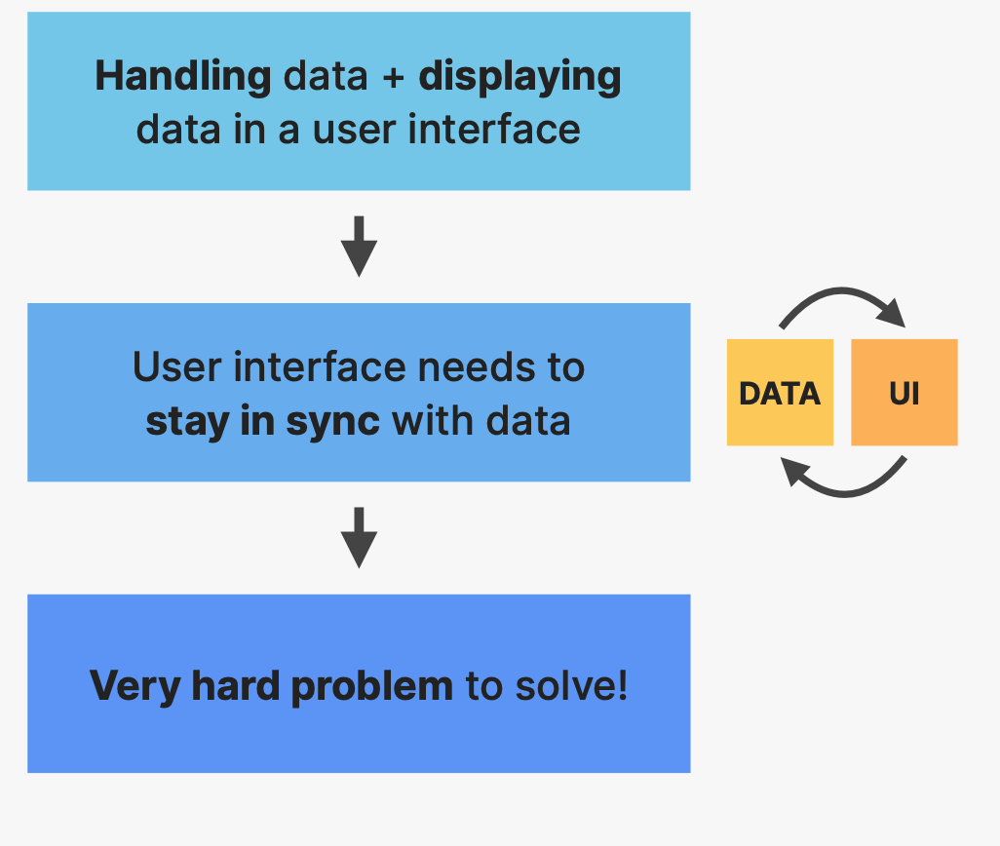
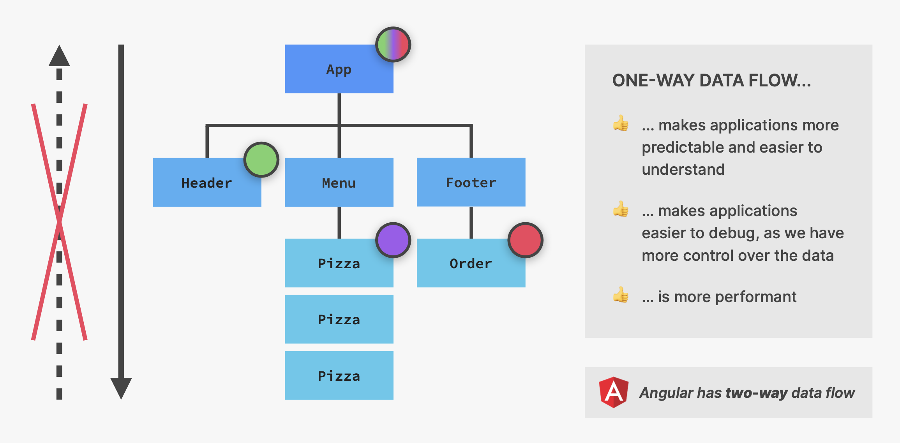
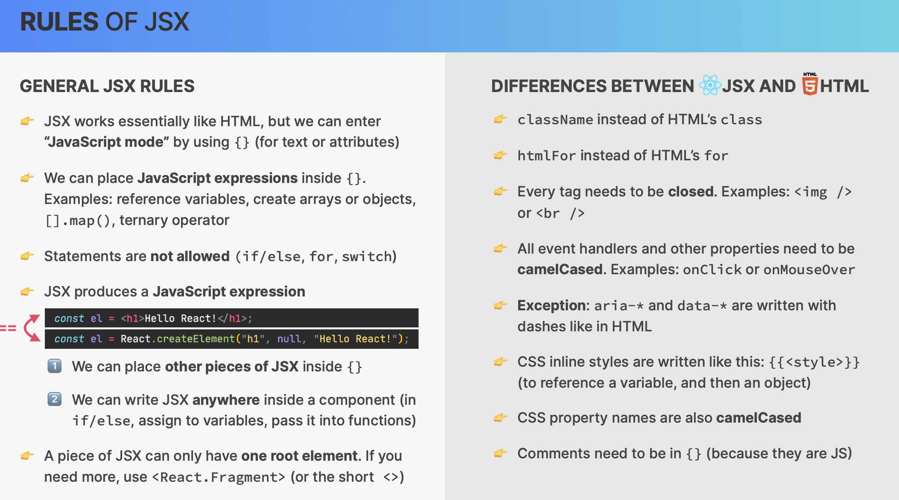

# React Study Note

## 1. React fundamentals

### 1.1 Why Do Front-End Frameworks Exist?

- The rise of **Single-page appications**

  - server-side rendering
  - client-side rendering
    

- Front-end web applications are all about:
  

- **Problems** with js:
  

- Why **framework** exist?

  

### 1.2 What is React?

- Rendering components one a webpage(UI) based on their current state
- Keeping the UI in sync with state, by re-rendering(reacting) when state changes

### 1.3 Setting up a project with Create-React-App

`npx create-react-app project-name`: create a project.
`sudo npm start`: start a react project.
`sudo chown -R username directory_name`: Revise permission of a directory

## 2. Working with Components, Props, and JSX

### 2.1 Rendering the Root Component and Strict Mode

```Js
import React from 'react';
import ReactDOM from 'react-dom/client';

function App() {
  return <h1>Hello React</h1>;
}

// Render app in the Dom in React 18
const root = ReactDOM.createRoot(document.getElementById('root'));
root.render(
  <React.StrictMode>
    <App />
  </React.StrictMode>
);

```

### 2.2 Debugging

When you get error:

- Make should app is runing.
- Always use eslint.
- Check Output tab in terminal.

### 2.3 Componenets as building blocks

- react applications are entirely made out of components.
- **Building blocks** of user interfaces in React.
- Piece of UI that has its own **data, logic, and appearances**.
- We build complex UIs by **building multiple components** and **combining** them.
- Components can be **reused, nested** inside each other, and **pass data** between them.

### 2.4 What is JSX?

- **Declarative** syntax to **describe** what components **look like** and **how they work**.
- Components must **return** a block of JSX.
- Extension of Javascript that allows us to **embed Javascript, CSS amd React components into HTML**.
- Each JSX element is **converted** to a React.createElement function call.
- We could use React **without JSX**.


### 2.5 Passing and Receiving Props

- the props can be `console.log`
- use js mode(`{}`) to prop numbers

```Js
function Menu() {
  return (
    <main className="menu">
      <h2>Our Menu</h2>
      <Pizza
        name="Pizza Spinaci"
        ingredients="Tomato, mozarella, spinach, and ricotta cheese"
        photoName="pizzas/spinaci.jpg"
        price={10}
      />
      <Pizza
        name="Pizza Funghi"
        ingredients="Tomato, mushrooms"
        photoName="pizzas/funghi.jpg"
        price={12}
      />
    </main>
  );
}

function Pizza(props) {
  console.log(props);
  // {name: 'Pizza Spinaci',
  // ingredient: 'Tomato, mozarella, spinach, and ricotta cheese',
  // photoName: 'pizzas/spinaci.jpg',
  // price: '10'}
  return (
    <div className="pizza">
      {/*  public is for simple things that do not need processing, while src is for your code and resources that webpack can optimize. Importing from src provides additional benefits, such as automatic optimizations and a more structured way of working with resources in your application. */}
      
      <div>
        <h3>{props.name}</h3>
        <p>{props.ingredients}</p>
        <span>{props.price}</span>
      </div>
    </div>
  );
}
```

### 2.6 Props, immutability, and one-way data flow

Props:

- Used to pass data from **parent components** to **child components**.
- read-only, **immutable**. Can only be updated by the parent component.

One-way data flow:


### 2.7 Rules of JSX



### 2.8 Conditional rendering

#### 2.8.1 Use `&&`

- React will not render `true` or `falsy` value.

```Js
function Menu() {
  const pizzas = pizzaData;
  return (
    <main className="menu">
      <h2>Our Menu</h2>
      {pizzas && (
        <ul className="pizzas">
          {pizzas.map(pizza => (
            <Pizza pizzaObj={pizza} key={pizza.name} />
          ))}
        </ul>
      )}
    )
  }
```

#### 2.8.2 Use Ternaries

```Js
function Menu() {
  const pizzas = pizzaData;
  return (
    <main className="menu">
      <h2>Our Menu</h2>
      {pizzas ? (
        <ul className="pizzas">
          {pizzas.map(pizza => (
            <Pizza pizzaObj={pizza} key={pizza.name} />
          ))}
        </ul>
      ) : null}
    </main>
  );
}
```

#### 2.8.3 Multiple returns

```Js
function Footer() {
  const hour = new Date().getHours();
  const openHour = 12;
  const closeHour = 22;

  const isOpen = hour >= openHour && hour <= closeHour;
  if (!isOpen) return <p>CLOSED</p>;
  return (
    <footer className="footer">
      {isOpen && (
        <div className="order">
          <p>We're open untill {closeHour}:00. Come visit us or order online</p>
          <button className="btn">Order</button>
        </div>
      )}
    </footer>
  );
}
```

### 2.9 Destructuring Props

- Use `{}`
- Write parameter on them

```Js
function Order(closeHour, openHour) {
  return (
    <div className="order">
      <p>
        We're open from {openHour} untill {closeHour}:00. Come visit us or order
        online
      </p>
      <button className="btn">Order</button>
    </div>
  );
}
```

### 2.10 React Fragments

`<></>`: Group a list of children **without adding extra nodes** to the DOM.

- Difference between `<div>` and `<>`:
  - Use a `<div>` when you need an actual DOM element for **styling** or **layout** purposes.
  - Use a React fragment when you want to group components or elements **without adding extra nodes** to the DOM, which can be beneficial for **performance** and cleaner DOM structure.
