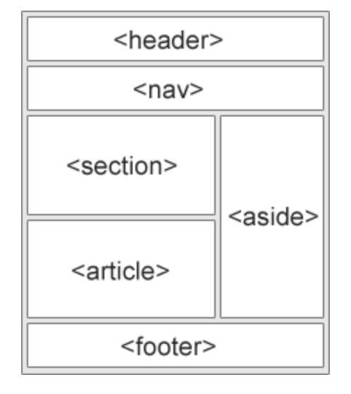
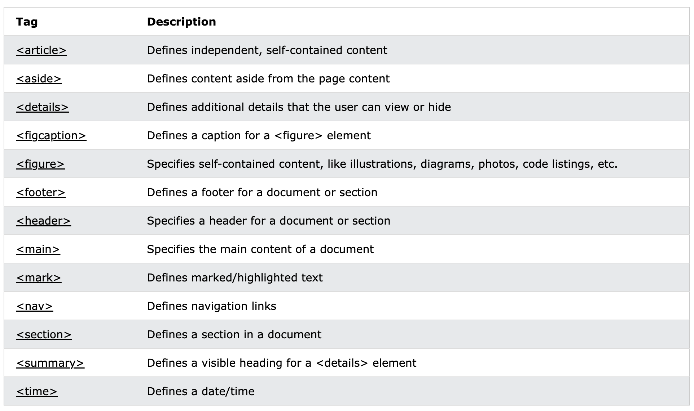

# HTML study notes

## 1. Structure

    <!DOCTYPE html>
    <html lang="en">
      <head>
        <meta charset="UTF-8" />
        <meta name="viewport" content="width=device-width, initial-scale=1.0" />
        <title>Document</title>
      </head>
      <body></body>
    </html>

`<!DOCTYPE html>` declaration represents the documnet type, and helps browsers to display web page correctly.

`<html lang="en">` specify the language that we use for this webpage.

`<head><\head>` is not visible in the browser window.

`<meta charset="UTF-8">` meta data: the data of data.

`<title></title>` define the title for html document.

`<body></body>` define the document's body.

## 2. Text Elements

`<h1><\h1>` means heading. 6 heading types from `<h1>` to `<h6>`. Each page should only have one h1 heading.

`<strong><\strong>` emphasize content.

`<em><\em>` Italic content.

`
` Paragraph.

## 3. Lists

`<ol><\ol>` ordered list.

`<ul><\ul>` unordered list.

`<li><\li>` list items.

## 4. Images

    

`` image attribute.
`src` the image source.
`alt` convient for search engine or decireble the image.

## 5. Hyperlinks

`<a href="#">Content<\a>`

`<a><\a>` means hyperlink.

`href="#"`href means the destination of website, # for placeholder.

## 6. Semantic html

A semantic element clearly describes its meaning to both the browser and the developer.

Help for search engine and accessibility.

### 6.1 header

`<header></header>` : the top part of a web document.

A `<header>` element typically contain:

- one or more heading eletments(h1-h6)
- logo or icon
- authorship information

**header cann not be placed within a `<footer>` `<address>`or another `<header>` element.**

### 6.2 nav

`<nav><\nav>`: Page navigation.

### 6.3 article

`<article><\article>`: independent, self-contained content.

An `<article>` element typically contain:

- Forum posts
- Blog posts
- User comments
- Product cards
- Newspaper articles

### 6.4 section

`<section><\section>` element defines a section in a document.

A `<section>` element typically contain:

- Chapters
- Introduction
- News items
- Contact information

### 6.5 footer

`<footer><footer>`: define a footer of a document.

A `<footer>` element typically contain:

- authorship information
- copyright information
- contact information
- sitemap
- back to top links
- related documents

### 6.6 aside

An `<aside>`element defines some content aside from the content it is placed in. Secondary information.

### 6.7 figure and figcaption

The `<figure>` tag specifies self-contained content, like illustrations, diagrams, photos, code listings, etc.

The `<figcaption>` tag defines a caption for a `<figure>`element. The `<figcaption>` element can be placed as the first or as the last child of a `<figure>` element.

### 6.8 semantic list

### Additional notes

The `aria-hidden` state indicates whether the element is exposed to an accessibility API.

#### Values

`true`: The element is hidden from the accessibility API.
`false`: The element is exposed to the accessibility API as if it was rendered.
`undefined`: The element's hidden state is determined by the user agent based on whether it is rendered.

### 6.9 Additional VS Code Extensions

Image preview: show image thumbnail in code.

Color Highlight: highlight colors.

Auto renaming tag: change back name automatically.

Live server: get the live web page when saved the code.

**\*aria-hidden**="true" should not be added when:\*\*

- The HTML `hidden` attribute is present.
- The element or the element's ancestor is hidden with `display: none`.
- The element or the element's ancestor is hidden with `visibility: hidden`
