# Web Design Studynote

## 1. Typography

Typography is the art and technique of arranging type to make written language **legible**, **readable** and **appealing** when displayed.

- Use only good and popular type faces and play it safe.
  [Google-Fonts](https://fonts.google.com/)
  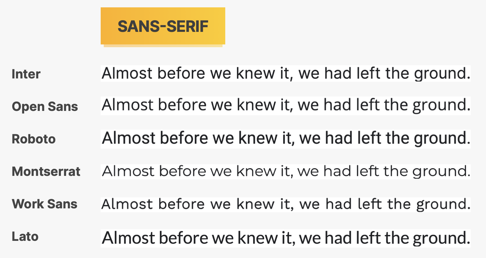
  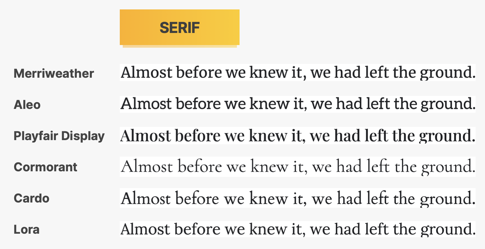
- Use just one typeface per page. If wanna more, limit to **2** typefaces.
- Choose the **right typeface** according to your website **personality**.
- When choosing font-sizes, **limit choices**! Use a "type scale" tool or other pre-defined range.
  [Type-scale-tool](https://typescale.com/)
- Use a font size between **16px** and **32px** for **normal** text.
- For **long text**, try a size of 20px or even bigger.
- For **headlines**, you can go really big(50px+) and bold(600+), depending on **presonality**.
- For any text, don't use a **font weight** under 400(regular).
- Use less that 75 characters **per line**.
- For normal-sized text, use a **line height** between 1.5 and 2. For big text, go below 1.5. The **smaller** or **longer** the text, the larger the line height needs to be.
- Decrease letter spacing in **headlines**, if it looks unnatural.
- Experiment with all **caps** for **short titles**. Make them small and bold and increasing **letter-spacing**.
- Usually, don't **justify** text.
- Don't **center long text blocks**. Small blocks are fine.

## 2. Color

- Make the main color match your **website's personality**: colors convey meaning!
  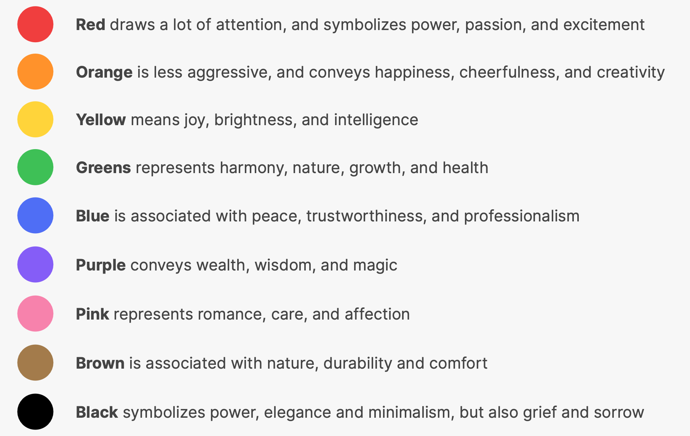
- Use a good **color tone**!
  [Open Color](https://yeun.github.io/open-color/)
- You need at least **two** types of colors in your color palette: a **main color** and a **grey color**.
- With more experience, you can add more colors: **accent(secondary)** colors.
- For diversity, create lighter and darker "versions" (**tints** and **shades**)
  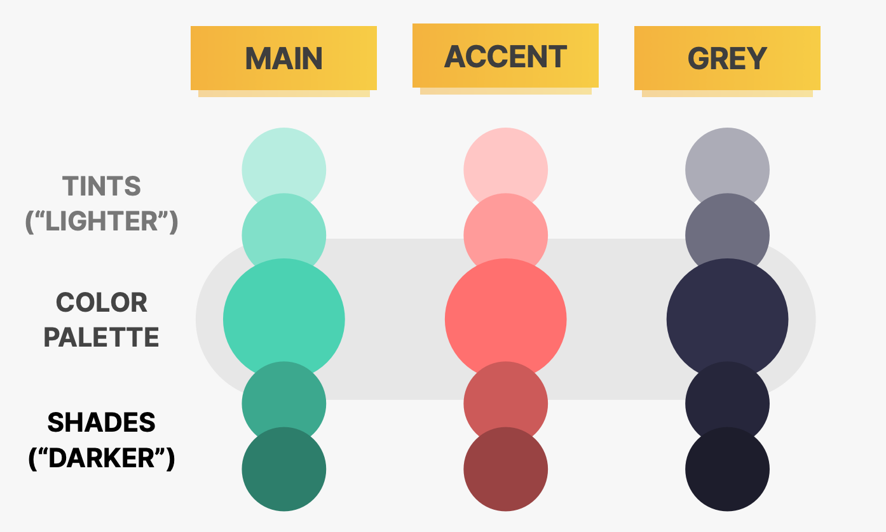
- Use your main color to **draw attention** to the most important elements on the page.
- Use colors to add **interesting accents** or make **entire components or section** stand out.
- You can try to use your color strategically in **images and illustrations**.
- On dark colored backgrounds, try to use a **tint** of the **background** for **text**.
- Text should usually **not** be **completely black**. **Lighten** if up it looks heavy and uninviting.
- **Don't make text too light**! Use a tool to check **contrast** between text and background colors.
  Contrast ratio needs to be at least **4.5:1 for normal** text and **3:1 for large** text(18px+).
  [Coolors](https://coolors.co/contrast-checker/112a46-acc8e5)

## 3. Images

- Different types of images: **product photos**, **stroytelling photos**, **illustrations**, **patterns**.
- Use images to support your website's **message and story**. So only use **relevant images**.
- Prefer **original images**.
- Try to show **real people** to trigger user's emotions.
- If necessary, **crop images** to fit your message.
- Experiment **combining** photos, illustrations and patterns.
- Handling **Text** on images:
  - Darker or brighten image (completely or partially, using a gradient).
  - Position text into neutral image area.
  - Put text in a box.
- To account for **high-res screens**, make image dimensions 2× as big as their displaye size.
- **Compress images** for a lower file size and better performance.
  [Compress-tool: Squoosh](https://squoosh.app/)
- When using multiple image side-by-side, make sure they have the **exact same dimensions**.

## 4. Icons

- Use good icon:
  - Use **good icon** pack.
    [phosphoricons](https://phosphoricons.com/)
  - Use **only one icon pack**. Don't mix icons from different icon packs.
  - Use **SVG icons** or **icon fonts**. Don't use bitmap image formats(.jpg and .png)!
    - Bitmap: do not scale, become unsharp!
    - SVG: vector-based, scale **indefinitely**!
  - Adjust to website personality! **Roundness**, **weight** and **filled/outlined** depend on typography.
- When to use icons:
  - Use icons to **provide visual assistance** to text.
  - Use icons for **product feature blocks**.
  - Use icons **associated with actions**, and **label them**(unless no space or icon is 100% clear)
  - Use icons as **bullet points**.
- Use icons well:

  - To keep icons neutral, **use same color as text**. To draw more attention, **use different color**.
  - Icons need to make sense and **fit the text or action**!
  - Don't make icons larger than what they **were designed for**. If needed, **enclose them in a shape**.

- Revise icon color in CSS:
  ```Javascript
  stroke: #087f5b; // light
  fill: #087f5b; // solid
  ```

## 5. Shadows

- Use shadows well:

  - You don't have to use shadows! Only use them if it makes sense for the **website personality**.
    Less shadow: serious/elegant
    More shadow: playful/fun
  - Use shadows in **small doses**: don't add shadows to every element!
  - Go **light** on shadows, don't make them too dark!

- Use shadows in the right situation:

  - Use **small** shadows for smaller elements that should stand out(to draw attention)
  - Use **medium-size** shadows for larger areas that should stand out a bit more. (e.g. cards)
  - Use **large** shadows for elements that should really float above the interface. (e.g. popup)
  - Experiment with **changing shadows** on mouse interaction(click and hover) normal: no shadow hover: medium-sized click: smaller shadow
  - Bonus: Experiment with **glows**(colored shadows).

- Shadow in CSS:

  ```CSS
  /*box-shadow:
  <offset-x> (horizontal offset)
  <offset-y> (vertical offset)
  <blur-radius>
  <spread-radius>
  */
  box-shadow: 0px 20px 30px 0px rgba(0, 0, 0, 0.07);
  ```

## 6. Border-radius

- Use border-radius to **increase the playfulness** and fun of the design, to make it **less serious**.
- Typefaces have a certain roundness: make sure that border-radius **matches that roundness**!
- Use border-radius on **buttons**, **images**, **around icons**, **standout sections** and **other elements**.
- CSS:

```CSS
/* General radius*/
.chair {
  border-radius: 12px;
}

/* Individual radius*/
.chair img {
  border-bottom-left-radius: 0;
  border-bottom-right-radius: 0;
}

```

## 7. Whitespace

The right amount of whitespace makes designs look **clean**, **modern** and **polished**.
**Invisible relations** between the elements of a layout.

- Where to use whitespace
  - Use tons of whitespace between **sections**.
  - Use a lot of whitespace **between groups of elements**.
  - Use whitespace **between elements**.
  - Inside **groups of elements**, try to use whitespace **instead of lines**.
- How much whitespace
  - **The more some elements**(or groups of elements) **belong together, the closer they should be!** (Title and text belong together, therefore there is less space between them/ Each label clearly belongs to a certain input field/ Button seems to belong to text block, so it's closer)
  - Start with **a lot of whitespace**, maybe even too much! Then **remove whitespace** from there. (Too much whitespace looks **detached**, too little looks too **crammed**)
  - Match **other design choices**. If you have big text or big icons, you need more whitespace.
  - Try a hard rule, such as using **multiples of 16px** for all spacing.

## 8. Visual Hierarchy

Eatabilishing which elements of a design are the most important ones.
Drawing attention to these most important elemetns.
Defining a "path" for users, to guide them through the page.
Use a combination of **position**, **size**, **colors**, **spacing**, **borders**, and **shadows** to establish a meaning ful visual hierarchy between elements/components.

- Visual hierarchy **fundamentals:**
  - Position important elements **closer to the top the page** where they get more attention.
  - Use **images** mindfully, as they draw **a lot of attention**.
  - **Whitespaces** create **seperation**, so use whitespace strategically to emphasize elements.
- Visual hierarchy for **text elements:**
  - For text elements, use font **size**, **font weight**, **color** and **whitespace** to convey importance.
  - What text elements to emphasize? **Titles**, **sub-titles**, **link**, **buttons**, **data points**, **icons**. You can also **de-emphasize** less important text.
- Visual hierarchy **between components:**
  - Emphasize an important component using **background color**, **shadow**, or **border**(or multiple).
  - Try to emphasizing some component A over component B by **de-emphasizing component B**.
  - What components to emphasize? **Testimonials**, **call-to-action sections**, **highlight sections**, **preview cards**, **forms**, **pricing tables**, **important rows/columns in tables**.

## 9. User Experience

**User Interface**: The visual presentation of a product. It's how the graphical interface looks and feels like.

**User Experience**: the overall experience the user has while interacting with the product.

- UX RULES FOR **USABILITY**:
  - Don't design complicated layouts. Don't reinvent the wheel. **Use patterns that users know**.
  - Make your call-to-action the **most prominent element**, and make the text descriptive.
  - Use **blue text** and **underlined text** only for links!
  - Animations should have a **purpose** and be **fast**: between 200 and 500ms.
  - In forms, align labels and fields in a **single vertical** line, to make the form **eaiser to scan**.
  - Offer users **good feedback** for all actions: form errors, form success, etc. [web apps]
  - Place actions buttons where they will **create an effect**(law of locality). [web apps]
- UX RULES FOR **WEBSITE CONTENT**:
  - Use a **descriptive**, **keyword-focused headline** on your main page. Don't be vague or fancy!
  - Only include **relevant information**, efficiently! **Cut out fluff** and make the content 100% clear.
  - Use **simple words**! Avoid technical jargon and "smart-sounding" words.
  - Break up long text with **sub-headings**, **images**, **block quotes**, **bullet points**, etc.

## 10. Website Personality

### 10.1 Serious/Elegant

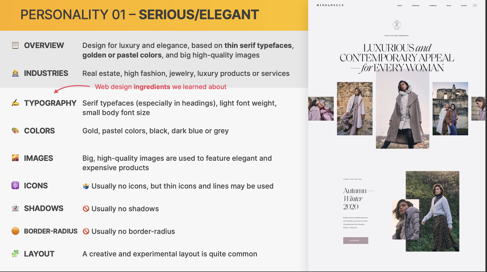

### 10.2 Minimalist/Simple

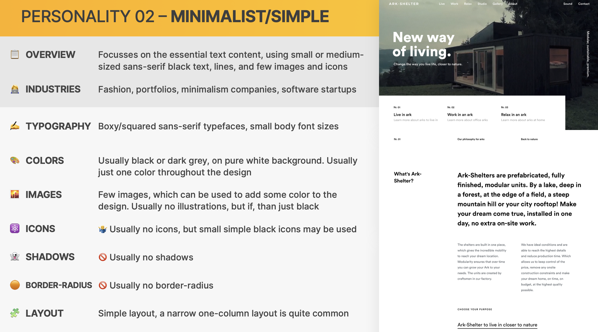

### 10.3 Startup/Upbeat

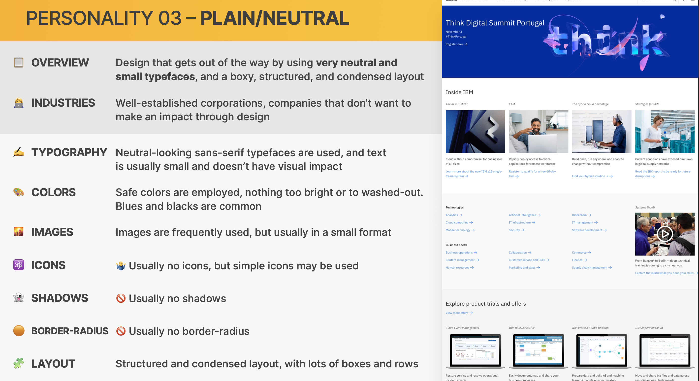

### 10.4 Bold/Confident

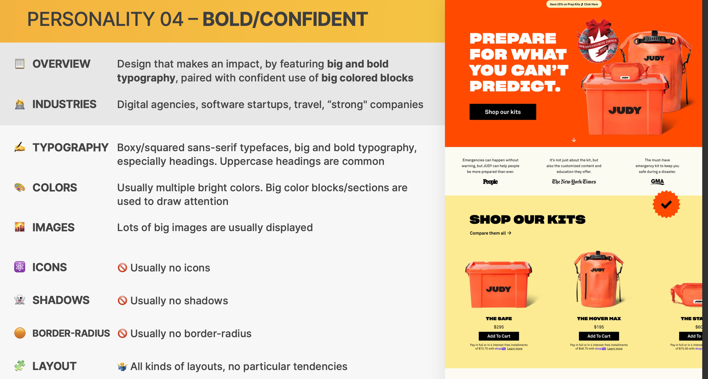

### 10.5 Calm/Peaceful

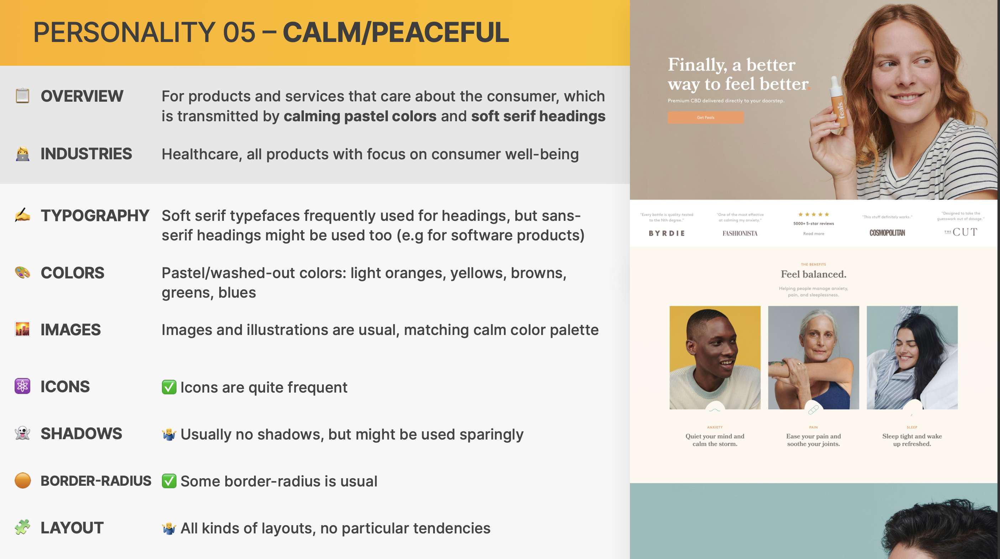

### 10.6 Startup/Upbeat

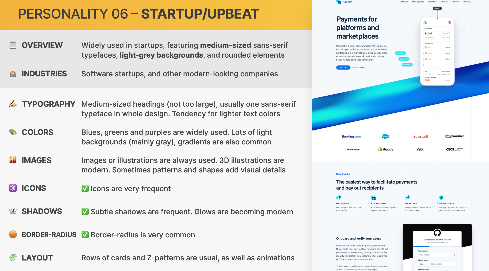

### 10.7 Playful/Fun

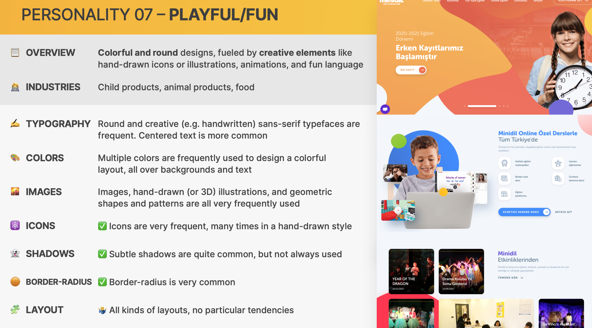

- **Advanced:** Combining playfulness and boldness.

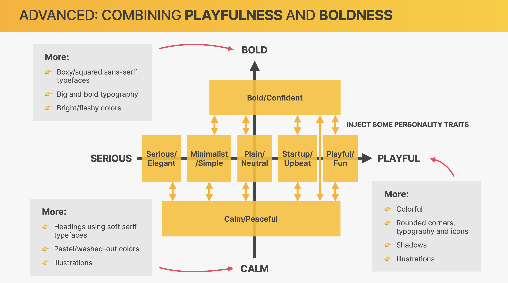

## 11. COMPONENTS AND LAYOUT PATTERN

**Element** -> **Component** -> **Layouts** -> **Webpage**

- Use **common elements** and **components** to convey you website's information
- Combine components into layouts using **common layout patterns**
- Assmble different **layout areas** into a complete, final page.

## 12. The 7 steps to a Great Website

**Check more in lecture slides**

1. Define
2. Plan
3. Sketch
4. Design and build
5. Test and build
6. Launch
7. Maintain and update

## 13 Responsive Design

Design technique to make a webpage adjust its layout and visual style to **any possible screen size**.

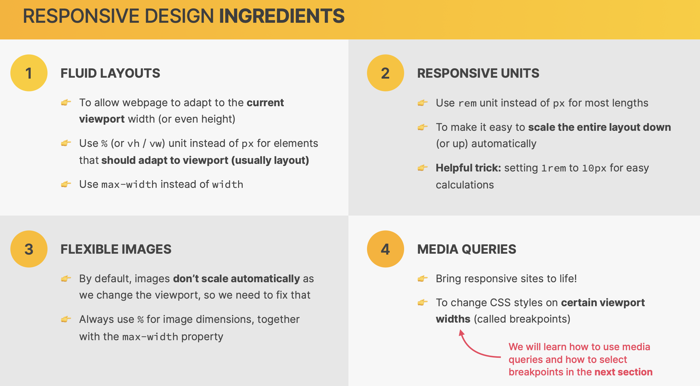

- `max-width`: If the container is larger, use the specified max-width.If the container is less than specified max-width, element width = container width

```CSS
max-width: 1000px;
```

- `rem`: The root element's(`<html>`) font-size. Default: 1rem = 16px

```CSS
html {
  /* font-size: 10px; */
  /* 10 px / 16 px = 62.5% */
  /* Percentage of user's browser font-size setting */
  font-size: 62.5%;
}

.test {
  max-width: 50rem;
  padding: 4rem;
  font-size: 2rem;
}

```

### 13.1 Media queries

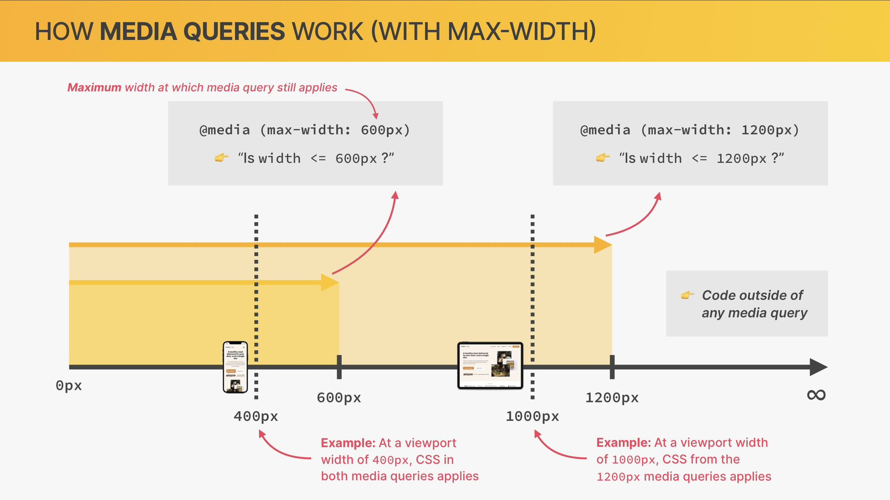

### 13.2 How to Select Breakpoints

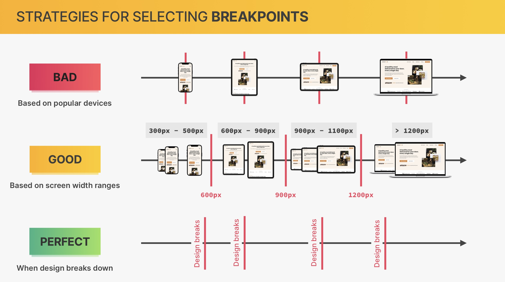

### 13.3 Omnifood-Samll Laptops

- Decrease **width** and **heading** `font-size`.
- **Grid** layout from 3 \* 4 to 2 \* 6.

### 13.4 Omnifood-Landscape Tablets

- decrease html whole `font-size`
- decrease **grid gaps**
- decrease heading `font-size`
- decrease header/nav/testimonial padding or gap

### 13.5 Omnifood-Tablets

- decrease **html** whole `font-size`
- **hero** changes to **1 column** and **center** contents.
- decrease size of hero **image**
- decrease size of logo **image**
- decrease **step number** `font-size`
- decrease **meals box**
- change **testimonial** to **1 colomn** and gallery to 6 \* 2
- change **cta** to **1 colomn** and decrease size of image

### 13.6 Omnifood-Mobile Navigation

- add menu and close `button`
- increase the size of font
- get `flex-direction` from `row` to `column`
- display correct icon
- hide navigation
- slide in and opacity animation

### 13.7 Omnifood-Smaller Tablets

- 3 cols and 4 cols -> 2 cols
- pricing plan -> original width
- footer grid change to 2 rows

### 13.8 Omnifood-Phones

- all grid for 1 column
- decrease hero button
- increase hero img
- revise z-pattern to one image one text
- increase image gap in z pattern by transform
- decrease logos size
- gallery to 4 \* 3

## 14. Omnifood-Effects, Optimizations and Deployment

### 14.1 Implementing Somooth Scrolling

### 14.2 Implementing Sickty Navigation Bar

### 14.3 Testing Performance with Lighthouse

### 14.4 Adding Favicon and Meta Description

- Add `<meta>` name description.
- Revise `<title>`.
- Add `favicon` for web, apple and andriod(different ways).

### 14.5 Image Optimization

- Make sure the render size = 1 / 2 Intrinsic size.
- Use Squoosh(or other softwares) to compress image.
- Handle compatibility

```html
<div class="hero-img-box">
  <picture>
    <!-- Not all browser support webp -->
    <source srcset="img/hero.webp" type="image/webp" />
    <source srcset="img/hero-min.png" type="image/png" />

    
  </picture>
</div>
```
